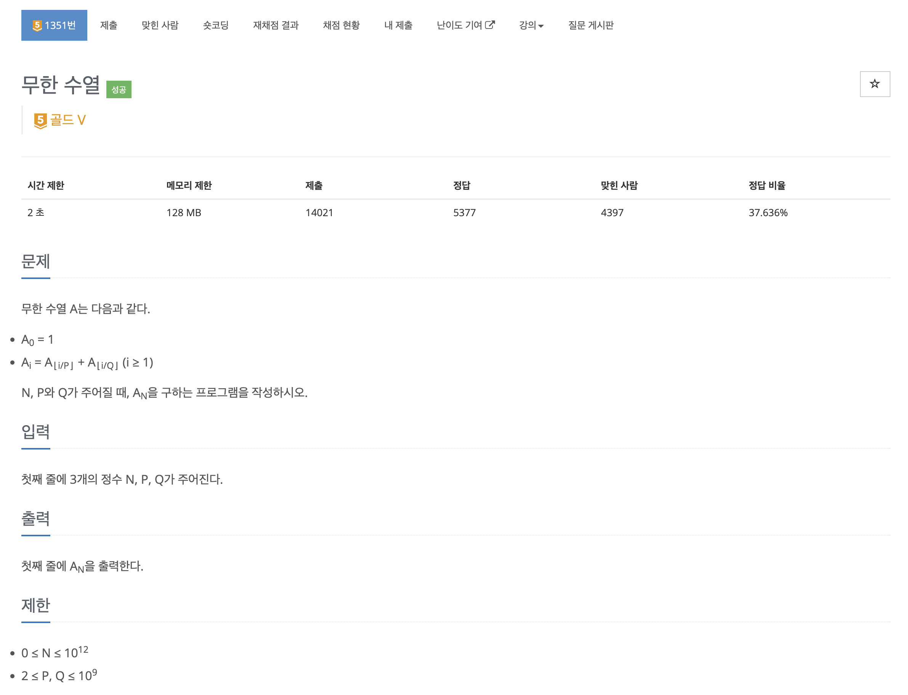
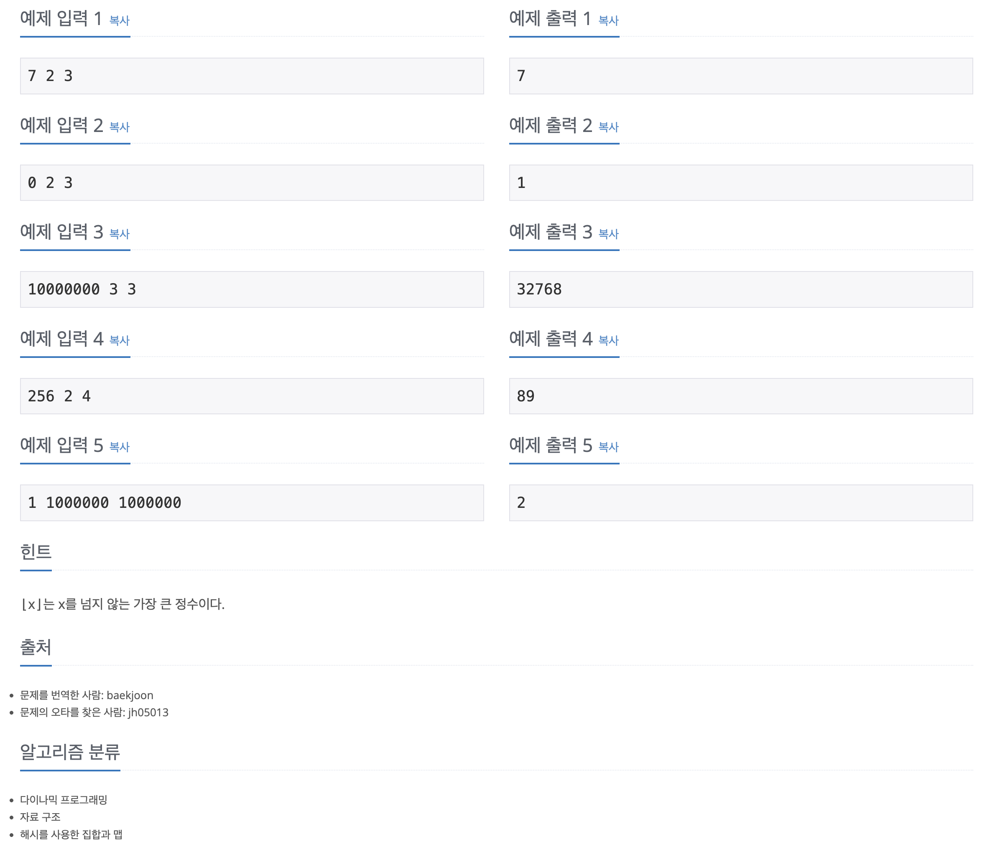

https://www.acmicpc.net/problem/1351

# 🔍 무한 수열

| 항목      | 내용                              |
| --------- | --------------------------------- |
| 설계 시간 | 5 min                             |
| 구현 시간 | 5 min                             |
| 난이도    | 골드 5                            |
| 알고리즘  | 다이나믹 프로그래밍, 해시맵 |
| 코드 길이 | 1499B                             |
| 실행 시간 | 68ms (시간 제한 2초)              |
| 메모리    | 11680KB (메모리 제한 128MB)       |

---

# 💡 아이디어

- Top-Down 방식의 다이나믹 프로그래밍을 활용
- 그냥 dfs를 돌리면 중복 연산으로 시간초과가 발생해서 메모이제이션 필수
- 메모이제이션 과정에서 수열의 크기가 int형 범위를 벗어나므로 배열로 메모이제이션하기 곤란(해시맵 활용)

---

# ✔ 문제 풀이

An은 A[i/p] + A[i/Q] 인데 A[i/p] 나 A[i/Q]를 알려면 다시 같은 과정을 반복해야 한다는 점에서 다이나믹 프로그래밍이 떠올랐다. 최종 정답을 구하기 위해 작은 문제로 쪼개는 과정이 자연스러워서 Top-Down 방식으로 풀었고 재귀는 특정 원소가 메모이제이션 되어있으면 반환하고 메모이제이션 되어있지 않으면 메모이제이션을 한 후 반환하도록 구현했다. 메모이제이션을 하는 과정에서 재귀가 들어가는게 약간 특이하게 느껴졌다.

---

# 🧠 어려웠던 점

다이나믹 프로그래밍 문제를 보통 Bottom-Up으로 접근해와서 재귀는 좀 익숙하지 않았고 메모이제이션에서 배열 대신 해시맵을 사용하는걸 떠올리는게 약간 어려웠다.

---

# 🧐 좋은 풀이

내꺼가 제일 나은듯