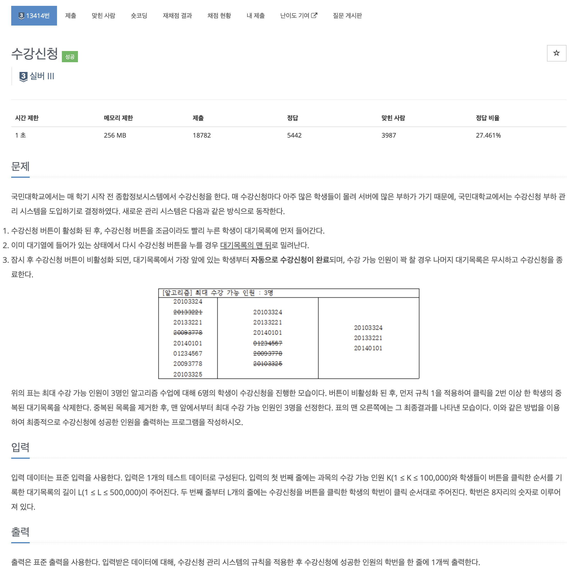
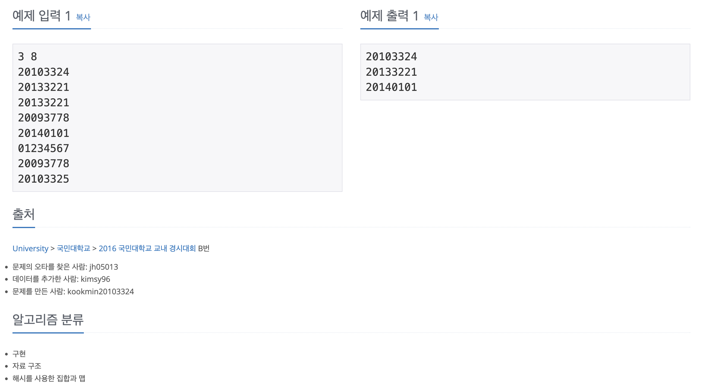

https://www.acmicpc.net/problem/13414

# 🔍 수강신청

| 항목      | 내용                              |
| --------- | --------------------------------- |
| 설계 시간 | 5 min                             |
| 구현 시간 | 15 min                             |
| 난이도    | 실버 3                            |
| 알고리즘  | 링크드 해시셋 |
| 코드 길이 | 914B                             |
| 실행 시간 | 512ms (시간 제한 1초)              |
| 메모리    | 69612KB (메모리 제한 256MB)       |

---

# 💡 아이디어

- 수강신청 과정은 순서가 있고 성공, 실패(True/False) 두 가지로 나뉜다.
- 순서와 T/F를 한번에 다룰 수 있는 LinkedHashSet 자료구조로 해결할 수 있다.

---

# ✔ 문제 풀이

- 버튼을 누른 순서대로 수강신청 목록에 들어가고 한번 더 클릭하면 목록의 맨 뒤로 간다는 점에서 큐를 떠올렸는데 중복 체크에서 Set을 사용해야 할 것 같아서 그냥 한번에 처리할 수 있을 것 같은 링크드 해시셋을 활용했다. 링크드 해시셋은 해시셋 + 향상된 for문으로 넣은 순서대로 출력 가능
- 버튼을 누른 순서로 대기목록에 들어가고 버튼을 한번 더 누르면 대기목록의 맨 뒤로 밀려나는건 링크드 해시셋에 존재하지 않는 학번이면 넣고 존재하는 학번이면 링크드 해시셋의 학번을 제거하고 새로 넣는 방식으로 구현할 수 있다.
- 일반 해시셋은 순회 과정에서 넣은 순서로 나오지 않아서 사용하지 않았고, 학번은 앞자리가 0인 경우가 있어서 String 타입으로 받아서 처리했다.

---

# 🧠 어려웠던 점

예제가 처음에 잘 이해가 안됐었다.

---

# 🧐 좋은 풀이

내꺼가 제일 나은듯