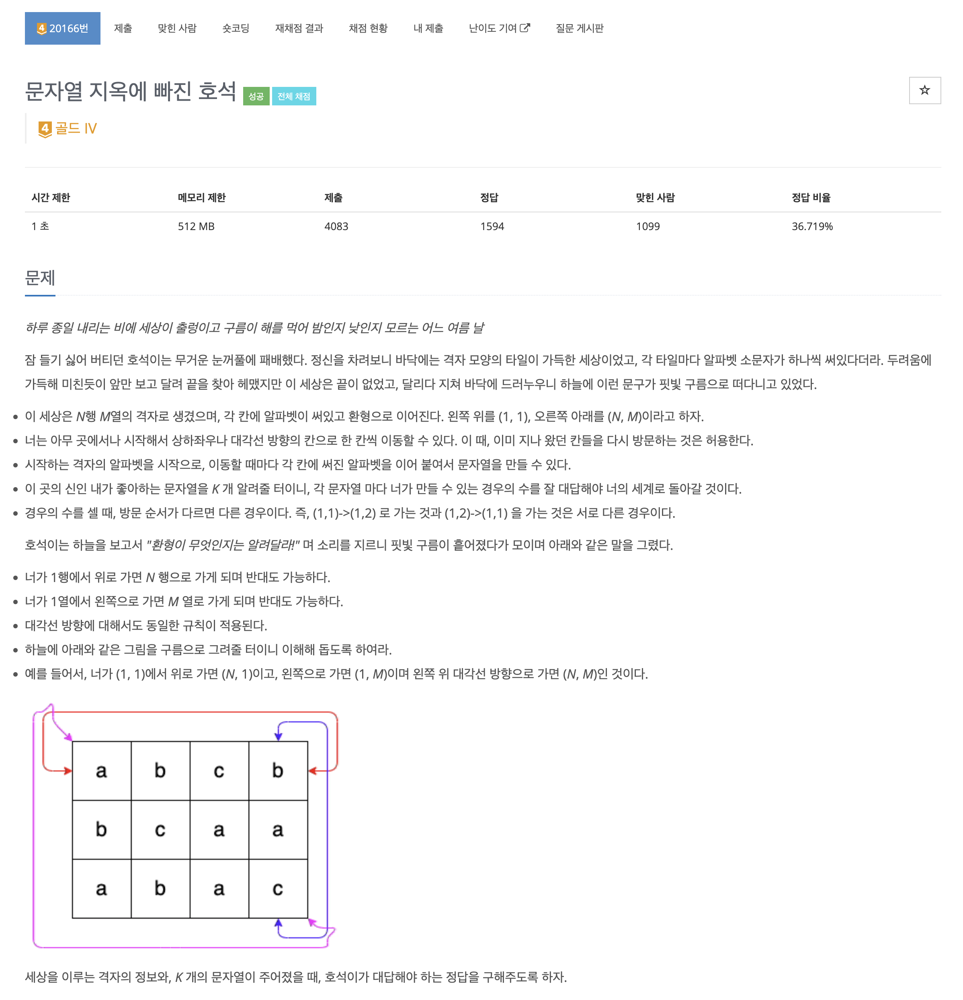
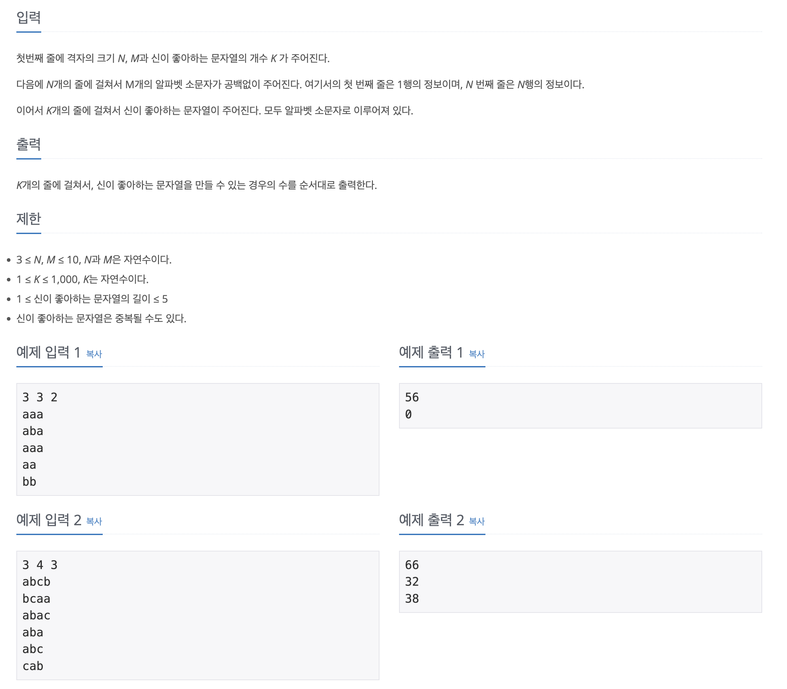

https://www.acmicpc.net/problem/20166

# 🔍 수강신청

| 항목      | 내용                              |
| --------- | --------------------------------- |
| 설계 시간 | 60 min                             |
| 구현 시간 | 180 min                             |
| 난이도    | 골드 4                            |
| 알고리즘  | dfs, 해시맵, 다이나믹 프로그래밍 |
| 코드 길이 | 1875B                             |
| 실행 시간 | 392ms (시간 제한 1초)              |
| 메모리    | 77836KB (메모리 제한 512MB)       |

---

# 💡 아이디어

- 주어진 격자의 크기 및 신이 좋아하는 문자열의 길이가 작다는 점에서 dfs로 풀이가 가능할 것이라는 믿음
- 신이 좋아하는 문자열이 중복될 수 있고 다른 조건에 비해 경우의 수를 찾는 횟수만 많다는 점에서 모든 케이스를 다 구하고 탐색의 시간복잡도를 낮추는게 좋아보여 해시맵으로 풀이(key: 문자열, value: 등장횟수)

---

# ✔ 문제 풀이

- dfs는 격자의 각 점을 시작점으로 하는 길이 1 ~ 5까지 모든 문자열을 탐색한다. 이를 구현하기 위해 3중 for문을 사용
- dfs 메서드 내부는 초기화, 종료조건, 재귀조건으로 나누어져 있고 초기화는 파라미터로 들고 다니는 문자열을 갱신, 종료조건은 길이를 다 채우면 해시맵에 넣고 종료, 재귀조건은 길이를 다 못채웠으면 8방 탐색으로 재귀에 들어간다. 반환 후 최근에 추가한 문자열을 삭제해서 다음 격자 방문이 정상적으로 되게 해준다.
- 문자열을 파라미터로 들고 다니며 처리하도록 구현했는데 이 과정에서 문자열 덧셈, 뺄셈(삭제 or 초기화) 연산이 필요해서 StringBuilder로 처리했다.
- 8방 탐색은 환형 처리를 해줘야 하는데 배열 길이만큼 더하고 배열 길이로 나누는게 가장 깔끔해보여서 이렇게 했다.

---

# 🧠 어려웠던 점

- 신이 좋아하는 문자열의 길이는 1 ~ 5의 랜덤한 입력 값인데 이걸 길이가 K인 문자열로 풀고 있어서 메모리 초과가 계속 발생했고 디버깅하는데 오래걸렸다.
- dfs 과정에서 중복 연산이 발생하는 부분이 생기는데 이걸 어떻게 해결할 지 어려워서 포기했다. 190ms 정도의 풀이가 아마 여기서 메모이제이션 같은 걸로 중복 연산을 줄였지 않았나 싶다.

---

# 🧐 좋은 풀이
