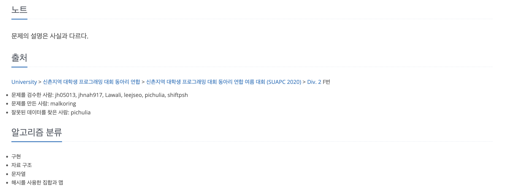

https://www.acmicpc.net/problem/19583

# 🔍 싸이버개강총회

| 항목      | 내용                      |
| --------- |-------------------------|
| 설계 시간 | 5 min                   |
| 구현 시간 | 15 min                  |
| 난이도    | 실버 2                    |
| 알고리즘  | 해시셋                     |
| 코드 길이 | 1392B                   |
| 실행 시간 | 456ms (시간 제한 1초)        |
| 메모리    | 54336KB (메모리 제한 1024MB) |

---

# 💡 아이디어

- HH:MM 형식의 String 타입으로 주어진 시간은 String 클래스의 compareTo 메서드로 비교했을 때 시간순(사전순) 비교가 가능하다.
- Collection 인터페이스의 retainAll 메서드로 두 컬렉션간 교집합을 구할 수 있다.

---

# ✔ 문제 풀이

- 문제 조건을 요약하면 S 이전에 채팅을 쳤고, E 이후 Q 이전에 채팅을 친 학회원의 수를 구하는 문제이다.
- HH:MM 형식으로 주어진 시간에서 기준이 되는 시간 이전인지 이후인지를 compareTo를 활용한 메서드로 처리했다.
- S 이전에 채팅을 친 학회원을 모은 집합과 E 이후 Q 이전에 채팅을 친 학회원을 모든 집합의 교집합의 크기가 출석이 확인된 학회원의 인원 수이다.
- 풀이 과정에서 채팅 기록이 최대 10만 줄이고 몇 개인지 알려주지 않아서 BufferedReader와 null 비교로 EOF 처리하는 것을 활용했다.

---

# 🧠 어려웠던 점

- 기본 메서드를 활용하지 않으면 구현이 약간 까다로웠을 것 같다.

---

# 🧐 좋은 풀이
