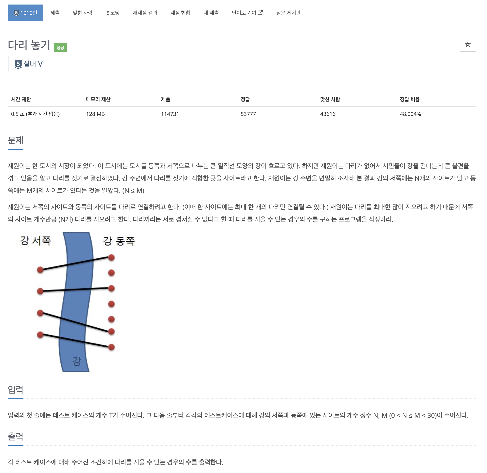
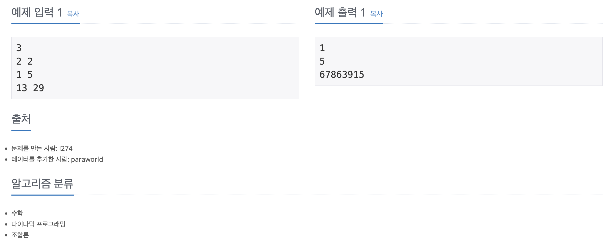

https://www.acmicpc.net/problem/1010

# 🔍 다리 놓기

| 항목      | 내용                     |
| --------- |------------------------|
| 설계 시간 | 5 min                  |
| 구현 시간 | 10 min                 |
| 난이도    | 실버 5                   |
| 알고리즘  | 수학, 다이나믹 프로그래밍         |
| 코드 길이 | 1030B                  |
| 실행 시간 | 68ms (시간 제한 0.5초)      |
| 메모리    | 11924KB (메모리 제한 128MB) |

---

# 💡 아이디어

- 다리를 지을 수 있는 경우의 수는 다이나믹 프로그래밍으로 구할 수 있다.

---

# ✔ 문제 풀이

왼쪽에 N개 오른쪽에 M개의 사이트가 있을 때 다리를 지을 수 있는 경우의 수는 왼쪽에 N-1개 오른쪽에 M-1개의 사이트가 있을 때 다리를 지을 수 있는 경우의 수 + 왼쪽에 N개 오른쪽에 M-1개의 사이트가 있을 때 다리를 지을 수 있는 경우의 수이다.
왼쪽에 N개 오른쪽에 M-1개의 사이트가 있을 때 오른쪽에 사이트를 하나 추가하면 왼쪽의 사이트 하나를 새로운 사이트에 연결한 후 왼쪽에 N-1개(하나 연결했으니까) 오른쪽에 M-1개(추가했지만 하나 연결했으니까)의 사이트가 있을 때 다리를 지을 수 있는 경우의 수가 기존 경우의 수에서 추가된다.

---

# 🧠 어려웠던 점

- dp 배열을 작성하면 규칙은 바로 보이는데 논리로 이해하기가 약간 어려웠다.

---

# 🧐 좋은 풀이
