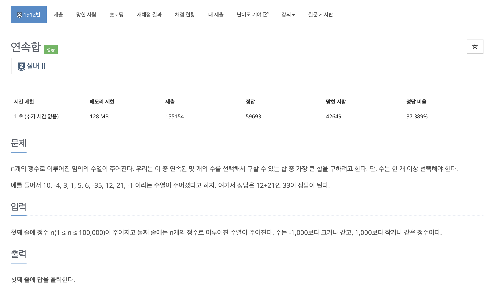
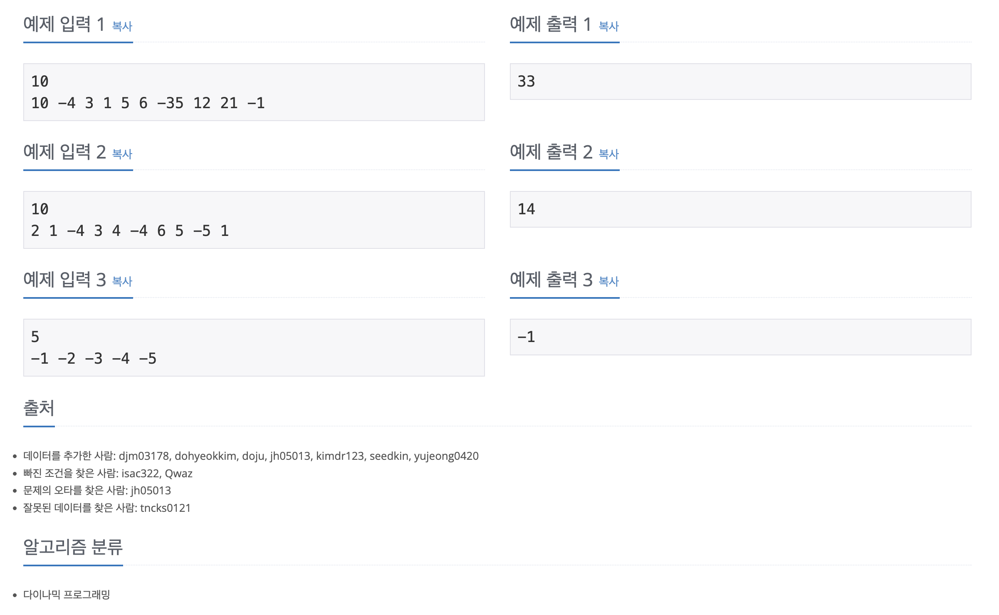

https://www.acmicpc.net/problem/1912

# 🔍 연속합

| 항목      | 내용                     |
| --------- |------------------------|
| 설계 시간 | 30 min                 |
| 구현 시간 | 30 min                 |
| 난이도    | 실버 2                   |
| 알고리즘  | 다이나믹 프로그래밍             |
| 코드 길이 | 823B                   |
| 실행 시간 | 168ms (시간 제한 1초)       |
| 메모리    | 22184KB (메모리 제한 128MB) |

---

# 💡 아이디어

- 시간 제한은 1초인데 N이 최대 10만이어서 O(N^2) 보다 빠른 풀이로 풀어야 한다.
- 누적합을 활용한 다이나믹 프로그래밍으로 O(N)으로 풀이 가능

---

# ✔ 문제 풀이

- 주어진 수열에서 누적합 배열을 생성한다.
- 누적합 배열을 순회하며 해당 인덱스에서 누적합과 해당 인덱스보다 작은 범위에서 누적합의 최솟값의 차를 구한다.
- 순회 과정에서 해당 차의 최댓값을 찾는다.

---

# 🧠 어려웠던 점

- N에 대한 2차원 배열은 메모리 초과, N에 대한 2중 for문 순회는 시간 초과가 발생해서 O(N) 풀이를 구상하는데 투 포인터 알고리즘으로 접근해서 시간이 좀 걸렸다.

---

# 🧐 좋은 풀이
