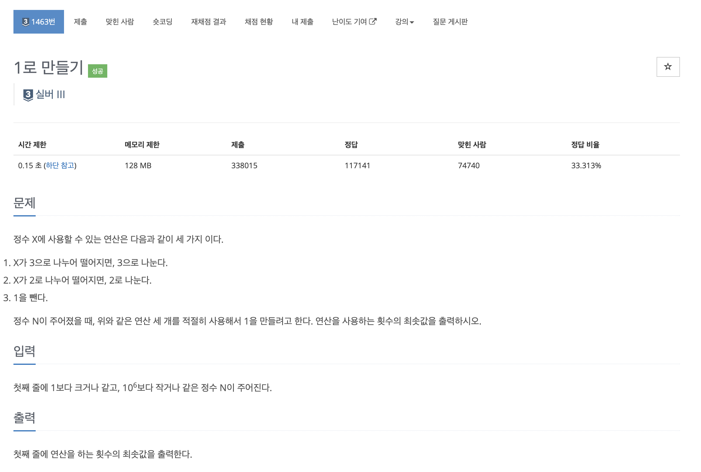
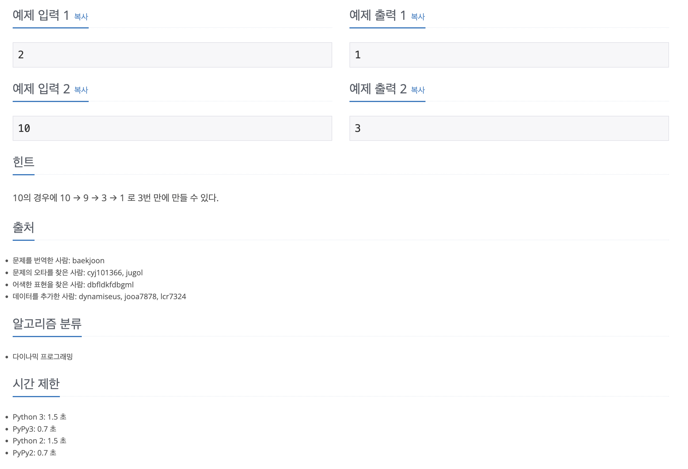

https://www.acmicpc.net/problem/1463

# 🔍 1로 만들기

| 항목      | 내용                                           |
| --------- |----------------------------------------------|
| 설계 시간 | 15 min                                       |
| 구현 시간 | 15 min                                       |
| 난이도    | 실버 3                                         |
| 알고리즘  | 다이나믹 프로그래밍                                   |
| 코드 길이 | 1128B / 652B / 799B                          |
| 실행 시간 | 508ms / 96ms / 820ms (시간 제한 0.15초)           |
| 메모리    | 112216KB / 15732KB / 216228KB (메모리 제한 128MB) |

---

# 💡 아이디어

- 우선순위 큐를 활용한 BFS, 다이나믹 프로그래밍으로 해결활 수 있다.

---

# ✔ 문제 풀이

BFS
- N이 1이 될 때까지 3가지 경우에 대한 BFS를 돌린다.
- BFS에서 탐색은 연산 횟수가 최소인 수를 뽑으며 1이 나올 때까지 반복해야해서 우선순위 큐를 이용한다.

DP
- 주어진 정수 크기(N)만큼 dp 배열을 생성한다.
- 1부터 N까지 순회하며 각 숫자를 만드는데 필요한 연산의 최솟값을 찾는 문제로 생각한다.
- 3의 배수도 2의 배수도 아닌 수는 해당 수보다 1 작은 수에서 1을 더했을 때만 만들어질 수 있다.
- 3의 배수면서 6의 배수가 아닌 수는 해당 수보다 1 작은 수에서 1을 더한 경우 또는 해당 수를 3으로 나눈 수에서 3을 곱한 경우에 만들어질 수 있다.
- 2의 배수면서 6의 배수가 아닌 수는 해당 수보다 1 작은 수에서 1을 더한 경우 또는 해당 수를 2로 나눈 수에서 2를 곱한 경우에 만들어질 수 있다.
- 6의 배수인 수는 해당 수보다 1 작은 수에서 1을 더한 경우 또는 해당 수를 3으로 나눈 수에서 3을 곱한 경우 또는 해당 수를 2로 나눈 수에서 2를 곱한 경우에 만들어질 수 있다.
- 각 조건을 연립해서 조건문을 작성해주는데 6의 배수인 경우를 먼저 체크하고 나머지 조건을 체크해준다.

DFS
- 메모이제이션을 활용한 다이나믹 프로그래밍 풀이 추가

---

# 🧠 어려웠던 점

- Top-Down 방식의 문제 같아 보였는데 Bottom-Up으로 풀게된 과정이 약간 어려웠다.

---

# 🧐 좋은 풀이
