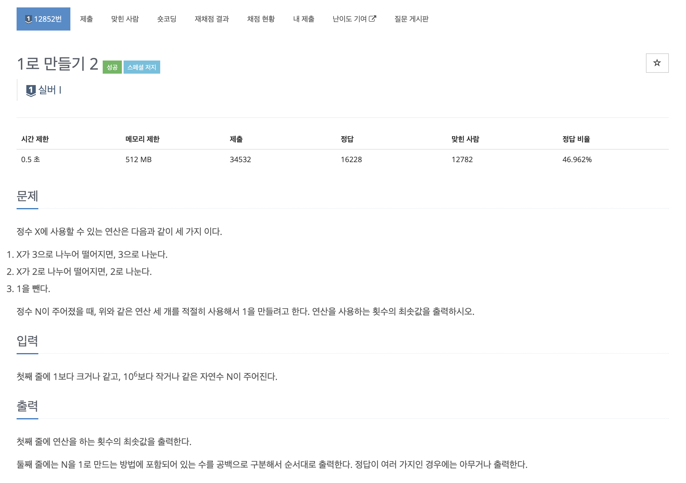
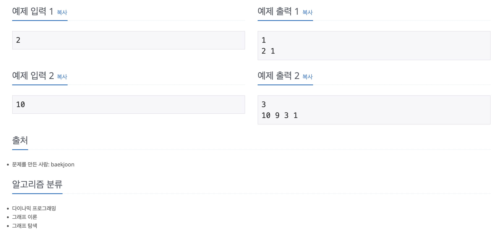

https://www.acmicpc.net/problem/12852

# 🔍 1로 만들기 2

| 항목      | 내용                     |
| --------- |------------------------|
| 설계 시간 | 120 min                |
| 구현 시간 | 120 min                |
| 난이도    | 실버 1                   |
| 알고리즘  | 다이나믹 프로그래밍             |
| 코드 길이 | 1059B                  |
| 실행 시간 | 100ms (시간 제한 0.5초)     |
| 메모리    | 19756KB (메모리 제한 512MB) |

---

# 💡 아이디어

- Bottom-Up 다이나믹 프로그래밍과 경로 찾기를 활용하면 간단하게 해결할 수 있다.

---

# ✔ 문제 풀이

- 기존 1로 만들기 문제에서 연산을 사용하는 횟수가 최소가 되는 경로까지 추가로 출력하는 문제이다.
- 경로는 해당 숫자를 만드는데 연산 횟수가 최소였던 숫자를 경로 배열에 저장한 후 이를 역순으로 탐색하는 방식으로 찾았다.
- 기존 1로 만들기와 동일한 방식으로 반복문을 작성하면 조건 분기가 복잡해져서 6의 배수, 3의 배수, 2의 배수, 아무 것도 아닌 경우 이렇게 4가지로 나눠서 찾았던 걸 일단 배수가 아니라 가정하고 기본 값을 채워넣은 후 2의 배수면 조건 체크하고 덮어쓰기, 3의 배수면 조건 체크하고 덮어쓰기 이렇게 바꿨다.

---

# 🧠 어려웠던 점

- dfs로 경로를 출력하려고 했는데 완전탐색을 하며 방문한 모든 곳을 출력해서 내가 원하는 특정 경로만 출력하기가 어려웠다.
- 제출에서는 정답이었는데 이전 위치를 저장하는 경로 탐색이 항상 정답이 된다는 확신이 없다.

---

# 🧐 좋은 풀이
