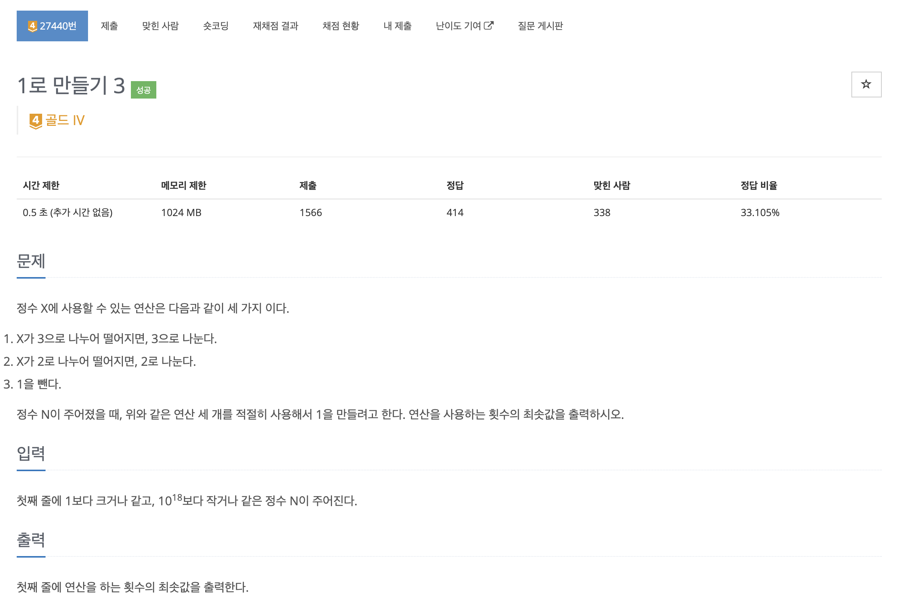
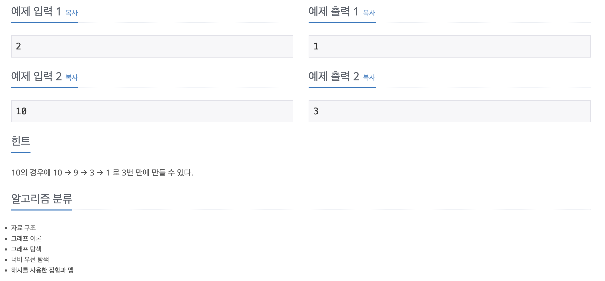

https://www.acmicpc.net/problem/27440

# 🔍 1로 만들기 3

| 항목      | 내용                      |
| --------- |-------------------------|
| 설계 시간 | 45 min                  |
| 구현 시간 | 15 min                  |
| 난이도    | 골드 4                    |
| 알고리즘  | BFS                     |
| 코드 길이 | 1540B                   |
| 실행 시간 | 132ms (시간 제한 0.5초)      |
| 메모리    | 15372KB (메모리 제한 1024MB) |

---

# 💡 아이디어

- BFS를 이용하면 해결할 수 있다.

---

# ✔ 문제 풀이

- 기존 1로 만들기 문제에서 정수의 크기가 int형의 범위를 넘어가는 문제다.
- 기존 1로 만들기 BFS 풀이를 정수 범위만 바꿔서 제출했는데 시간 초과가 발생해서 방문 체크 로직을 추가했다.
- 정수의 타입이 long이어서 방문 체크 배열은 사용하지 못해서 방문 체크 집합을 이용해서 방문 체크를 진행했다.
- BFS에서 연산 횟수가 적은 순서로 탐색하도록 우선순위 큐를 이용해 노드를 탐색하므로 현재 노드가 가장 최적 경로이기 때문에 현재 노드를 방문 체크하고 같은 정수는 다시 방문하지 않아도 문제가 없을 것으로 판단했다.(다익스트라 알고리즘이랑 같은 원리?)

---

# 🧠 어려웠던 점

- 수의 크기만 커진 문제여서 HashMap을 이용한 다이나믹 프로그래밍으로 풀 수 있을 줄 알았는데 Top-Down, Bottom-Up 모두 1%에서 시간 초과가 발생했다.
- 다이나믹 프로그래밍 최적화로 푸는 문제라고 확신해서 계속 접근했는데 도저히 안돼서 알고리즘 분류를 확인했느데 너비 우선 탐색이 있는 것을 보고 이전의 BFS 풀이를 최적화하니 통과가 됐다.

---

# 🧐 좋은 풀이
