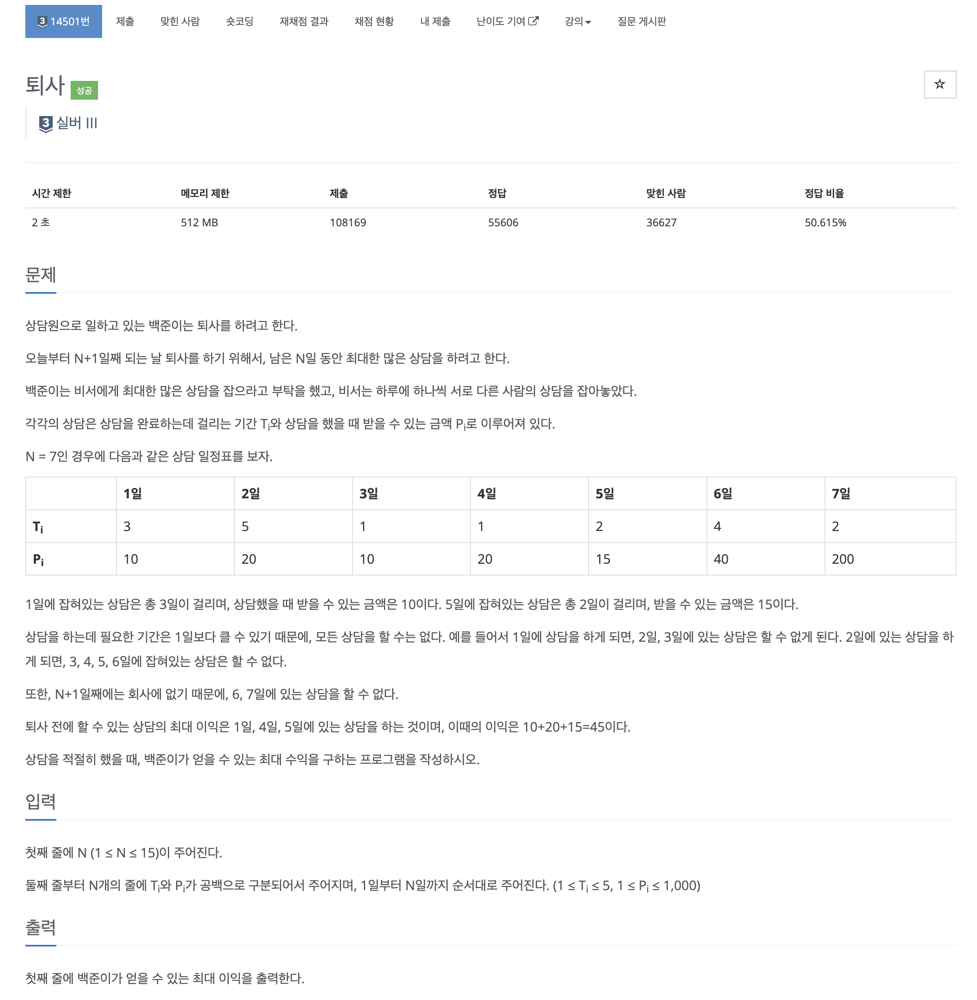
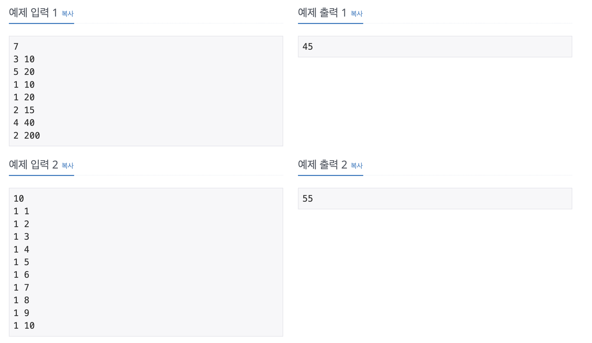
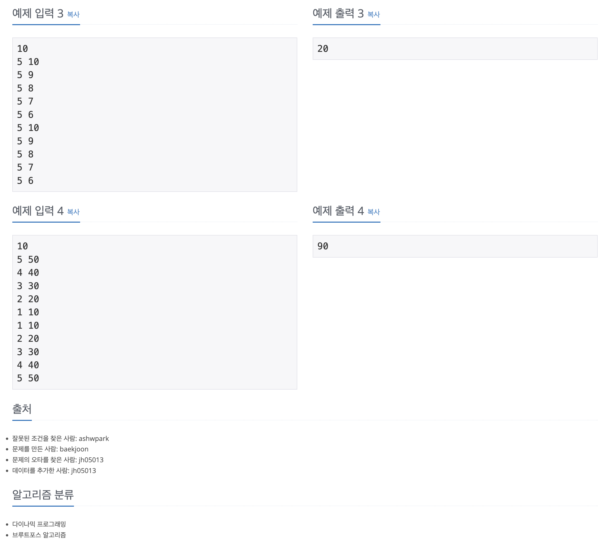

https://www.acmicpc.net/problem/14501

# 🔍 퇴사

| 항목      | 내용                               |
| --------- |----------------------------------|
| 설계 시간 | 30 min                           |
| 구현 시간 | 30 min                           |
| 난이도    | 실버 3                             |
| 알고리즘  | 다이나믹 프로그래밍 / 브루트포스 알고리즘          |
| 코드 길이 | 1498B / 818B                     |
| 실행 시간 | 88ms / 64ms (시간 제한 2초)           |
| 메모리    | 16856KB / 11568KB (메모리 제한 512MB) |

---

# 💡 아이디어

- 부분집합을 이용한 완전탐색과 다이나믹 프로그래밍 두 가지 방식으로 풀었다.

---

# ✔ 문제 풀이

PowerSet
- N이 최대 15여서 부분집합을 활용한 완전탐색도 충분해보였다.(2^15)
- powerSet 메서드를 통해 T/F로 상담을 선택한 후 상담이 중복되지 않으면서 주어진 기간에 완료할 수 있는지 체크한다.
- 모든 조건을 만족하면 얻을 수 있는 최대 수익을 갱신하며 같은 과정을 반복한다.

DP
- dp 배열의 인덱스는 퇴사하는 날 얻을 수 있는 최대 수익을 저장한다. N일까지 상담 일정표에 있으면 최대 수익은 N+1일에 얻는다. T는 최대 5여서 패딩까지 해줬다.
- 점화식은 `dp[i + t[i]] = Math.max(dp[i + t[i]], dp[i] + p[i]);`로 i일에 t[i]만큼 걸리는 상담을 진행했을 때 얻을 수 있는 최대 수익은 기존에 해당일에 얻을 수 있었던 최대 수익과 i일에 얻을 수 있었던 최대 수익 + i일에 있는 상담을 진행했을 때 얻을 수 있는 수익 중 최댓값이다.
- `dp[i + 1] = Math.max(dp[i + 1], dp[i]);`로 전날 얻을 수 있는 최대 수익과 비교 갱신을 해줘야 한다.

---

# 🧠 어려웠던 점

- 상담이 같은 날 중복될 수 없는 조건이 dp에서 자연스럽게 체크되는 과정이 아리까리하다.

---

# 🧐 좋은 풀이
