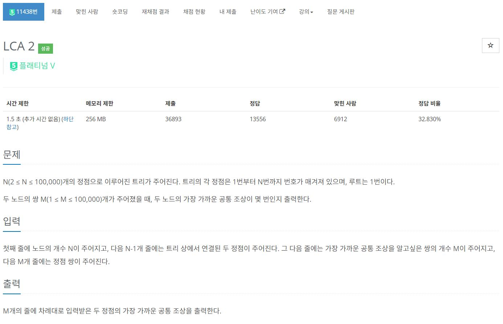
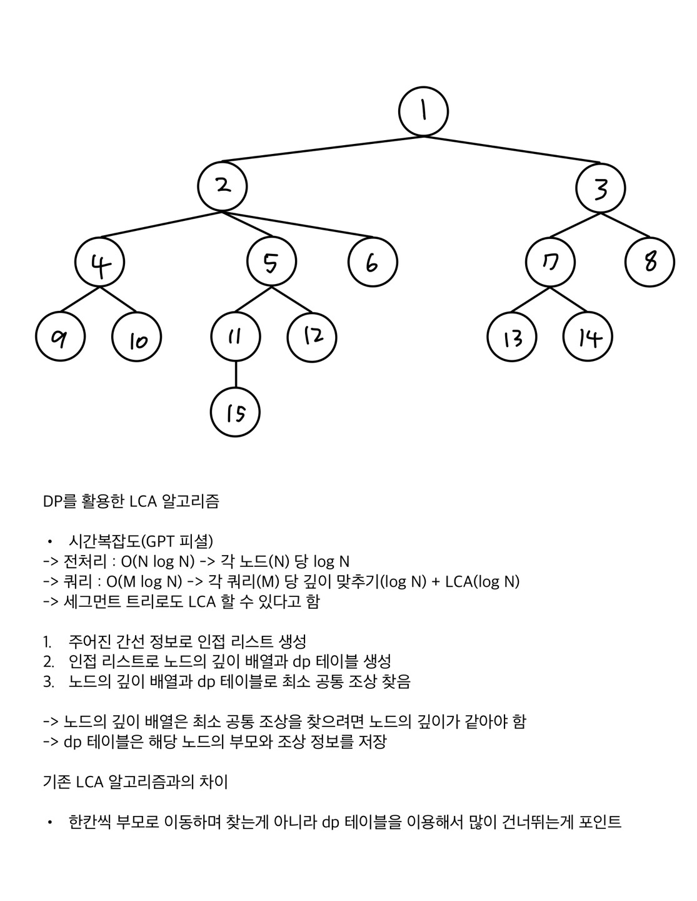
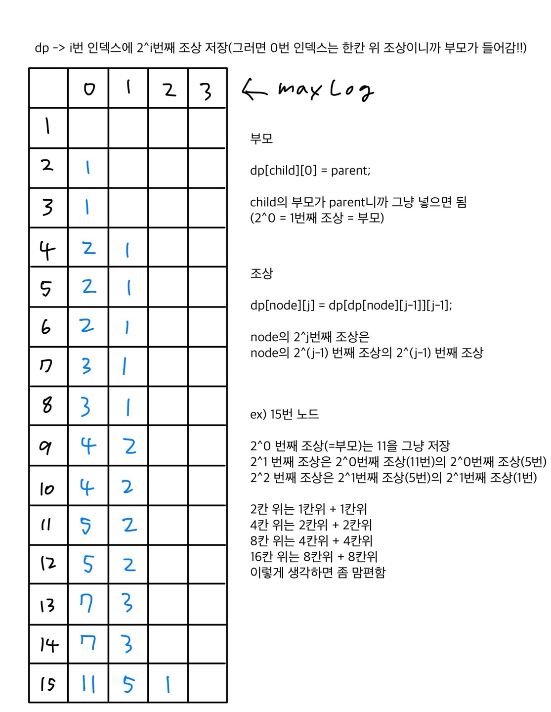

https://www.acmicpc.net/problem/11438

# 🔍 LCA 2

- 설계 시간 : ? min
- 구현 시간 : ? min
- 난이도 : 플래티넘 5
- 알고리즘 : LCA 알고리즘(dp)
- 코드 길이 : 5296B / 5296B
- 실행 시간 : BFS - 752ms(제한 1.5초) / DFS - 680ms(제한 1.5초)
- 메모리 : 100296KB / 103400KB

---

# 💡 아이디어

- 제목 그대로 LCA 알고리즘으로 풀면 되는 문제인데 두 노드에서 한 칸씩 위로 올라가며 부모가 같아지는 시점까지 반복하는 방식은 시간 제한 때문에 안됨
- 포인트는 한칸씩 말고 좀 많이 건너뛰어야 하는데 dp 테이블에 조상 정보를 저장해서 여러 칸을 건너뛰며 최소 공통 조상을 찾을 수 있음
- dp 테이블에 저장하는 조상은 모든 조상을 저장하는게 아니라 2^n 번째 조상들을 저장한다는 것만 일단 암기

---

# ✔ 문제 풀이

풀이 흐름

1. 간선 정보를 바탕으로 트리의 인접 리스트 초기화
2. 각 노드의 깊이를 저장하는 배열(`int[] depth`) + 조상들을 저장할 dp 테이블(`int[][] dp`) 선언
3. BFS or DFS로 `depth` 와 `dp` 의 각 행의 첫번째 열까지만 초기화
4. `dp` 의 조상들 초기화
5. 쿼리별로 LCA 알고리즘 수행

포인트

1. dp 테이블의 열의 길이를 설정하는 방법
2. dp 테이블에서 조상을 저장하는 원리
3. 두 노드의 높이를 조정하는 비트 마스킹
4. 최소 공통 조상을 찾는 반복문

# 🧠 어려웠던 점

- 알고리즘 자체가 좀 어지러움

---

# 🧐 좋은 풀이
