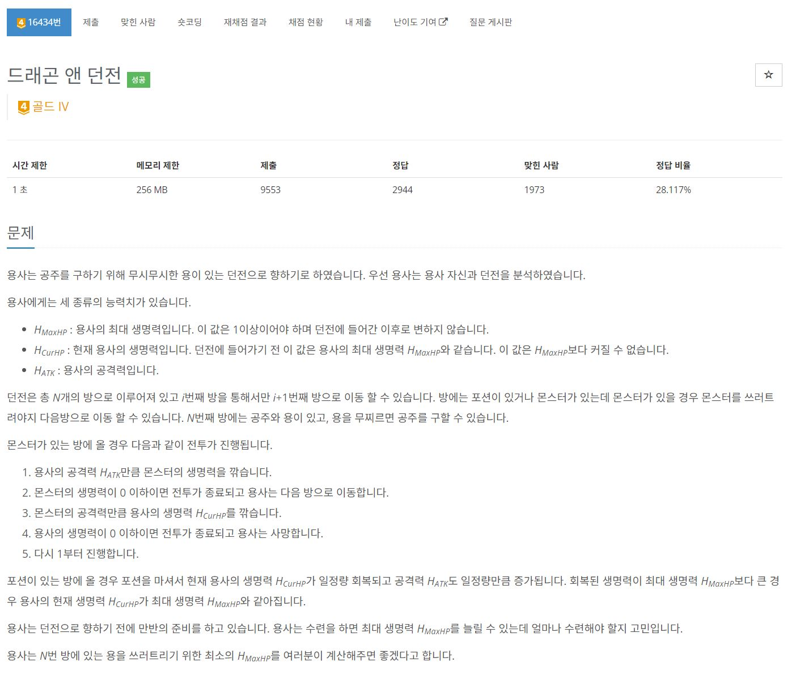
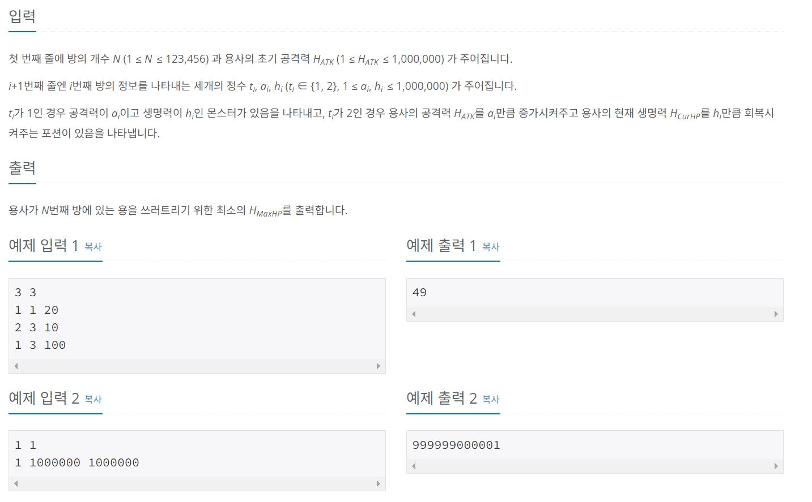

https://www.acmicpc.net/problem/16434

# 🔍 드래곤 앤 던전

- 설계 시간 : ? min
- 구현 시간 : ? min
- 난이도 : 골드 4
- 알고리즘 : 매개변수 이분탐색
- 코드 길이 : 2892B
- 실행 시간 : 656ms(시간 제한 1초)
- 메모리 : 54036KB

---

# 💡 아이디어

- 용사의 현재 생명력을 빠르게 찾아야 하는데 매개변수 이분탐색으로 찾을 수 있다.
- 예제 출력2의 값이 int형의 범위를 넘어가서 long 범위로 이분탐색을 진행하고 int형 오버플로우에 대비해서 long으로 변수들을 선언
- 구현 파트는 용사 클래스에 메서드를 만들어서 구현하는 방식으로 해결

---

# ✔ 문제 풀이

- 용사 클래스를 만들어서 필드와 메서드를 채워준다.
- 필드는 용사의 스펙(최대 생명력, 현재 생명력, 공격력)
- 메서드는 용사의 행동(몬스터와 싸우기, 포션 먹기)
- 이분 탐색으로 구한 체력에 대한 시뮬레이션을 돌려서 통과하면 더 빡빡한 조건에서 시뮬레이션을 하고 시뮬레이션이 실패하면 더 널널한 조건에서 시뮬레이션을 하는 과정을 반복하는 원리

# 🧠 어려웠던 점

묵시적 형변환이 잘 일어났는지 확실히 체크해야 된다.

---

# 🧐 좋은 풀이
