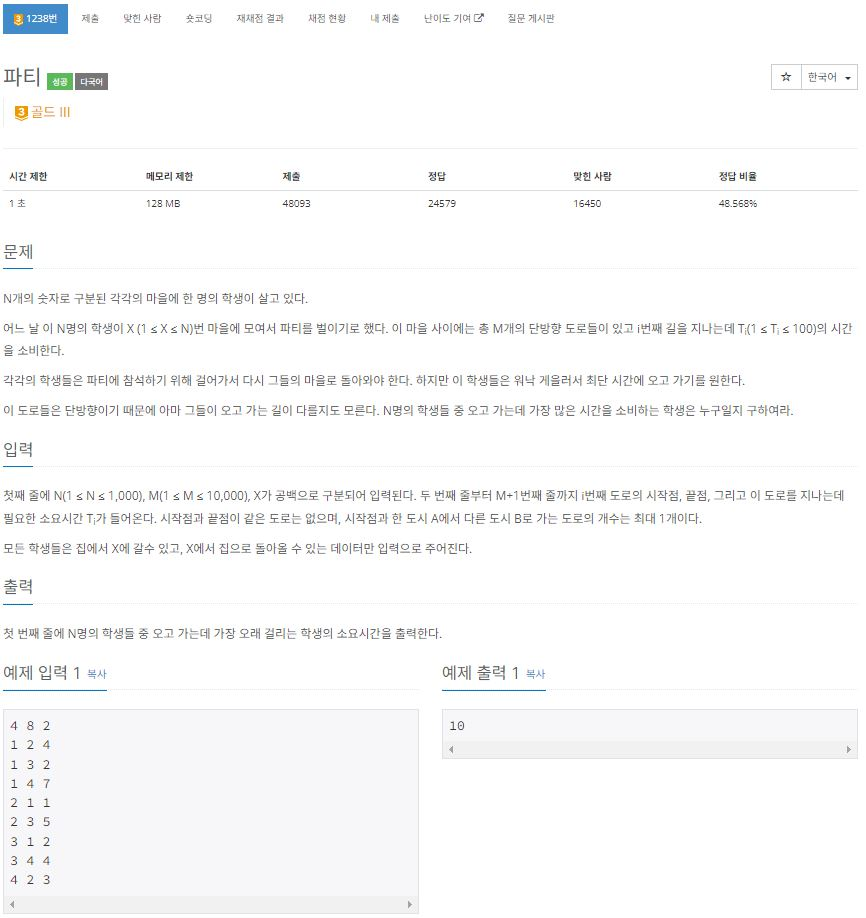

https://www.acmicpc.net/problem/1238

# 🔍 파티
- 설계 시간 : 1min
- 구현 시간 : 197min
- 난이도 : 골드 3
- 알고리즘 : 다익스트라 알고리즘
- 코드 길이 : 2160B
- 실행 시간 : 1004ms(제한 1초)
- 메모리 : 73488KB

------------------------------

# 💡 아이디어

- 딱봐도 다익스트라고 구현만 할 줄 알면 되는 문제로 보임

------------------------------

# 🧠 어려웠던 점

- 다익스트라 구현하는게 어려웠음

------------------------------

# 🧐 좋은 풀이

- 다익스트라를 N + 1번 구해서 풀어야 된다고 생각했는데, 학생 마을에서 X 마을로 가는 간선의 방향을 바꾸면 1 + 1번으로 풀 수 있다고 함
- 시간초과 나거나 4% 테케에서 틀린 사람들도 많은데 다익스트라 코드 잘못짜면 이상해지기(시간복잡도) 쉬워서 공부 잘해야 됨
- 플로이드 워셜은 C++로 한 사람은 좀 있는데 자바도 될지는 모르겠음(시간복잡도 O(N³)인데 N<=1000이라 일반적으로는 어렵다고 함)
