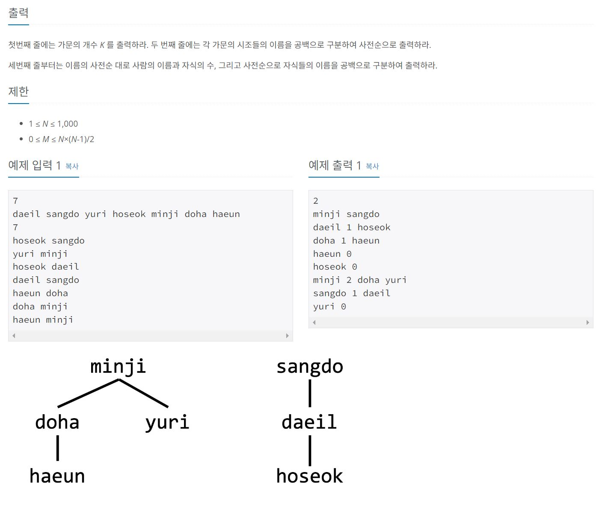

https://www.acmicpc.net/problem/21276

# 🔍 계보 복원가 호석
- 설계 시간 : ? min
- 구현 시간 : ? min
- 난이도 : 골드 3
- 알고리즘 : 위상 정렬 / 해시
- 코드 길이 : 3629B
- 실행 시간 : 816ms(제한 1초)
- 메모리 : 155572KB

------------------------------

# 💡 아이디어

- 딱 보면 위상 정렬 문제인데 조건이 2가지가 있음
  - 연결관계가 조상 -> 후손만 주어짐(부모 -> 자식 포함)
  - 각 노드가 정수(Integer)가 아니라 문자열(String)으로 주어짐

- 일단 각 노드의 부모와 조상을 구분하는게 포인트인데 위상 정렬 과정에서 특정 노드를 꺼내고 다른 노드의 진입차수를 감소시켰을 때, 진입차수가 0이 된 노드가 해당 특정 노드의 자식 노드가 됨
- 문자열을 기준으로 노드들을 구분 및 관리해야 해서 Map을 한번 써봄

------------------------------

# ✔ 문제 풀이

- 아이디어를 그대로 반영하면 됨

- Map은 3가지를 만들어서 사용했음
  - Map<String, PriorityQueue<String>> childMap -> key: 이름 value: 해당 사람의 자식들
  - Map<String, List<String>> descendantMap -> key: 이름 value: 해당 사람의 자손들
  - Map<String, Integer> indegree -> key: 이름 value: 해당 사람의 조상의 수

- Map의 put, get, keySet을 잘 활용하면 됨

- 출력이 약간 귀찮긴한데 천천히 하면 됨

------------------------------

# 🧠 어려웠던 점

- Map을 다루는게 아직 미숙해서 상당히 헤맸다. 
  - 특정 key의 value 갱신
  - value에 Collection 타입 넣어서 처리
- 테케가 엄청 많은거 같은데 다 통과되기 쉽지 않았다. 
- 출력 초과나면 print가 예상보다 더 되거나 덜 된거인듯

------------------------------

# 🧐 좋은 풀이

- 사람마다 풀이가 좀 달라서 직접 풀어보고 비교해봐도 좋을듯
