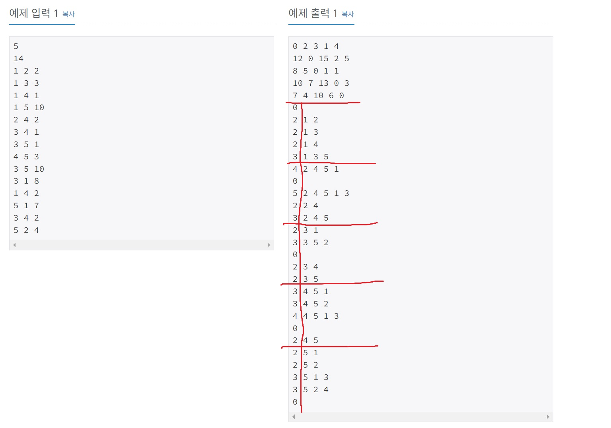

https://www.acmicpc.net/problem/11780

- 출력은 플로이드 워셜 알고리즘의 dp 테이블을 먼저 출력
- 이후 각 도시에 대해 다른 도시로 가는 최단 거리에 포함된 도시의 수 출력(없으면 0 출력)
- 이후 최단 거리로 가는 경로에 포함된 도시들을 순서대로 출력

# 🔍 플로이드 2

- 설계 시간 : ? min
- 구현 시간 : ? min
- 난이도 : 골드 2
- 알고리즘 : 플로이드 워셜 알고리즘
- 코드 길이 : 3212B / 3181B
- 실행 시간 : 404ms(제한 1초) / 380ms(제한 1초)
- 메모리 : 49608KB / 48596KB

---

# 💡 아이디어

- 제목 그대로 플로이드 워셜 알고리즘을 이용해서 푸는 문제로 최단 거리와 최단 경로를 모두 출력해야 하는 문제
- 플로이드 워셜 알고리즘의 dp 테이블로는 최단 거리만 구할 수 있어서 최단 경로를 구하기 위한 dp 테이블을 추가로 만드는게 포인트

---

# ✔ 문제 풀이

- 최단 경로를 구하기 위한 dp 테이블은 2차원으로 초기화
- (i, j)에는 i -> j로 가는 최단 거리에서 i 다음에 방문해야 하는 도시를 저장(리스트 같은 걸로 주렁주렁 연결하는게 아님)

# 🧠 어려웠던 점

- 경로 추적 계열 문제 다 이런 방식이긴한데 아이디어를 떠올리기 쉽지 않다.
- 구현에서 실수하기 쉬운 포인트가 좀 있다.
- 경로 dp 식에 비하면 이해하기 제법 어렵다.

---

# 🧐 좋은 풀이

- before, next 두 가지 다 풀 수 있는데 next가 좀 더 정석인 것 같음
