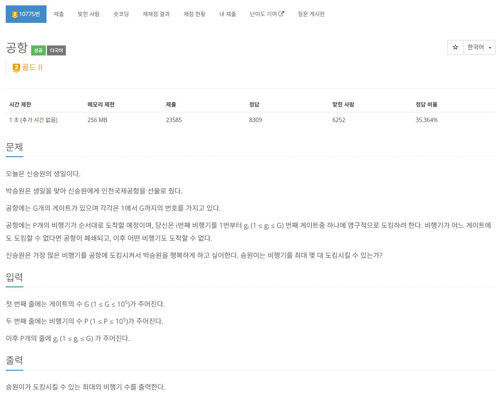
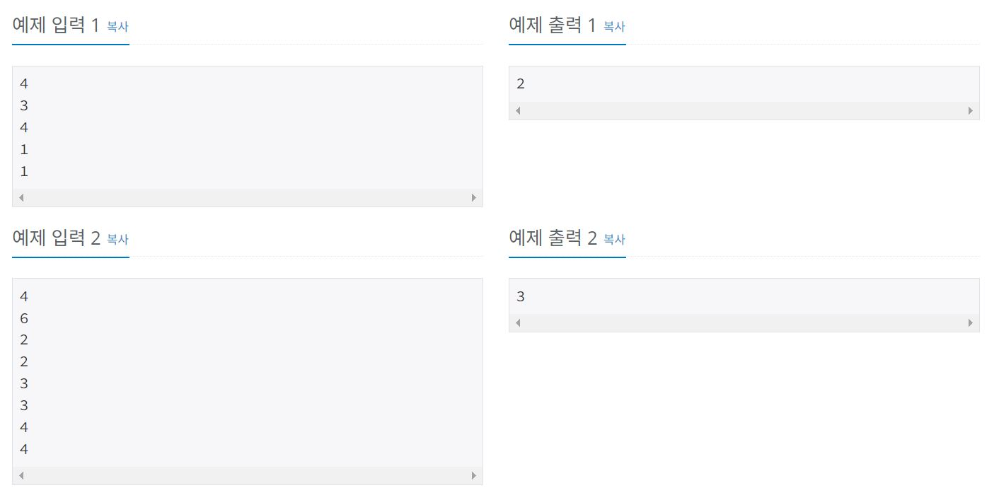
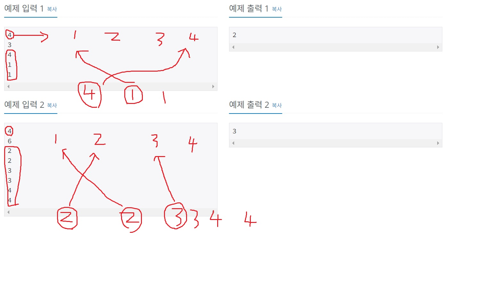

https://www.acmicpc.net/problem/10775

# 🔍 공항

- 설계 시간 : ? min
- 구현 시간 : ? min
- 난이도 : 골드 2
- 알고리즘 : 유니온 파인드 알고리즘
- 코드 길이 : 1399B / 1883B / 934B
- 실행 시간 : 196ms(제한 1초) / 168ms(제한 1초) / 172ms(제한 1초)
- 메모리 : 21768KB / 23420KB / 24844KB

---

# 💡 아이디어

- 딱 생각나는 비행기와 번호가 같은 게이트에 대보고 안되면 옆 게이트에 대보고 이거 반복하는건 시간 초과나서 안됨
- 빠르게 도킹할 수 있는 위치를 찾아야하는데 유니온 파인드 알고리즘을 활용해서 해결할 수 있음
- 약간의 잡기술로 선형 탐색으로 풀 수 있는데 문제가 널널해서 가능한걸로 보임?

---

# ✔ 문제 풀이

- 기본은 비행기는 댈 수 있는 게이트 중 번호가 가장 큰 게이트에 대야 많이 댈 수 있음(앞으로 비행기 번호 = 댈 수 있는 가장 큰 게이트 번호)

1. 풀이 1
   - 잡기술로 시간을 줄인 2중 for문 풀이
   - 번호가 같은 비행기가 들어왔을 때 최근에 같은 번호의 비행기가 도킹한 위치부터 탐색해서 탐색 횟수를 줄임
   - 이게 통과되는게 논란이 있는데 속도 차이 거의 안남
2. 풀이 2
   - 유니온 파인드 알고리즘을 활용하는 정석 풀이
   - 유니온 파인드 알고리즘에서 부모배열은 인덱스에 비행기 번호, 값에 도킹할 수 있는 게이트 번호를 저장(정확히 그룹장 배열이 이렇게 됨)
   - 도킹할 수 있는 게이트는 find-set으로 찾으면 금방 찾을 수 있음
   - union-set만 잘하면 되는데 비행기를 도킹하면 이제 도킹할 수 있는 게이트는 옆 칸이 됨(나중에 find 또 할거라서 결국 상관 없는거 같음)
   - 코드보면 `union(find(n) - 1, find(n));` 은 되고 `union(find(n - 1), find(n));` 은 안되는데 암만 봐도 차이를 모르겠었음;;
3. 풀이 3
   - 풀이 2의 저 코드가 find 한번 더 돌리면 무조건 같은거 같은데 차이를 모르겠어서 풀이들 찾아봄
   - 로직은 거의 같은데 이게 더 정석이고 깔끔한거 같아서 가져옮

# 🧠 어려웠던 점

- 유니온 파인드를 떠올리는 것도 어렵고 떠올려도 푸는 것도 쉽지 않음

---

# 🧐 좋은 풀이
