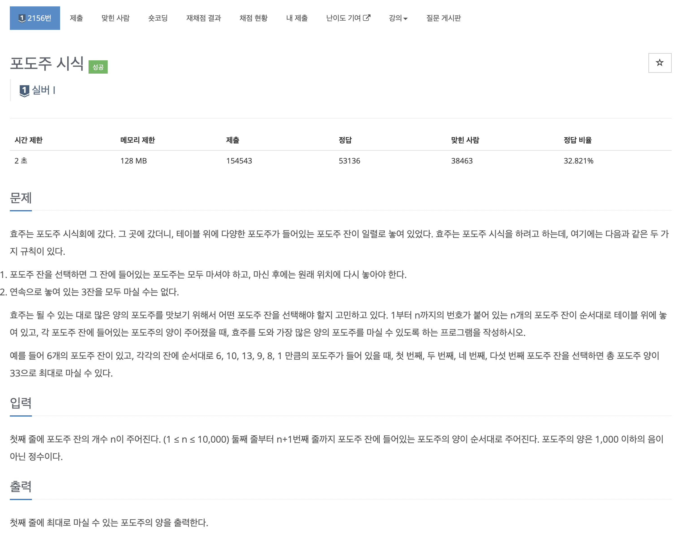
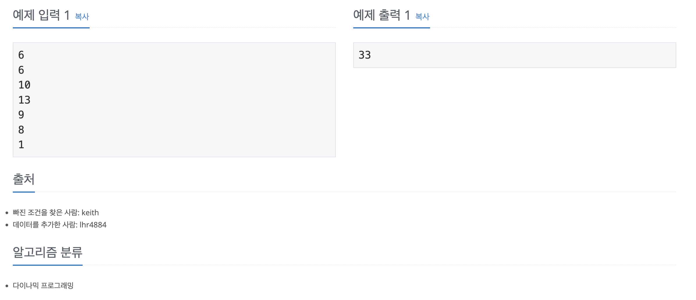

https://www.acmicpc.net/problem/2156

# 🔍 포도주 시식

| 항목      | 내용                     |
| --------- |------------------------|
| 설계 시간 | 15 min                 |
| 구현 시간 | 15 min                 |
| 난이도    | 실버 1                   |
| 알고리즘  | 다이나믹 프로그래밍             |
| 코드 길이 | 609B                   |
| 실행 시간 | 96ms (시간 제한 2초)        |
| 메모리    | 13272KB (메모리 제한 128MB) |

---

# 💡 아이디어

- 다이나믹 프로그래밍으로 간단하게 해결할 수 있다.

---

# ✔ 문제 풀이

포도주를 3잔 연속으로 마실 수 없을 때 마실 수 있는 포도주 양의 최댓값을 구하는 문제다.
dp 배열에는 현재 위치하는 잔까지 주어졌을 때 마실 수 있는 포도주 양의 최댓값을 저장한다.

현재 위치하는 잔까지 주어졌을 때 마실 수 있는 포도주 양의 최댓값은 현재 잔을 마실 때와 미시지 않았을 때로 나눌 수 있다.
1. 현재 잔을 마실 때
- max(현재 잔보다 2칸 전의 잔을 마시고 현재 잔을 마시는 경우, 현재 잔보다 3칸 전의 잔과 현재 잔보다 1칸 전의 잔을 마시고 현재 잔을 마시는 경우)
- 3잔을 연속으로 마실 수 없어서 현재 잔 기준 이전 3개 잔에 대해 경우의 수를 나눈다.

2. 현재 잔을 마시지 않을 때
- 현재 잔보다 1칸 전의 잔을 마시는 경우와 동일

---

# 🧠 어려웠던 점

- 점화식은 계단 오르기 문제와 같은 원리라서 금방 생각했는데 2%에서 계속 오답이 나왔다.
- 처음에는 dp 배열이 현재 잔을 마셨을 때 최댓값을 저장하는 방식으로 구현했는데 현재 잔을 마시지 않는 경우도 고려해야했다.

ex)
6
1
1
0
0
1
1

ans : 4

---

# 🧐 좋은 풀이
