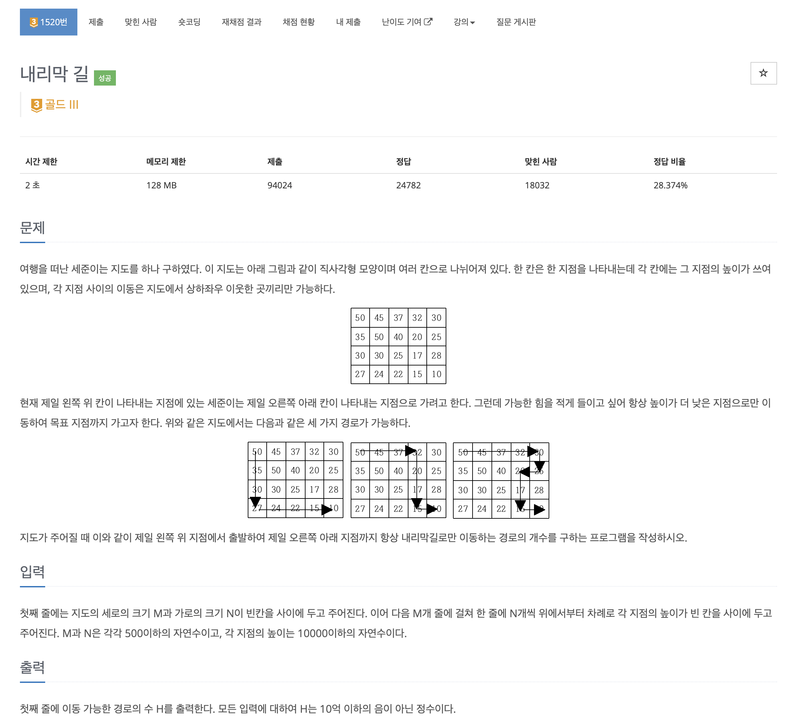

https://www.acmicpc.net/problem/1520

# 🔍 내리막 길

| 항목      | 내용                     |
| --------- |------------------------|
| 설계 시간 | 30 min                 |
| 구현 시간 | 30 min                 |
| 난이도    | 골드 3                   |
| 알고리즘  | 다이나믹 프로그래밍 / 깊이 우선 탐색  |
| 코드 길이 | 1463B                  |
| 실행 시간 | 284ms (시간 제한 2초)       |
| 메모리    | 39472KB (메모리 제한 128MB) |

---

# 💡 아이디어

- 깊이 우선 탐색 + 다이나믹 프로그래밍으로 해결할 수 있다.

---

# ✔ 문제 풀이

지도의 맨 왼쪽 맨 위에서 맨 오른쪽 맨 아래로 내리막 길로만 이동하는 경로의 개수를 구해야 한다.
경로는 상하좌우로 이어질 수 있어서 각각의 위치에서 상하좌우를 모두 고려해야했다.

점화식은 현재 위치(r, c)에서 도착 지점(M-1, N-1)으로 갈 수 있는 경로의 개수는 현재 위치의 상하좌우에 위치한 내리막 길에서 도착 지점으로 갈 수 있는 경로의 개수의 합이다.
이를 현재 위치에서 도착 지점으로 갈 수 있는 경로의 개수를 반환하는 dfs로 구현했고 종료 조건은 도착지점에 도착하면 경로를 하나 세어주는 방식으로 구현했다.

여기까지 구현하면 정답은 맞는데 시간초과가 발생해서 다이나믹 프로그래밍으로 최적화를 해줬다.
최적화는 지도와 같은 크기의 2차원 dp 배열을 만들고 dp 배열에는 경로의 개수를 저장한다.
이후 재귀 과정에서 dp 배열은 먼저 체크해서 경로의 개수가 저장된 위치면 경로의 개수를 바로 반환하고 저장되지 않았으면 경로의 개수를 저장시키고 반환하면 된다.
여기서 dp 배열을 최초 0으로 초기화하고 dp 배열이 0이 아니면 dp 배열의 값을 반환하도록 하면 불가능한 경로(해당 위치에서 도착 지점 방문 불가)에 대한 최적화가 안되서 dp 배열을 -1로 초기화해줬다.(방문체크느낌)

---

# 🧠 어려웠던 점

- 40%에서 시간 초과가 계속 발생했는데 불가능한 경로에 대한 최적화가 안되는걸 찾기가 어려웠다. 메모이제이션을 이용해서 방문 체크 배열이 필요없다고 생각했는데 초기화 과정에서 문제가 있었다.

---

# 🧐 좋은 풀이
