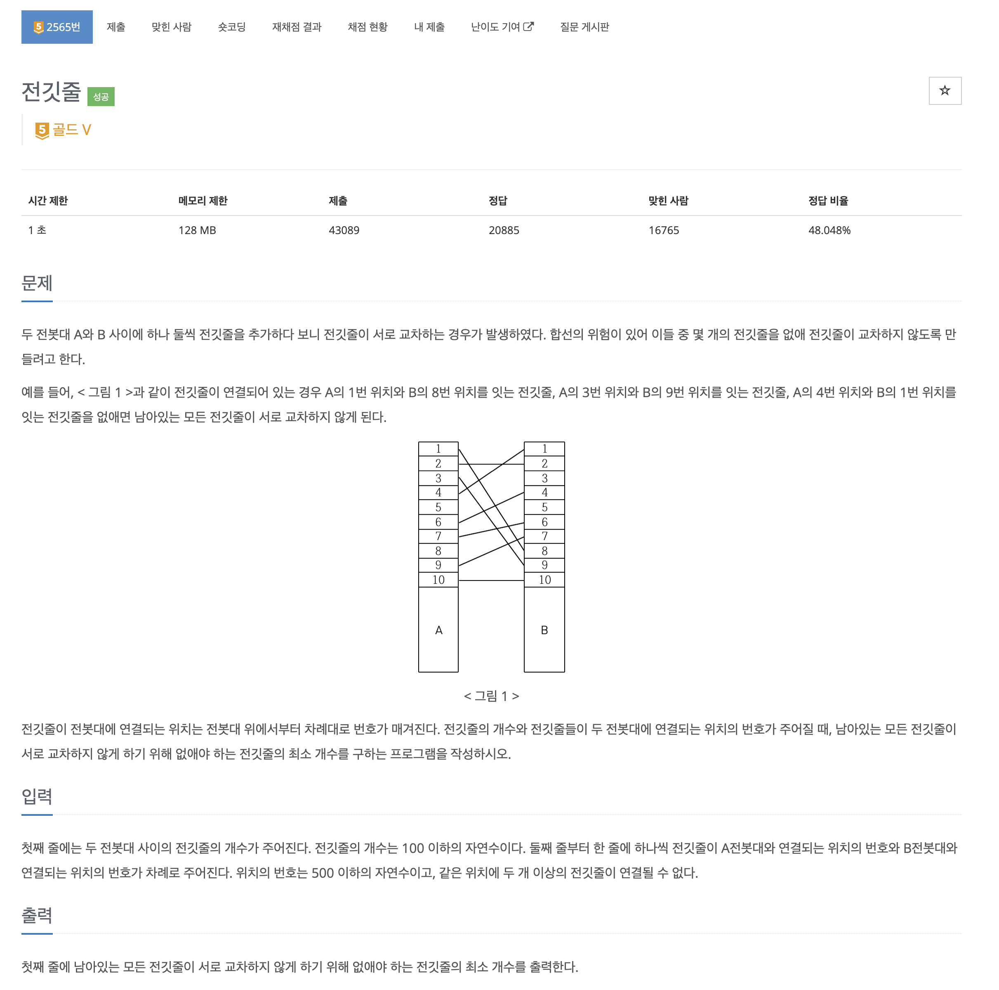

https://www.acmicpc.net/problem/2565

# 🔍 전깃줄

| 항목      | 내용                     |
| --------- |------------------------|
| 설계 시간 | 30 min                 |
| 구현 시간 | 30 min                 |
| 난이도    | 골드 5                   |
| 알고리즘  | 다이나믹 프로그래밍, LIS        |
| 코드 길이 | 960B                   |
| 실행 시간 | 188ms (시간 제한 1초)       |
| 메모리    | 18276KB (메모리 제한 128MB) |

---

# 💡 아이디어

- LIS 알고리즘으로 해결할 수 있다.

---

# ✔ 문제 풀이

- 전깃줄을 A 전봇대를 기준으로 위에서부터 번호를 매겼을 때 전깃줄이 교차하지 않는 상태는 전깃줄의 순서가 커질수록 B 전봇대에서의 위치가 같이 커져야 한다.
- 이를 활용해 A 전봇대 위치를 기준으로 정렬한 후 B 전봇대에서의 위치에 대한 LIS를 구하면 이 값이 서로 교차되지 않고 연결될 수 있는 최대 전깃줄의 수이다.
- 문제는 없애야할 전깃줄의 최소 개수를 구해야하므로 처음 주어진 전깃줄의 수에서 LIS의 크기를 뻬주면 된다.

---

# 🧠 어려웠던 점

- LIS 개념의 문제라는 것을 캐치하는게 좀 어려웠다.

---

# 🧐 좋은 풀이
