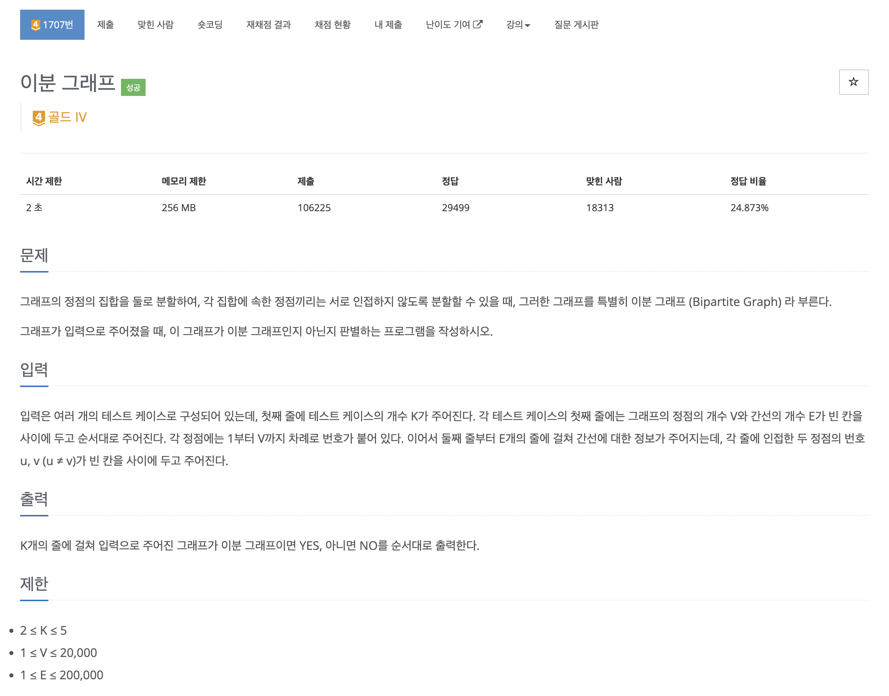

https://www.acmicpc.net/problem/1707

# 🔍 이분 그래프

| 항목      | 내용                      |
| --------- |-------------------------|
| 설계 시간 | 30 min                  |
| 구현 시간 | 30 min                  |
| 난이도    | 골드 4                    |
| 알고리즘  | BFS                     |
| 코드 길이 | 2508B                   |
| 실행 시간 | 828ms (시간 제한 2초)        |
| 메모리    | 286484KB (메모리 제한 256MB) |

---

# 💡 아이디어

- BFS와 방문 체크 응용으로 해결할 수 있다.

---

# ✔ 문제 풀이

- 이분 그래프의 조건이 정점을 두 집합으로 분할했을 때, 각 집합의 정점끼리는 서로 인접하지 않아야 한다.(그래프가 두 개로 쪼개지는거 아님)
- 두 집합에 대해 한 집합의 정점을 빨간색, 다른 집합의 정점을 검은색으로 칠한다고 생각하면 이분 그래프를 만족하려면 빨간색과 검정색이 퐁당퐁당 나오는 그래프가 되면 된다.
- 구현은 BFS를 활용해서 그래프를 탐색하며 번갈아 색깔을 칠해주고 같은 색이 인접하게 칠해지는 경우 이분 그래프가 아닌 것으로 판단했다.
- 색을 칠하는 것이 방문 체크가 되므로 방문안한 노드를 WHITE, 색이 칠해진 노드는 RED 또는 BLACK으로 생각하고 BFS에서 큐 전체를 비울때마다 색을 바꿔주는 방식으로 구현했다.

---

# 🧠 어려웠던 점

- 그래프와 집합이 나와서 유니온 파인드 알고리즘으로 해보려했는데 아이디어가 잘 떠오르지 않았다.
- 처음엔 사이클이 있으면 이분 그래프가 아닌 것으로 생각했는데 사이클의 존재를 찾는 방법을 찾기도 어려웠고 짝수 크기의 사이클은 이분 그래프가 가능해서 포기했다.(홀수 사이클을 찾는 문제인듯?)
- 주어진 그래프가 한 덩어리가 아닌 케이스가 있는데 문제 조건에 안써있어서 찾기 어려웠다.(테스트 케이스 47% 쯤)

---

# 🧐 좋은 풀이
