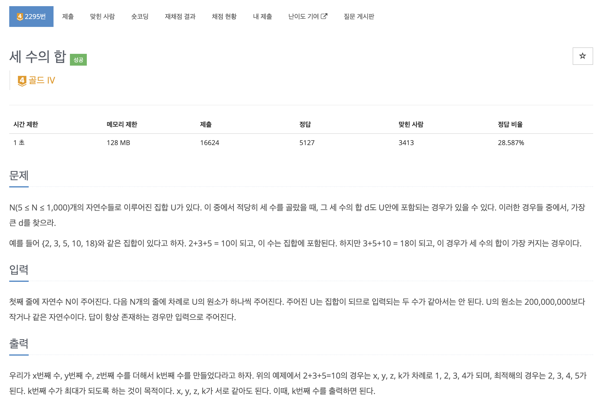
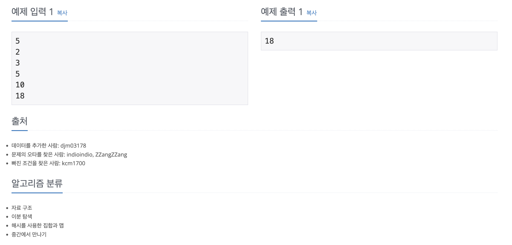

https://www.acmicpc.net/problem/2295

# 🔍 세 수의 합

| 항목      | 내용                         |
| --------- |----------------------------|
| 설계 시간 | 60 min                     |
| 구현 시간 | 30 min                     |
| 난이도    | 골드 4                       |
| 알고리즘  | 해시셋, 이분 탐색, 중간에서 만나기(MITM) |
| 코드 길이 | 834B                       |
| 실행 시간 | 304ms (시간 제한 1초)           |
| 메모리    | 44996KB (메모리 제한 128MB)     |

---

# 💡 아이디어

- x + y + z = k 를 x + y = k - z 로 바꿔서 해결했다.

---

# ✔ 문제 풀이

- N이 최대 1000이어서 O(N^3) 풀이는 안된다.
- 포인트는 O(N^3) 풀이를 O(N^2) 여러개로 쪼개는 느낌으로 두 수의 합을 별도의 자료구조로 저장한 후(O(N^2)) 두 수의 차를 구하며(O(N^2)) 이 차가 두 수의 합에 존재하는 지 찾는 방식으로 구할 수 있다. 
- 두 수 x와 y의 합은 HashSet에 저장했고 두 수의 차 k - z를 2중 for문을 돌며 구해서 k - z가 HashSet에 존재할 때 해당 값에 z 만 더해주면 된다.
- 배열을 정렬하고 구하면 처음 찾은 수가 최대가 된다.

---

# 🧠 어려웠던 점

- O(N^3) 을 쪼개는 과정이 어려웠는데 처음엔 투 포인터 알고리즘인줄 알고 많이 절었다.
- 알고리즘 분류를 확인하고 중간에서 만나기 알고리즘이라고 나와서 구글링했는데 뭔지 잘 모르겠다.
- 일반적인 풀이로 푼 사람들 아이디어 참고해서 풀었는데 생각보다 어려운 문제라 느껴졌다.

---

# 🧐 좋은 풀이

- 두 수의 합을 HashSet에 저장하고 찾는게 배열이나 리스트에 저장하고 이분 탐색하는 코드들보다 좋다고 생각했는데 막상 오히려 느린거 같기도 해서 둘 다 참고해보면 좋을 듯