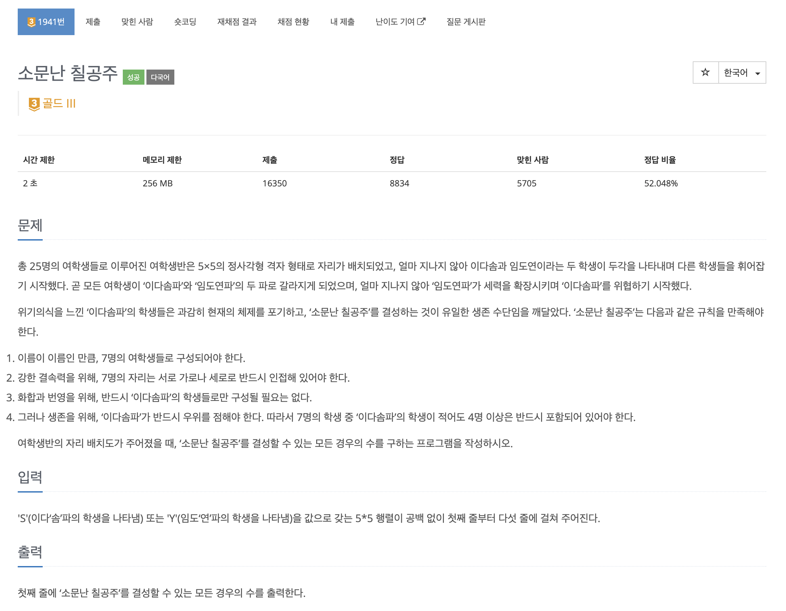
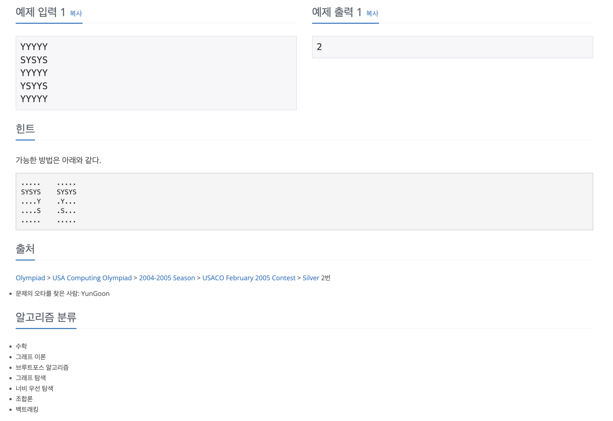

https://www.acmicpc.net/problem/1941

# 🔍 소문난 칠공주

| 항목      | 내용                               |
| --------- |----------------------------------|
| 설계 시간 | 60 min                           |
| 구현 시간 | 30 min                           |
| 난이도    | 골드 3                             |
| 알고리즘  | 조합, BFS, 비트마스크                   |
| 코드 길이 | 2037B / 2230B                    |
| 실행 시간 | 404ms / 280ms (시간 제한 2초)         |
| 메모리    | 243020KB, 66968KB (메모리 제한 256MB) |

---

# 💡 아이디어

- 기본은 조합과 BFS의 활용으로 구할 수 있고 입력의 크기가 작아서(60 이하) 비트마스킹을 활용해 볼 수도 있다.

---

# ✔ 문제 풀이

- 입력이 5 * 5로 아주 작아서 완전탐색으로 먼저 접근했다.
- 처음엔 dfs로 백트래킹하며 풀려고 했는데 문제 아래 힌트의 2번째 그림처럼 삼발이로 이어진 케이스를 dfs로 구할 수 없을 것 같아서 접었다. 추가로 중복 경로가 나올거 같은데 구분을 못할 거 같았다.

- 다음엔 조합을 활용해서 7명의 조합을 전부 구하고 BFS로 탐색하며 가능한 케이스의 개수를 세는 방향으로 접근했다.
- 25C7 정도면 할만한 연산이어서 맵의 위치를 0부터 24의 숫자로 매핑시켜 조합을 구하고 check 메서드에서 이다솜파가 더 많은 것을 확인 후 BFS에 들어갔다.
- BFS는 7명이 전부 가로세로로 붙어있는지만 판단하는 메서드로 방문체크와 조합으로 구한 7명인 경우에만 Queue에 넣는 등 약간 구현이 귀찮았다.

- 비트마스킹은 0부터 24까지의 수 중 7개를 뽑는 조합이면 굳이 배열이 아니라 하나의 int형 정수로도 표현이 가능해서 활용해보려고 했다.
- 일단 직접 구현은 어지러워서 GPT의 도움을 받아서 구현이 가능한 것과 내 코드 기준 조합 + BFS 보다 1.5배 빠른 것, 25% 메모리 사용 정도만 확인했다.

---

# 🧠 어려웠던 점

- 순열과 조합 시리즈를 쌩으로 쓰는 문제가 오랜만이라 의심을 많이 했다.
- 코드를 깔끔하게 짜는게 좀 어려웠다.
- 2차원 배열로만 구현을 짜면 조합으로 구한 값인지 비교하는 과정 등에서 equals가 깔끔하지 않아서 1차원 배열로 변환하는 과정이 필요했는데 약간 구현이 어지러웠다.

---

# 🧐 좋은 풀이
