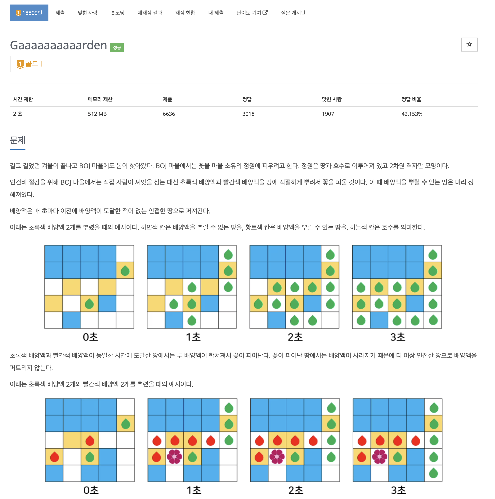
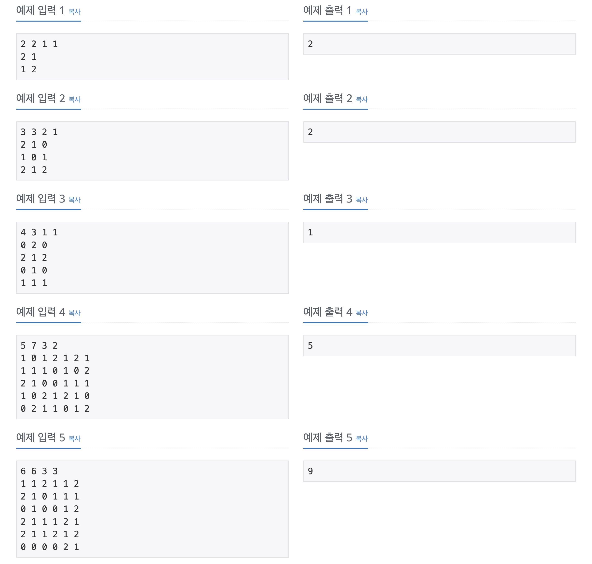
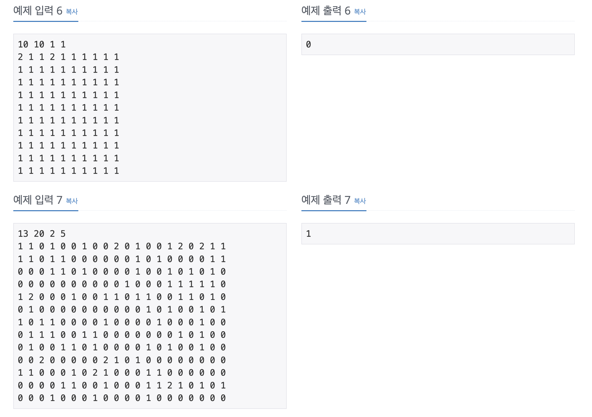
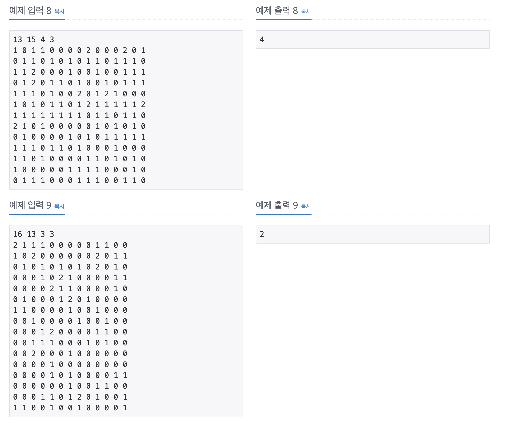
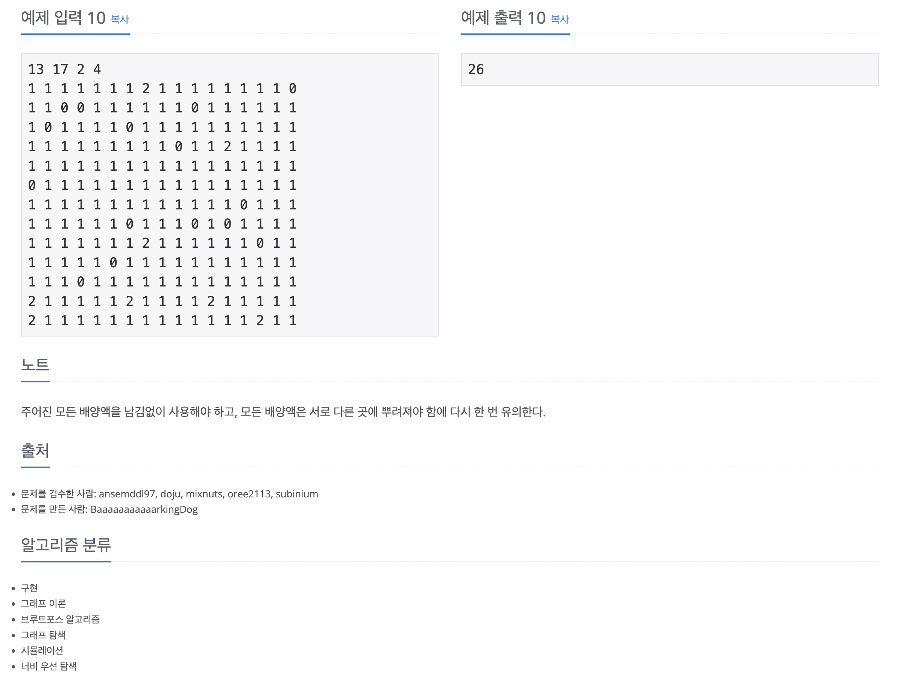

https://www.acmicpc.net/problem/18809

# 🔍 Gaaaaaaaaaarden

| 항목      | 내용                     |
| --------- |------------------------|
| 설계 시간 | min                    |
| 구현 시간 | min                    |
| 난이도    | 골드 1                   |
| 알고리즘  | 시뮬레이션, 조합, BFS         |
| 코드 길이 | 1661B                  |
| 실행 시간 | 184ms (시간 제한 2초)       |
| 메모리    | 14988KB (메모리 제한 512MB) |

---

# 💡 아이디어

- 조합을 활용한 완전 탐색 + BFS로 해결할 수 있다.

---

# ✔ 문제 풀이

- 배양액을 뿌릴 수 있는 황토색 칸은 최대 10개에 각 배양액의 개수도 최대 5개로 조합을 통해 구할 수 있을만큼 충분히 작다.
- 조합을 두 배양액에 대해 수행하는 점이 조금 까다로운데 황토색 칸 중 초록색 배양액을 넣을 칸을 조합으로 뽑고 다시 남은 황토색 칸 중 빨간색 배양액을 넣을 칸을 조합으로 뽑았다.
- 이후 BFS로 꽃의 개수를 세면 되는데 약간 시뮬레이션 틱한 구현이 필요했다.

---

# 🧠 어려웠던 점

- 조합 + 조합을 구현하는게 꽤 어려웠다.
- 시간 초과가 계속나는데 이유를 못찾아서 오래 걸렸는데 시뮬레이션에서 조건 처리 미흡으로 큐에 무한대로 쌓이는 문제가 있었다. 질문 게시판 테케로 알았다.
- 시뮬레이션 구현도 좀 어려웠는데 처음에 배양액 별로 큐를 각각 써서 구현하다 큐를 하나로 합쳤는데 조건처리가 까다로웠다. 지금도 마음에 안든다.

---

# 🧐 좋은 풀이
