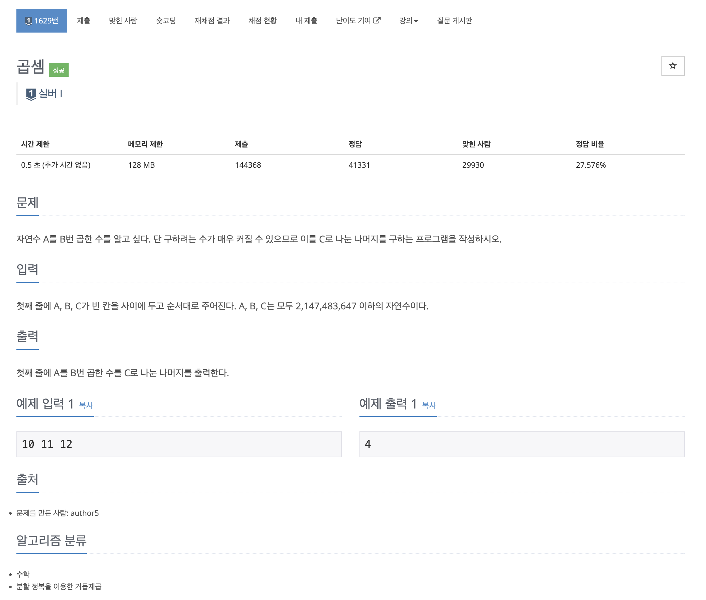

https://www.acmicpc.net/problem/1629

# 🔍 곱셈

| 항목      | 내용                     |
| --------- |------------------------|
| 설계 시간 | 15 min                 |
| 구현 시간 | 15 min                 |
| 난이도    | 실버 1                   |
| 알고리즘  | 재귀, 분할정복               |
| 코드 길이 | 704B                   |
| 실행 시간 | 68ms (시간 제한 0.5초)      |
| 메모리    | 11444KB (메모리 제한 128MB) |

---

# 💡 아이디어

- A^B = A^(B/2) * A^(B/2)

---

# ✔ 문제 풀이

- A, B, C 모두 int형 범위 최댓값까지 주어질 수 있어서 그냥 맘편히 long으로 선언했다.
- B가 작으면 A^B = A^(B-1) * A 로 재귀를 통해 구할 수 있는데 이 문제는 B가 커서 아이디어처럼 분할정복으로 해결해야 한다.
- 계산과정에서 B가 홀수면 정수 나눗셈의 버림 처리가 생겨서 이를 고려해야하고 재귀 결과의 곱셈 과정에서 long 오버플로우도 발생할 수 있어서 주의해서 구현했다.

---

# 🧠 어려웠던 점

- 처음엔 half 변수 없이 바로 재귀를 반환하게 짰는데 시간 초과가 발생했다.
- 암만봐도 이렇게 푸는건데 이상해서 찾아보니 half 없이 두 재귀 함수의 곱을 리턴하는건 두 재귀 함수를 각각 계산해서 중복 계산이 발생해서 느리다고 나왔다.

---

# 🧐 좋은 풀이
