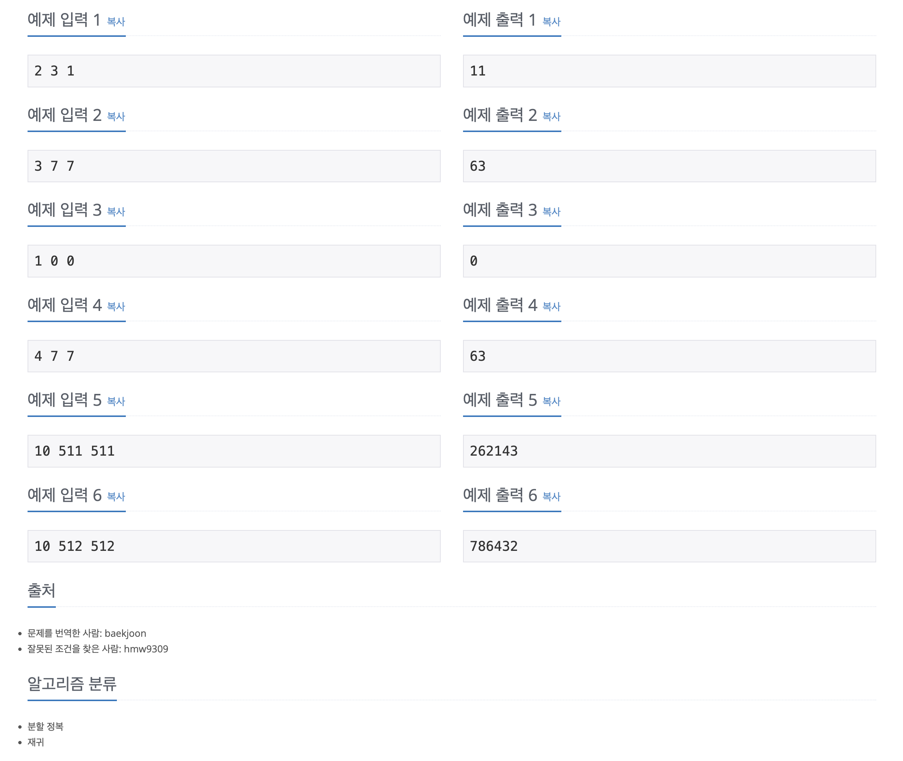

https://www.acmicpc.net/problem/1074

# 🔍 Z

| 항목      | 내용                     |
| --------- |------------------------|
| 설계 시간 | 45 min                 |
| 구현 시간 | 30 min                 |
| 난이도    | 골드 5                   |
| 알고리즘  | 재귀                     |
| 코드 길이 | 1205B                  |
| 실행 시간 | 640ms (시간 제한 0.5초)     |
| 메모리    | 11556KB (메모리 제한 512MB) |

---

# 💡 아이디어

- 재귀 함수를 통해 r행 c열을 추적해가며 찾으면 해결할 수 있다.

---

# ✔ 문제 풀이

- 그림에서 Z 모양 탐색이 프렉탈처럼 나타나서 재귀로 풀어야겠다라는 힌트를 바로 얻을 수 있다.
- 구현이 약간 까다로웠는데 재귀 함수에서는 현재 바라보는 사각형의 왼쪽 위, 오른쪽 아래 두 점의 좌표와 정답, 현재 바라보는 사각형의 크기를 파라미터로 받았다.
- 재귀 과정은 현재 바라보는 사각형의 왼쪽 위 점이 (r, c)가 될 때까지 반복했다.
- 사각형의 크기는 재귀 과정마다 4분의 1이 되고 정답은 작아진 사각형의 크기를 몇 개 더하냐로 정해진다.

---

# 🧠 어려웠던 점

- 모든 r, c의 값을 구하는 완전탐색처럼 풀면 시간초과가 발생했다. 특정 포인트만 타겟으로 찾아야 했다.
- dp로 푸는건가 했는데 점화식 찾는 것도 어려웠고 2차원 배열의 크기가 너무 커져서 메모리 초과가 발생했다.

---

# 🧐 좋은 풀이
