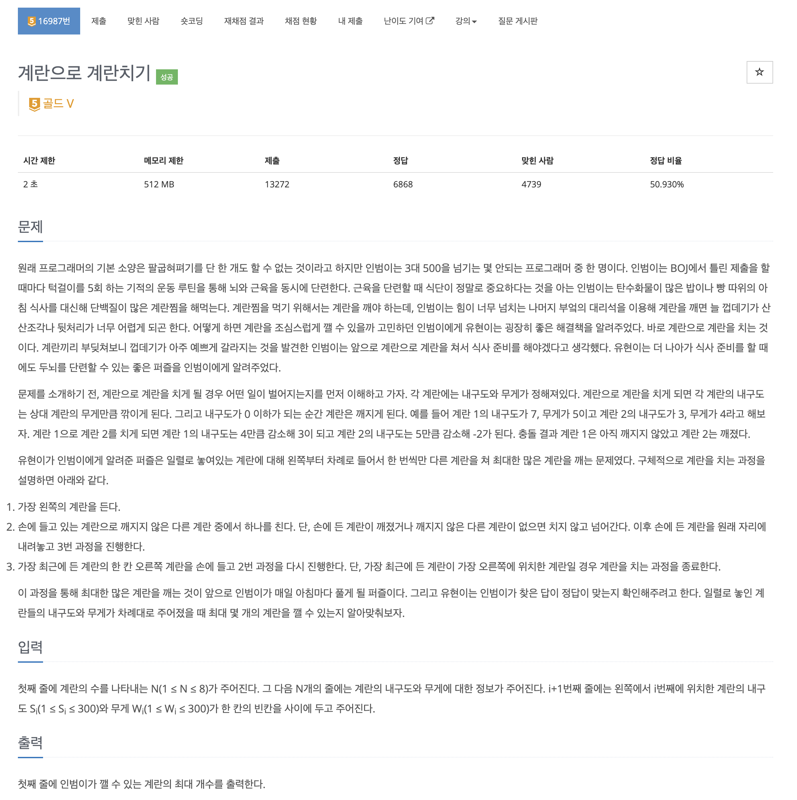
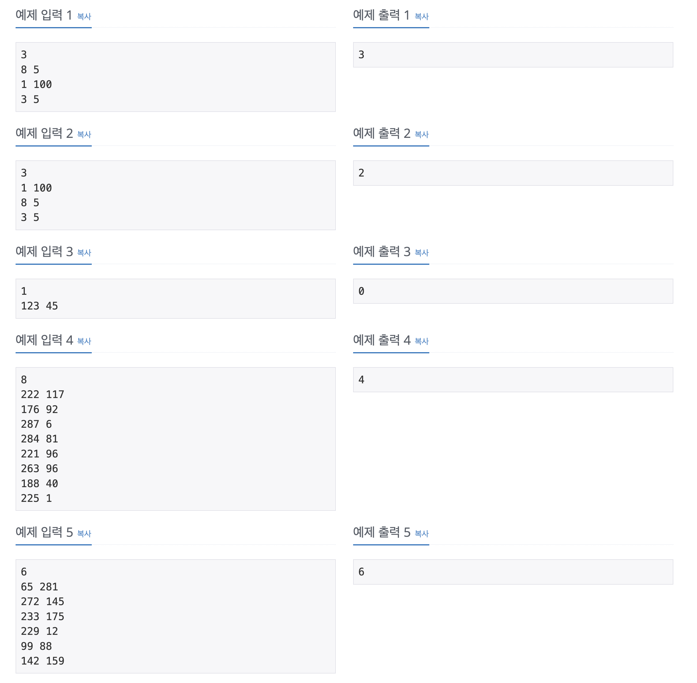
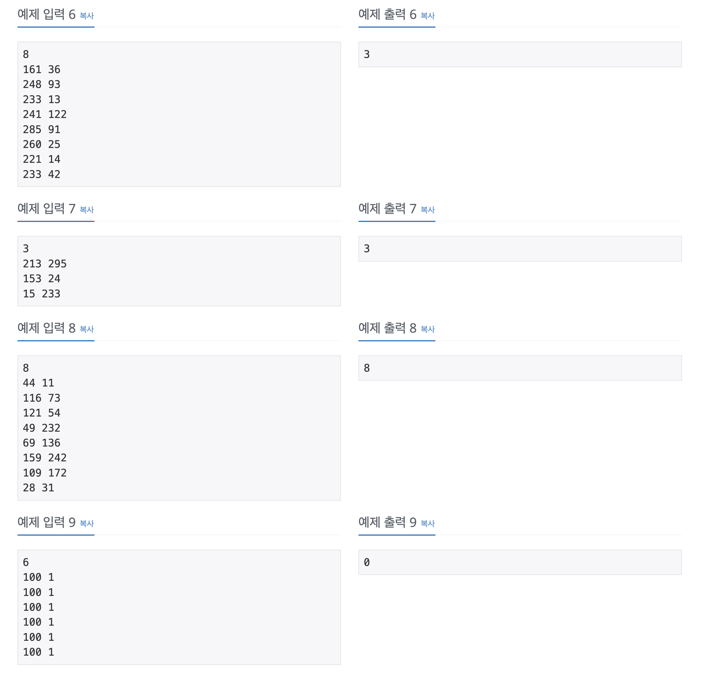

https://www.acmicpc.net/problem/1074

# 🔍 계란으로 계란치기

| 항목      | 내용                     |
| --------- |------------------------|
| 설계 시간 | 60 min                 |
| 구현 시간 | 60 min                 |
| 난이도    | 골드 5                   |
| 알고리즘  | 재귀, 브루트포스, 백트래킹        |
| 코드 길이 | 1661B                  |
| 실행 시간 | 184ms (시간 제한 2초)       |
| 메모리    | 14988KB (메모리 제한 512MB) |

---

# 💡 아이디어

- 재귀 함수를 통한 완전 탐색 + 백트래킹으로 풀 수 있었다.

---

# ✔ 문제 풀이

- solve 메서드에서 selIdx는 현재 손에 들 예정인 계란, i는 칠 예정인 계란이다.
- 기본 뼈대는 중복 순열 베이스로 구현했다.

---

# 🧠 어려웠던 점

- N이 아주 작아서 완전탐색 계열인 것 같았는데 혹시 그리디나 dp 계열인가 의심하느라 시간이 좀 걸렸다.
- 처음엔 중복 순열로 경우의 수를 다 구하고 시뮬레이션을 돌렸는데 거의 2000ms가 나와서 중복 순열에 시뮬레이션을 합치면서 백트래킹을 적용했는데 이게 좀 빡셌다.

---

# 🧐 좋은 풀이
