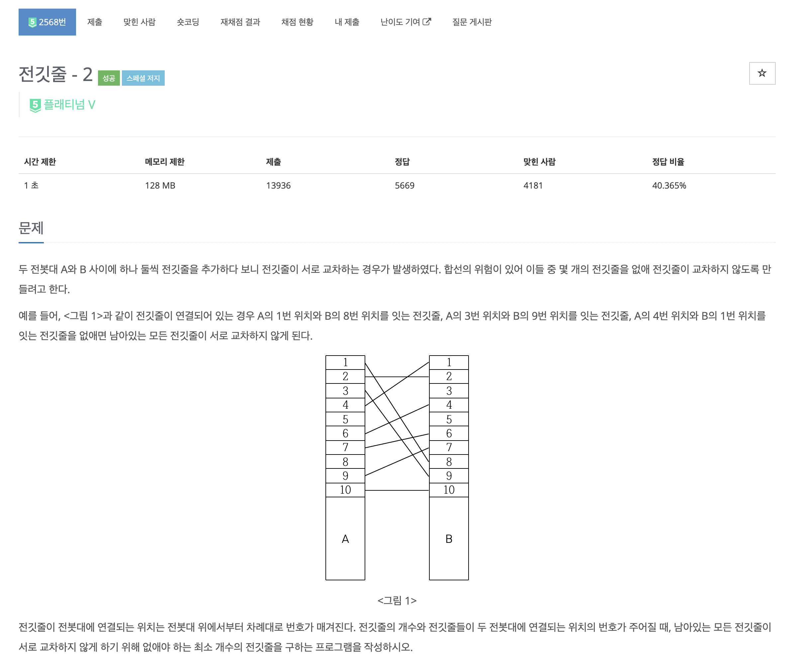
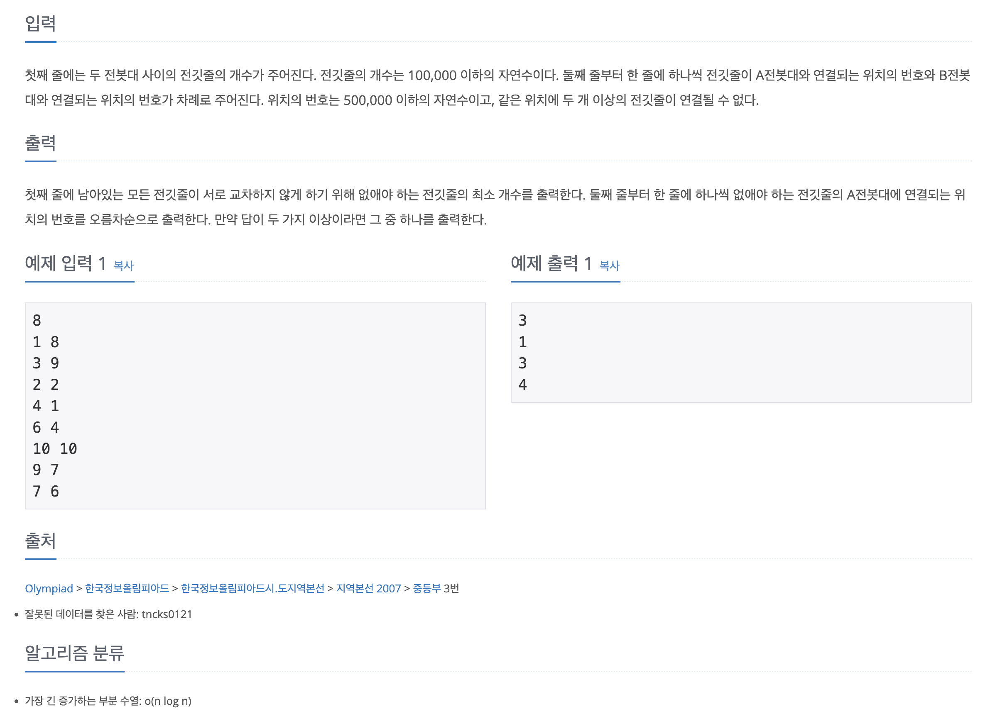

https://www.acmicpc.net/problem/2568

# 🔍 전깃줄 - 2

| 항목      | 내용                     |
| --------- |------------------------|
| 설계 시간 | 30 min                 |
| 구현 시간 | 30 min                 |
| 난이도    | 플래티넘 5                 |
| 알고리즘  | LIS, 다이나믹 프로그래밍, 이분 탐색 |
| 코드 길이 | 1818B                  |
| 실행 시간 | 592ms (시간 제한 1초)       |
| 메모리    | 59508KB (메모리 제한 128MB) |

---

# 💡 아이디어

- 이분 탐색을 활용한 O(N log N) 시간복잡도 LIS 알고리즘과 배열을 활용한 경로복원으로 해결할 수 있다.

---

# ✔ 문제 풀이

- 두 전봇대에서 전깃줄이 교차하지 않게 없애는 최소 개수를 구하는 문제로 전깃줄이 교차하지 않는 상황을 상상해보면 A 전봇대의 1번 위치부터 아래로 전깃줄을 살펴보며 해당 전깃줄이 연결된 B 전봇대의 위치를 봤을 때 전부 오름차순이어야 함을 알 수 있다.
- 이는 LIS 문제이므로 이제 구현만 하면 되는데 기존의 전깃줄 문제는 O(N^2)의 다이나믹 프로그래밍을 활용한 LIS로 해결이 가능했지만 이 문제는 범위가 커서 이분 탐색을 활용한 LIS로 해결해야 했다.(https://www.acmicpc.net/problem/2565)

- 구현은 [N][2] 의 2차원 배열로 입력을 받은 후 A 전봇대의 전깃줄의 위치에 대해 정렬을 수행했을 때 B 전봇대의 전깃줄의 위치의 LIS를 구하는 문제가 됐다.
- dp 배열은 Lower Bound 이분 탐색으로 전깃줄이 들어갈 수 있는 위치를 저장했다. 이를 통해 dp 배열의 index 위치에는 길이가 index의 숫자와 동일한 LIS의 마지막 수가 저장되고 dp 배열의 길이는 LIS의 길이가 된다.
- before 배열은 dp 배열에 저장된 인덱스를 저장했는데 dp 배열의 인덱스가 LIS의 길이이므로 before 배열의 값들은 특정 전깃줄을 포함하는 LIS 길이가 된다.

- 이를 통해 LIS를 구해서 전체 전깃줄에서 빼면 없애야 할 전깃줄의 수를 구할 수 있고 before 배열을 역순으로 돌며 len과 일치하지 않는 전깃줄은 Stack에 넣고 일치하는 전깃줄을 발견하면 Stack에 넣지 않고 len-1을 해주면 없애야 할 전깃줄의 숫자도 얻을 수 있다.

---

# 🧠 어려웠던 점

- 전깃줄의 숫자를 before 배열로 역추적하며 찾는 과정을 O(N)으로 구현했는데 약간 더 최적화가 되지 않을까했다. 보통 경로 추적은 경로의 길이가 R이면 O(R)로 찾는게 일반적이라 생각해서 도전했는데 안됐다.
- 오랜만에 이분탐색 LIS라 구현에서 좀 어지러웠다. dp 배열 앞에 패딩으로 인덱스와 LIS 길이 맞추기, 이분 탐색 left=1 right=배열길이+1은 그냥 외워야겠다.

---

# 🧐 좋은 풀이
