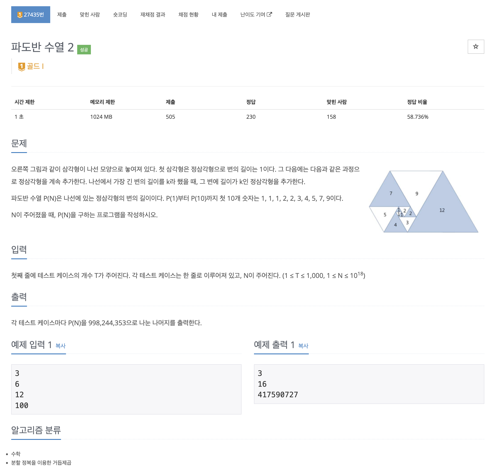
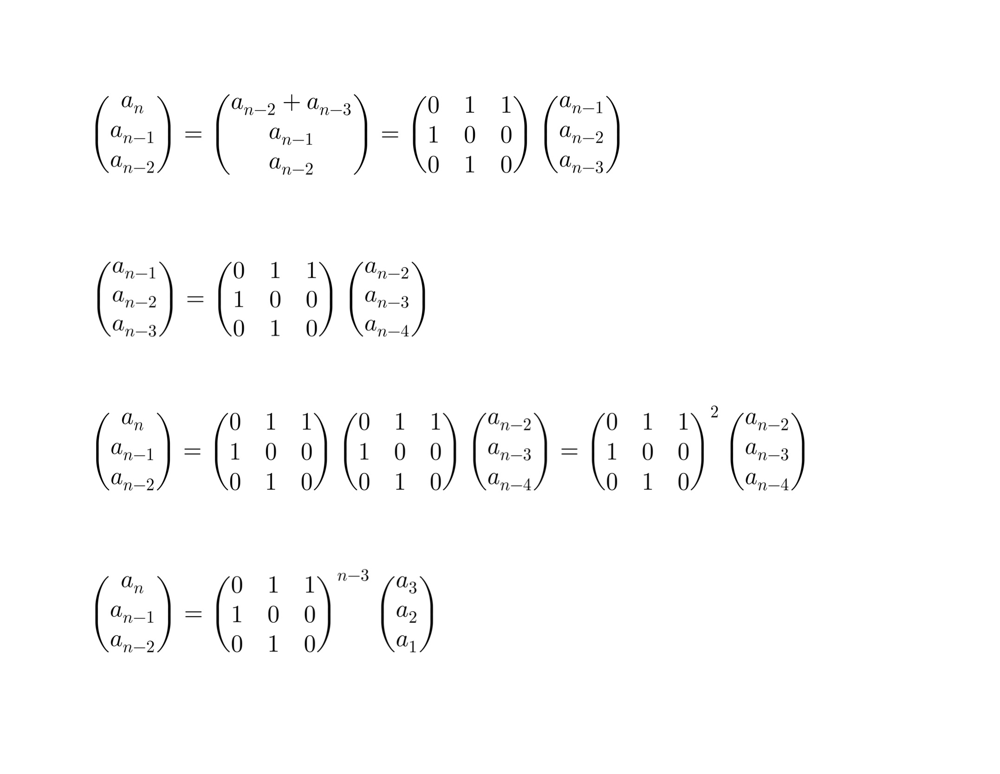

https://www.acmicpc.net/problem/27435

# 🔍 파도반 수열 2

| 항목      | 내용                      |
| --------- |-------------------------|
| 설계 시간 | 60 min                  |
| 구현 시간 | 60 min                  |
| 난이도    | 골드 1                    |
| 알고리즘  | 수학, 분할정복을 이용한 거듭제곱      |
| 코드 길이 | 1551B                   |
| 실행 시간 | 244ms (시간 제한 1초)        |
| 메모리    | 32996KB (메모리 제한 1024MB) |

---

# 💡 아이디어

- 점화식의 행렬 변환 + 재귀를 이용한 거듭제곱 분할 정복으로 해결할 수 있다.
- 같은 시리즈 파도반 수열 문제에서 N의 범위만 커진 케이스로 해당 문제에서 `a(n) = a(n-2) + a(n-3)` 또는 `a(n) = a(n-1) + a(n-5)` 이라는 점화식을 도출할 수 있다.

---

# ✔ 문제 풀이

- N의 범위가 매우 커서 배열을 활용한 풀이나 선형 풀이는 시간과 메모리 제한으로 해결할 수 없다.
- 포인트는 크게 두 가지로 일단 N에 대한 log 풀이를 떠올리는 것과 점화식을 행렬로 표현할 수 있는 점을 활용해야 했다.
- 사진처럼 점화식은 잘 어떻게 하면 행렬의 거듭제곱으로 표현할 수 있는데 이때 행렬의 거듭제곱을 재귀를 통한 분할정복으로 풀어내면 해결할 수 있다.

---

# 🧠 어려웠던 점

- N의 크기때문에 점화식에서 일반항을 도출하는 문제인줄 알았는데 모르겠어서 문제 유형을 봤다가 거듭제곱이라 써있는걸 보고 그냥 점화식에서 거듭제곱이 왜 나왔는지 검색을 해보고 행렬을 활용하는걸 알게되었다. 모르면 당하는 유형이었다.
- 단순 거듭제곱 문제보다 재귀 구현이 꽤 까다로웠다.

---

# 🧐 좋은 풀이
