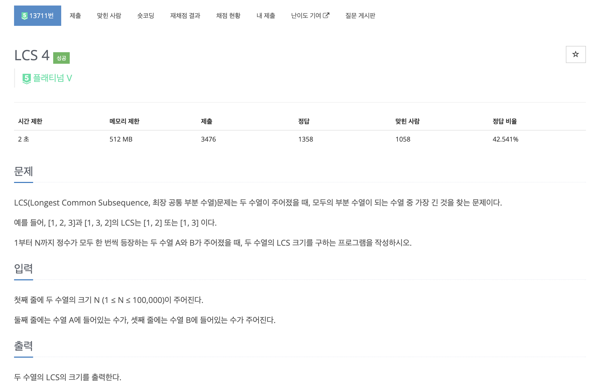
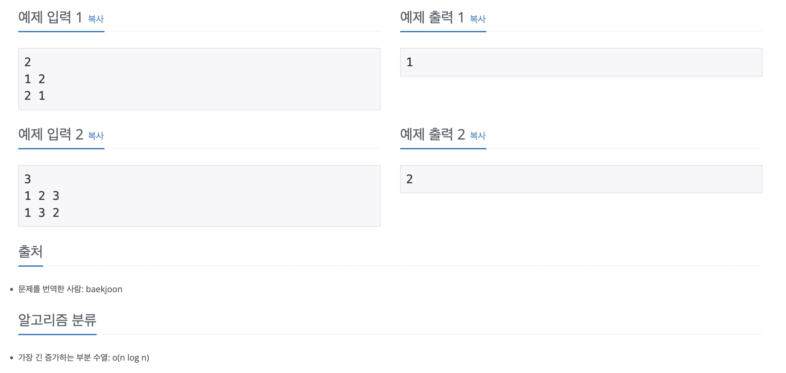

https://www.acmicpc.net/problem/13711

# 🔍 LCS 4

| 항목      | 내용                     |
| --------- |------------------------|
| 설계 시간 | 60 min                 |
| 구현 시간 | 60 min                 |
| 난이도    | 플래티넘 5                 |
| 알고리즘  | LIS, 다이나믹 프로그래밍, 이분 탐색 |
| 코드 길이 | 1424B                  |
| 실행 시간 | 464ms (시간 제한 2초)       |
| 메모리    | 56080KB (메모리 제한 512MB) |

---

# 💡 아이디어

- 이분 탐색을 활용한 O(N log N) 시간복잡도 LIS 알고리즘으로 해결할 수 있다.

---

# ✔ 문제 풀이

- LCS를 구하라는 문제지만 사실은 LIS를 구해야하는 문제이다. 이 블로그에 설명이 잘 나와있다.(https://seungwuk98.github.io/%EC%95%8C%EA%B3%A0%EB%A6%AC%EC%A6%98/01-lcs-4/)
- N이 최대 10만이어서 이분 탐색을 활용한 LIS로 구현만 하면 되고 해당 블로그처럼 LIS를 구할 수열을 생성만 잘하면 됐다.

---

# 🧠 어려웠던 점

- 30분 고민하고 도저히 모르겠어서 알고리즘 유형을 봤다가 LIS인거 확인하고 다시 츄라이했는데 쉽지 않았다. 수열 변환이 포인트 같긴해도 원리를 모르겠어서 구글링을 하다가 저 블로그를 보고 이해했다.

---

# 🧐 좋은 풀이
