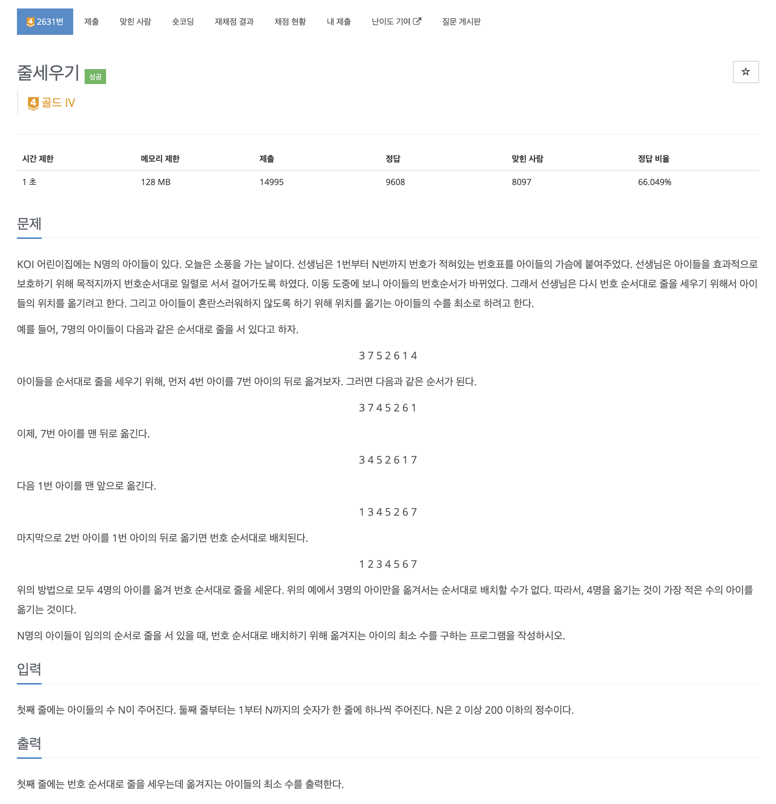
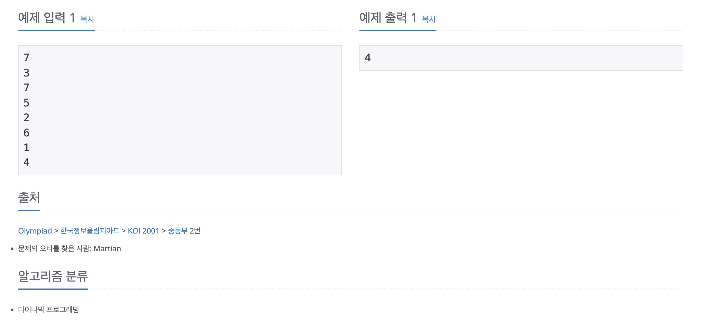

https://www.acmicpc.net/problem/2631

# 🔍 줄세우기

| 항목      | 내용                     |
| --------- |------------------------|
| 설계 시간 | 15 min                 |
| 구현 시간 | 5 min                  |
| 난이도    | 골드 4                   |
| 알고리즘  | 다이나믹 프로그래밍, LIS        |
| 코드 길이 | 735B                   |
| 실행 시간 | 72ms (시간 제한 1초)        |
| 메모리    | 11484KB (메모리 제한 128MB) |

---

# 💡 아이디어

- 아이들의 번호를 오름차순으로 배치하기 위해 이동시켜야하는 횟수의 최솟값은 아이들의 번호에 대한 LIS에 포함되지 않는 아이들을 적절한 위치에 배치하는 횟수다.

---

# ✔ 문제 풀이

- N이 최대 200이어서 O(N^2) 시간복잡도 다이나믹 프로그래밍으로 LIS의 길이를 구해서 처음 아이들의 수에서 빼주는 방식으로 구현했다.

---

# 🧠 어려웠던 점

- 처음엔 삽입 정렬이나 선택 정렬같은 O(N^2) 정렬 알고리즘을 약간 변형해서 구현하는 걸로 접근했는데 자꾸 반례가 생기는 느낌이었다.
- 정렬을 위한 아이들의 이동에 일정한 규칙이 없는거 같던 와중 어디로 이동시킬지는 몰라도 이동시켜야 하는 아이들의 수만 구하면 된다는 점에서 LIS가 떠올랐다.

---

# 🧐 좋은 풀이
