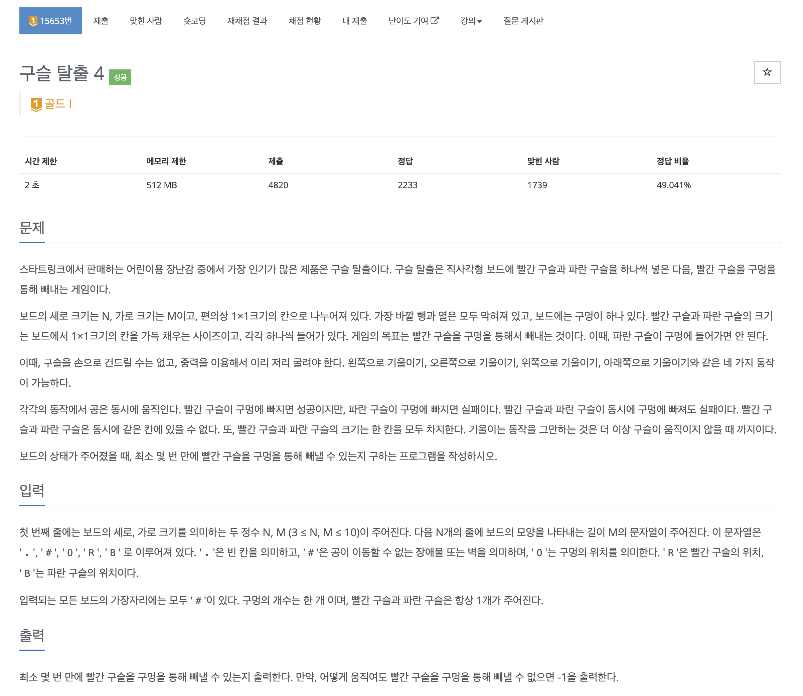
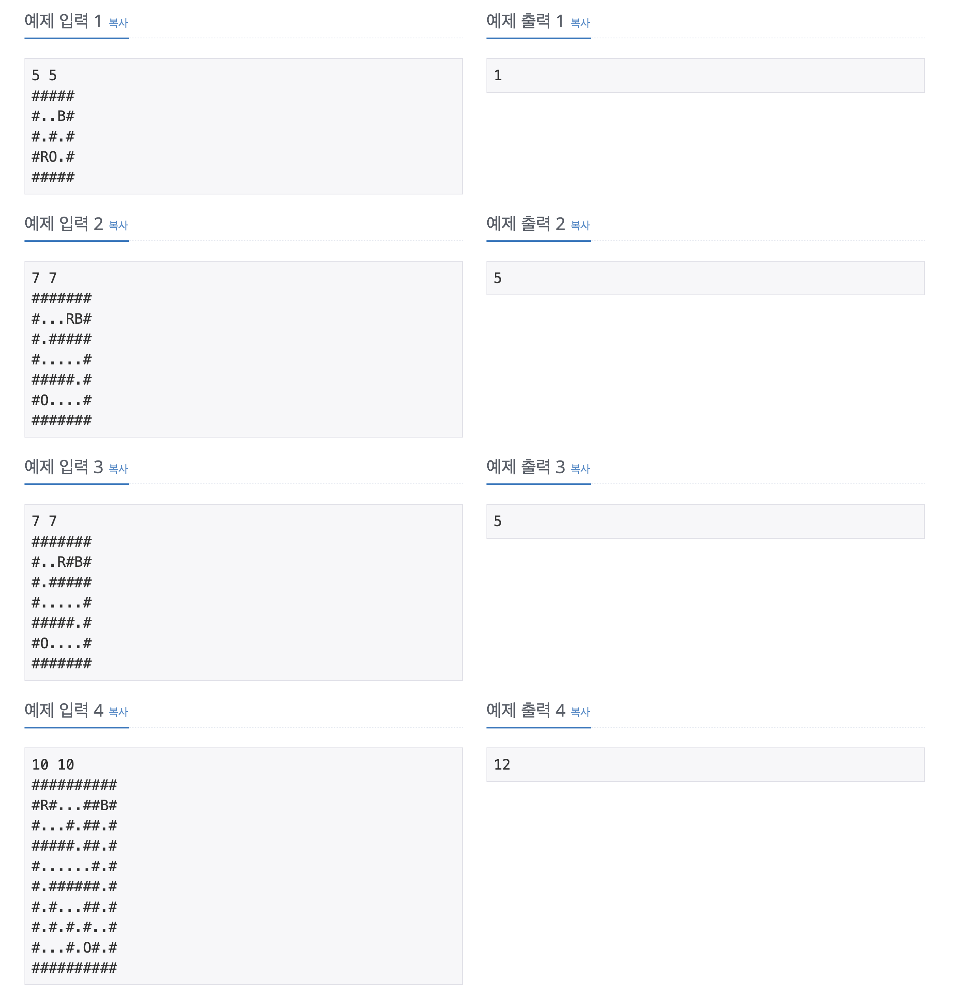
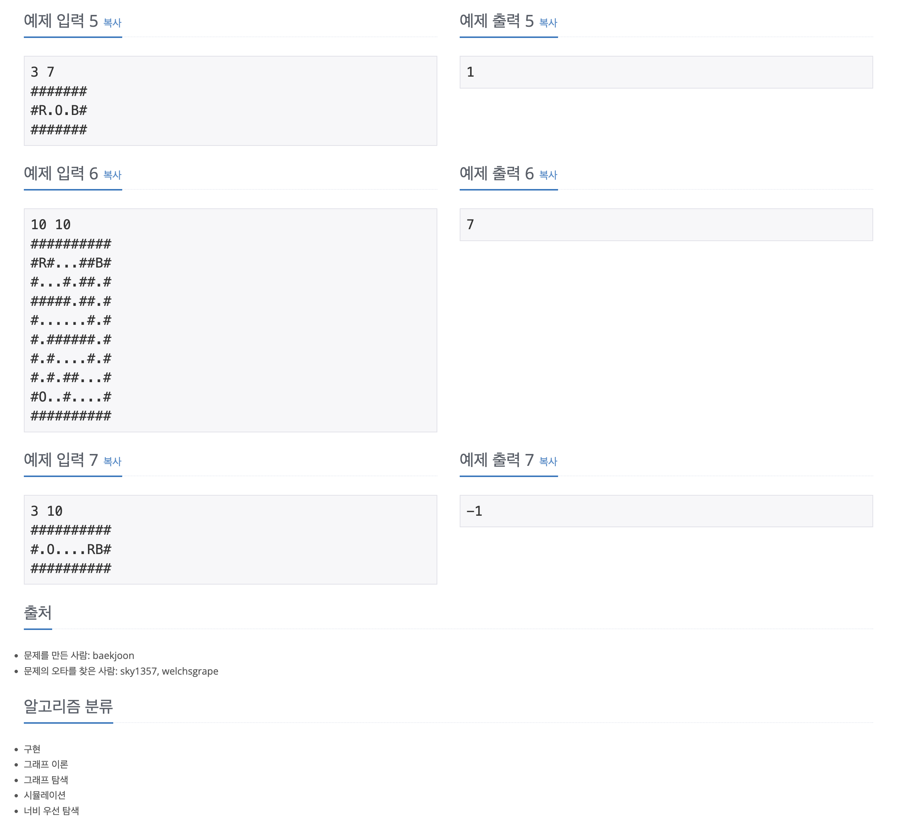

https://www.acmicpc.net/problem/15653

# 🔍 구슬 탈출 4

| 항목      | 내용                  |
| --------- |---------------------|
| 설계 시간 | 60 min              |
| 구현 시간 | 15 min              |
| 난이도    | 골드 1                |
| 알고리즘  | BFS, 시뮬레이션          |
| 코드 길이 | 7369B               |
| 실행 시간 | 68ms (시간 제한 2초)     |
| 메모리    | 12668KB (메모리 제한 512MB) |

---

# 💡 아이디어

- BFS 알고리즘으로 시뮬레이션을 잘 돌리면 해결할 수 있다.

---

# ✔ 문제 풀이

- 빨간 구슬, 파란 구슬, 구멍의 위치를 Point 객체에 담아서 관리했다. 객체에 대한 시뮬레이션이라 원본이 변경되지 않는게 중요하다고 생각해서 깊은 복사를 하기도 쉽고 직관적이어서 활용했다.
- BFS는 Queue에는 빨간 구슬, 파란 구슬을 같이 담고 같이 빼는 방식으로 구현했고 방문 체크는 4차원 배열로 빨간 구슬의 위치와 파란 구슬의 위치를 같이 기록했다. 빨간 구슬의 위치가 일정해도 파란 구슬의 위치가 달라지면 다른 상황이라 같이 기록해야한다.
- Queue가 빌 때까지 BFS를 진행하는데 두 구슬을 같이 넣었으니 같이 빼서 다루고 빨간 구슬이 구멍에 위치하고 파란 구슬이 구멍이 아닌 곳에 위치하면 dist를 반환했다. 두 구슬을 빼니 Queue 크기의 절반만큼 반복해야한다.
- move는 상하좌우 기울이는 방향과 보드, 두 구슬의 위치로 이동 후 다음 구슬들의 위치를 반환하는데 이를 통해 다음 구슬의 위치를 Queue에 넣고 방문 체크를 한다. 이때 깊은 복사로 새 객체를 넣어줘야 각 상하좌우에 대한 시뮬레이션이 독립적으로 돌아간다.
- isSamePosition은 객체의 equals랑 같은 역할
- move는 두 구슬의 위치관계에 따라 이동시키는 것으로 위로 기울였을 때 더 위에 있는 구슬이 먼저 이동해야한다거나 하는 상황이 있어서 조건 분기가 됐고 각 구슬은 구멍에 위치하면 더 이동시키지 않았다.

---

# 🧠 어려웠던 점

- 기존 구슬탈출 1, 2, 3 문제들은 중복순열 + 백트래킹으로 풀었는데 이 문제는 이렇게는 풀 수가 없어서 BFS로 바꿔서 풀었다.
- move 메서드가 너무 지저분한데 깔끔하게 만들기가 좀 어려웠고 두 구슬의 이동처리, 충돌 처리, 구멍 방문 등 조건이 상당히 까다롭게 느껴졌다.
- 시뮬레이션이 원본값을 수정하지 않게 하는 과정에서 깊은 복사 처리를 잘 해줘야하는데 실수할 여지가 많았던 것 같다.

---

# 🧐 좋은 풀이
