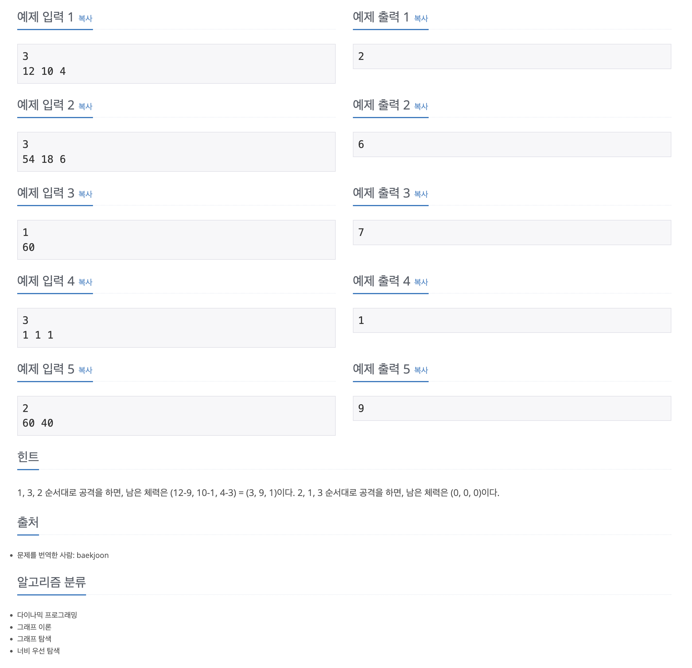

https://www.acmicpc.net/problem/12869

# 🔍 뮤탈리스크

| 항목      | 내용                                         |
| --------- |--------------------------------------------|
| 설계 시간 | 30 min                                     |
| 구현 시간 | 30 min                                     |
| 난이도    | 골드 4                                       |
| 알고리즘  | BFS, DFS, 다이나믹 프로그래밍                       |
| 코드 길이 | 1855B / 1564B / 1790B                      |
| 실행 시간 | 80ms / 80ms / 88ms (시간 제한 2초)              |
| 메모리    | 13440KB / 13404KB / 14904KB (메모리 제한 512MB) |

---

# 💡 아이디어

- BFS, DFS, 탑다운 다이나믹 프로그래밍으로 해결했다.
- SCV에 대한 뮤탈리스크의 공격은 그리디하게 해결할 수 없다.

---

# ✔ 문제 풀이

- 기본 아이디어는 SCV는 입력으로 몇 기가 주어지든 3기로 맞추고 파괴된 SCV도 그냥 놔둔다. 대신 체력은 0으로
- 공격은 9-3-1 이렇게 들어가는데 순열로 총 6가지 케이스가 나오게 된다. 각 scv 조합당 6개의 새로운 케이스가 나온다.
- 이걸 탐색배열로 나타내고 배열의 clone 메서드를 활용한 hit 메서드로 다음 SCV의 체력 조합을 구한다.

---

# 🧠 어려웠던 점

- 문제 자체는 크게 어렵지 않았는데 풀이 과정에서 DFS와 탑다운 다이나믹 프로그래밍에 대한 개념적 구분이 좀 어려웠다.

---

# 🧐 좋은 풀이
