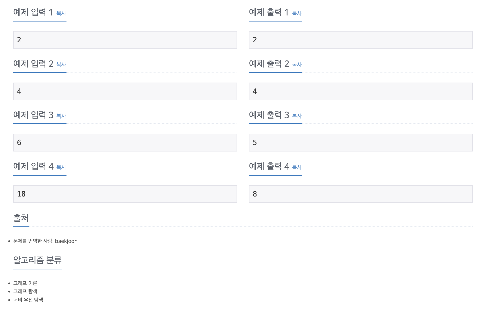

https://www.acmicpc.net/problem/14226

# 🔍 이모티콘

| 항목      | 내용                     |
| --------- |------------------------|
| 설계 시간 | 15 min                 |
| 구현 시간 | 15 min                 |
| 난이도    | 골드 4                   |
| 알고리즘  | BFS                    |
| 코드 길이 | 1901B                  |
| 실행 시간 | 72ms (시간 제한 2초)        |
| 메모리    | 13064KB (메모리 제한 512MB) |

---

# 💡 아이디어

- BFS 알고리즘으로 해결할 수 있다.

---

# ✔ 문제 풀이

- 화면의 이모티콘 수와 클립보드의 이모티콘 수를 필드로 갖는 이모지 클래스를 활용한 BFS로 구현했다.
- 이모지 객체의 화면의 이모티콘 수가 S개가 될 때까지 반복하며 3가지 동작에 대해 변화하는 상태를 새롭게 큐에 추가하면 된다.
- 최소 시간을 구해야하므로 최단거리 BFS로 구현하면 된다.

---

# 🧠 어려웠던 점

---

# 🧐 좋은 풀이
