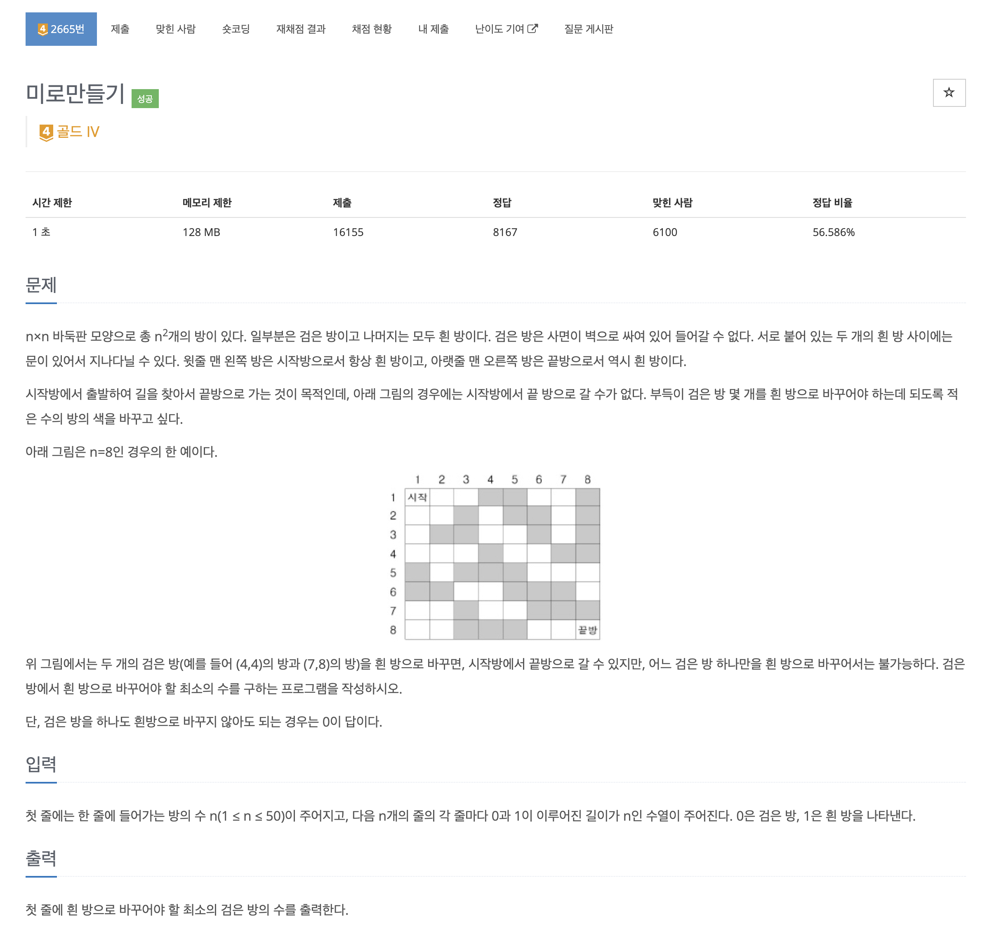
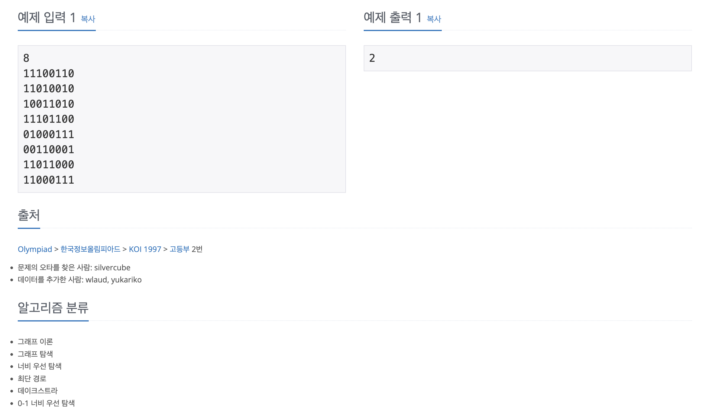

https://www.acmicpc.net/problem/2665

# 🔍 미로만들기

| 항목      | 내용                               |
| --------- |----------------------------------|
| 설계 시간 | 15 min                           |
| 구현 시간 | 30 min                           |
| 난이도    | 골드 4                             |
| 알고리즘  | 0-1 BFS, 다익스트라 알고리즘              |
| 코드 길이 | 1906B / 2402B                    |
| 실행 시간 | 68ms / 72ms (시간 제한 1초)           |
| 메모리    | 11756KB / 11832KB (메모리 제한 128MB) |

---

# 💡 아이디어

- 기본은 다익스트라 알고리즘으로 해결할 수 있고 간선의 가중치가 0, 1 두 가지라서 0-1 BFS로도 해결 가능

---

# ✔ 문제 풀이

- 벽을 바꾸면서 이동할 수 있을 때 목적지까지 벽을 최소한으로 바꾸면서 이동해야하는 문제로 주어진 미로에서 벽이 있는 칸으로 이동을 가중치 1인 간선, 빈 방으로 이동을 가중치 0인 간선으로 바꿔 생각하면 최소 가중치의 합으로 목적지에 도달하는 문제가 된다.
- 기본은 사방탐색 + 다익스트라로 무난히 구현하면 해결된다.
- 0-1 BFS는 Deque 자료구조를 사용해서 가중치가 0인 간선은 앞에, 가중치가 1인 간선은 뒤에 삽입하며 Deque의 앞에서 노드를 하나씩 꺼내는 방식으로 삽입 과정에서 알아서 정렬이 돼서 다익스트라보다 빠르게 해결할 수 있다.

---

# 🧠 어려웠던 점

- 갈 수 없는 곳을 방문할 수 있는 조건이 있는 그래프 문제는 보통 방문체크 트릭을 활용한 BFS가 많아서 유형을 파악하는게 좀 어려운 문제 같고 다익스트라 구현은 언제든 쉽지 않다.

---

# 🧐 좋은 풀이
