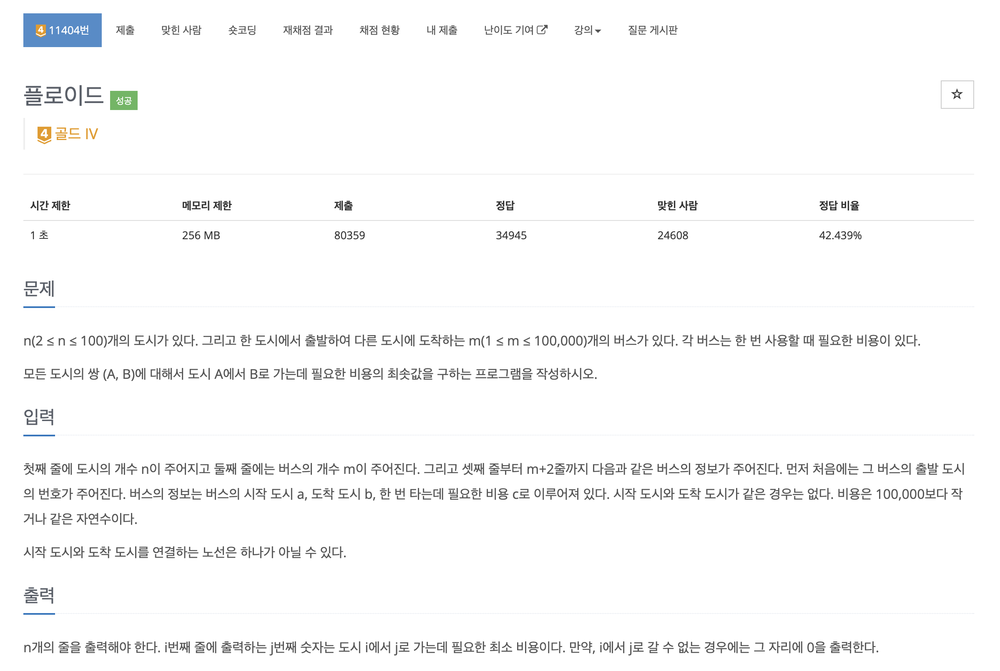

https://www.acmicpc.net/problem/11404

# 🔍 플로이드

| 항목    | 내용                     |
|-------|------------------------|
| 설계 시간 | 5 min                  |
| 구현 시간 | 10 min                 |
| 난이도   | 골드 4                   |
| 알고리즘  | 플로이드 워셜 알고리즘           |
| 코드 길이 | 1534B                  |
| 실행 시간 | 300ms (시간 제한 1초)       |
| 메모리   | 41912KB (메모리 제한 256MB) |

---

# 💡 아이디어

- 제목 그대로 플로이드 워셜 알고리즘을 적용하는 문제로 플로이드 워셜 알고리즘에서 사용하는 dp 테이블을 출력해야한다.

---

# ✔ 문제 풀이

- i, j가 일치하는 경로가 여러 개 나올 수 있어서 그 중 최솟값으로 초기화해야 한다.
- i -> j로 다른 도시를 경유해서 갈 수 있어도 0을 출력해야해서 dp 테이블 초기화 시 dp[i][i] = 0을 활용했다.

---

# 🧠 어려웠던 점

---

# 🧐 좋은 풀이
