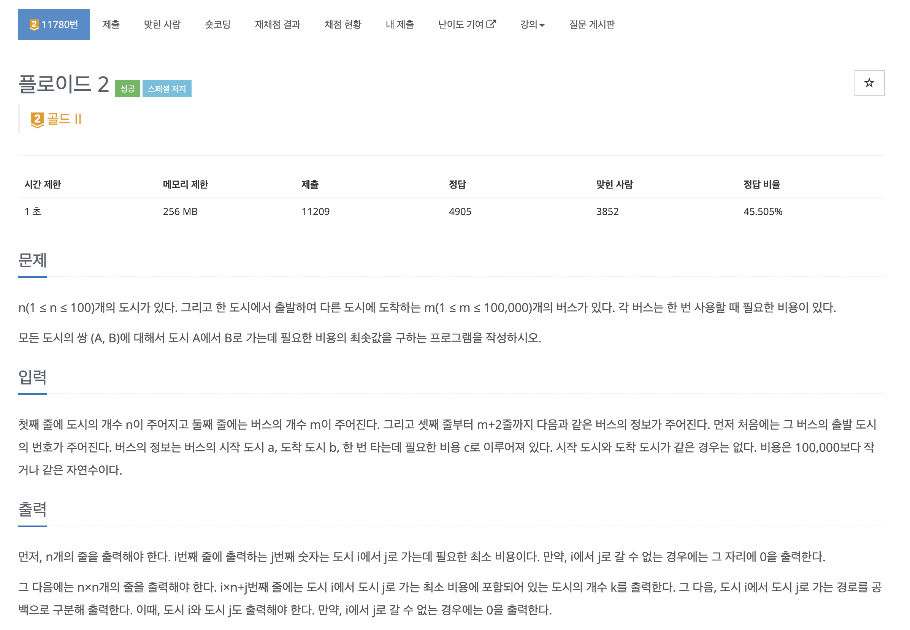
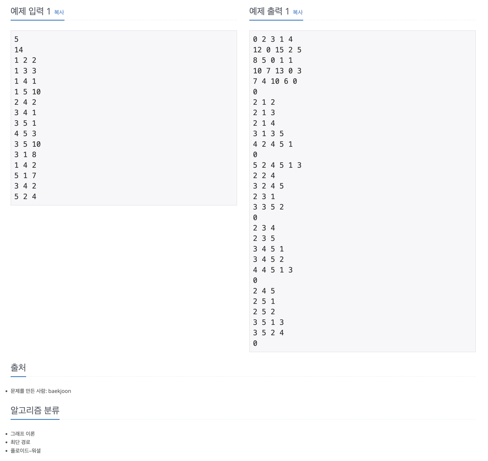

https://www.acmicpc.net/problem/11780

# 🔍 플로이드

| 항목    | 내용                     |
|-------|------------------------|
| 설계 시간 | 5 min                  |
| 구현 시간 | 30 min                 |
| 난이도   | 골드 2                   |
| 알고리즘  | 플로이드 워셜 알고리즘           |
| 코드 길이 | 2512B                  |
| 실행 시간 | 392ms (시간 제한 1초)       |
| 메모리   | 53320KB (메모리 제한 256MB) |

---

# 💡 아이디어

- 제목 그대로 플로이드 워셜 알고리즘을 적용하는 문제로 플로이드 워셜 알고리즘에서 사용하는 dp 테이블과 경로를 출력해야한다.
- 경로는 이전에 방문했던 도시를 저장하는 before 배열을 활용했다.

---

# ✔ 문제 풀이

- 경로만 보면 i -> j로 가는 최단 경로에서 j 직전에 k를 방문했을 시 before[i][j] = before[k][j]로 점화식을 구성할 수 있다.
- 이렇게 하면 k를 거쳐서 가는게 최단 경로일 때 i -> j를 가기 위해 k -> j를 방문해야함을 기록할 수 있다.
- 이전에 방문한 도시들을 추적하며 경로를 찾아가므로 Stack에 저장한 후 역순으로 찾으면 원래 경로를 얻을 수 있다.

---

# 🧠 어려웠던 점

- 플로이드 워셜 알고리즘의 경로 추적은 별로 직관적이지도 않고 스스로 떠올리기는 어려운거 같다.

---

# 🧐 좋은 풀이
