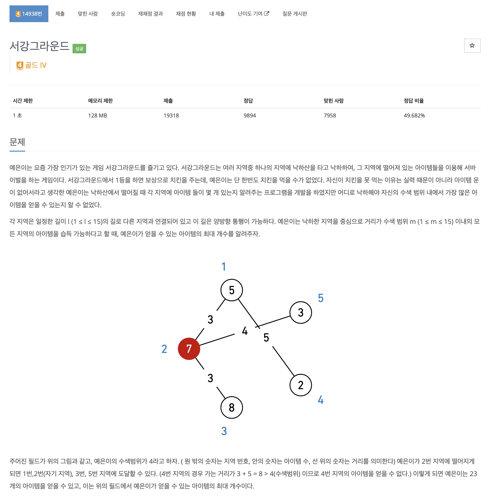
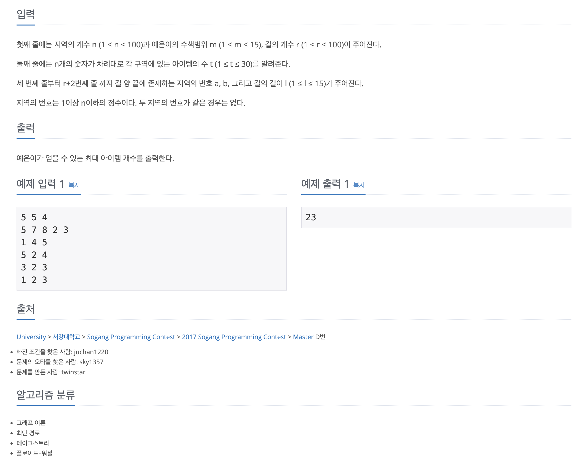

https://www.acmicpc.net/problem/14938

# 🔍 서강그라운드

| 항목    | 내용                               |
|-------|----------------------------------|
| 설계 시간 | 5 min                            |
| 구현 시간 | 10 min                           |
| 난이도   | 골드 4                             |
| 알고리즘  | 다익스트라 알고리즘, 플로이드 워셜 알고리즘         |
| 코드 길이 | 2779B / 1713B                    |
| 실행 시간 | 76ms / 100ms (시간 제한 1초)          |
| 메모리   | 12168KB / 12532KB (메모리 제한 128MB) |

---

# 💡 아이디어

- 최단거리를 통해 아이템의 합을 구하는 문제로 다익스트라 알고리즘과 N이 최대 100이어서 플로이드 워셜 알고리즘으로 해결할 수 있다.

---

# ✔ 문제 풀이

- 다익스트라 알고리즘은 거리 배열을 반환 후 M 이하인 지역의 아이템을 줍는 방식으로 구현했고 플로이드 워셜은 dp 테이블로 바로 계산했다.

---

# 🧠 어려웠던 점

---

# 🧐 좋은 풀이
