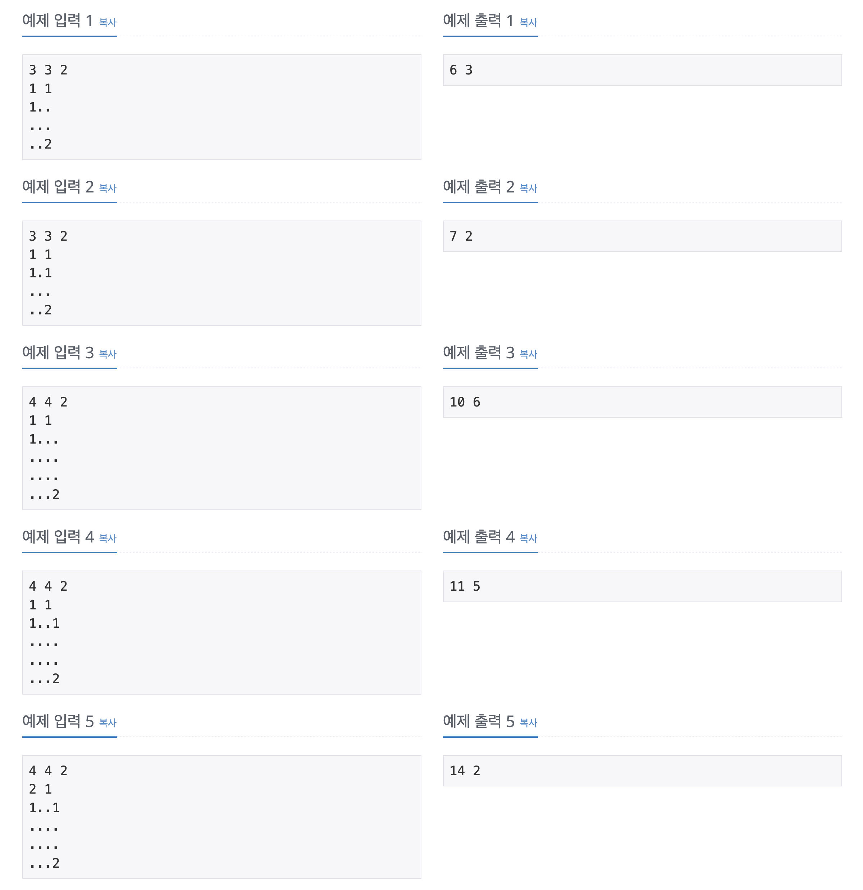
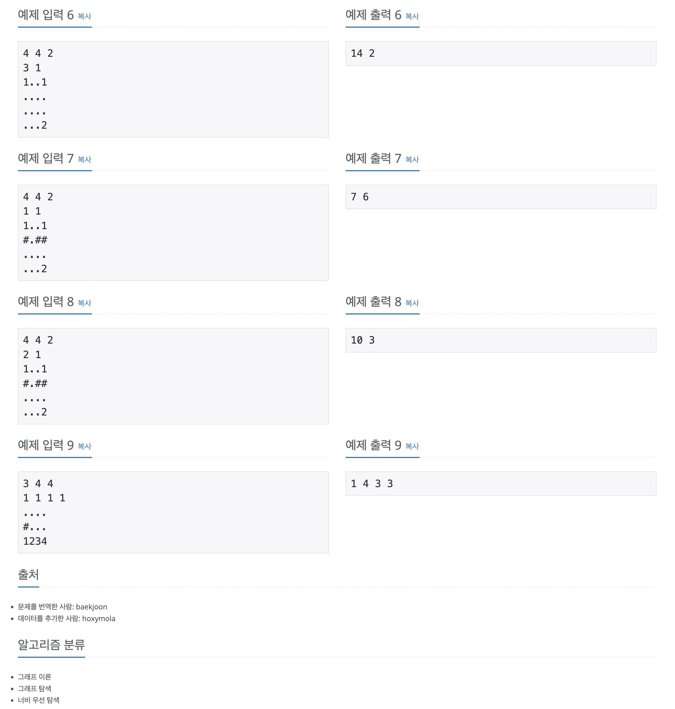

https://www.acmicpc.net/problem/16920

# 🔍 확장 게임

| 항목    | 내용                     |
|-------|------------------------|
| 설계 시간 | 30 min                 |
| 구현 시간 | 90 min                 |
| 난이도   | 골드 2                   |
| 알고리즘  | BFS                    |
| 코드 길이 | 3178B                  |
| 실행 시간 | 400ms (시간 제한 2초)       |
| 메모리   | 54480KB (메모리 제한 512MB) |

---

# 💡 아이디어

- 각 플레이어 별로 성을 Queue로 관리하며 BFS를 적용하면 해결할 수 있었다.

---

# ✔ 문제 풀이

- 1번 플레이어부터 P번 플레이어까지 번호 순으로 순서가 돌아와서 정렬 개념이 필요한데 인덱스를 플레이어 번호로 하는 큐 배열을 적용했다.
- BFS는 각 플레이어 큐 배열에 대한 최단 거리 BFS를 적용해서 플레이어가 성을 지을 수 있는 영역을 탐색하는 방식으로 구현했다.
- 원본 맵을 수정할거라 방문 체크는 생략했고 게임 종료 후 카운팅 배열로 원본 맵에서 성의 개수를 센 후 반환하는 방식으로 구현했다.

---

# 🧠 어려웠던 점

- 처음에 단일 큐를 활용해서 구현을 하려고 했는데 예외 케이스가 많이 발생했다. 출력해보면 잘하면 될 거 같긴 한데 정석적인 느낌이 없어서 던졌다.
- 단일 큐 구현 디버깅에서 입력을 우선순위 큐로 받고 BFS의 큐에 생성자로 넣어 초기화하는 방식으로 구현했는데 정렬된 상태로 큐에 들어가지 않는걸 알게 됐다.(addAll 메서드)

---

# 🧐 좋은 풀이
