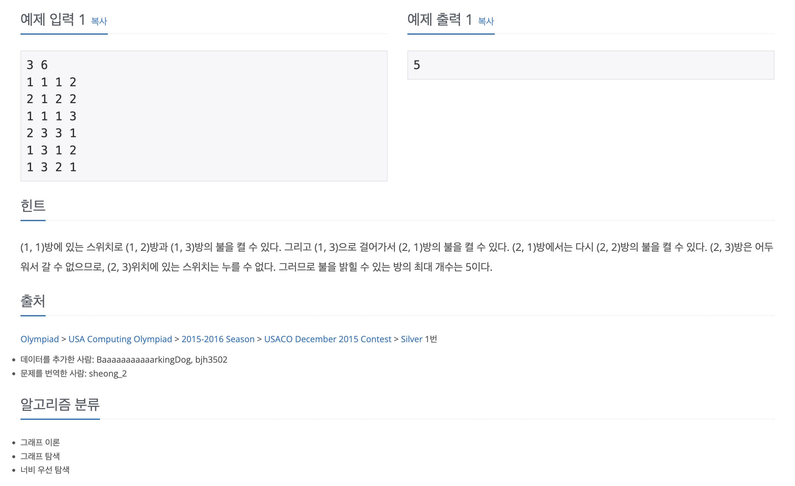

https://www.acmicpc.net/problem/11967

# 🔍 불켜기

| 항목    | 내용                                |
|-------|-----------------------------------|
| 설계 시간 | 90 min                            |
| 구현 시간 | 30 min                            |
| 난이도   | 골드 2                              |
| 알고리즘  | BFS                               |
| 코드 길이 | 2485B / 2743B                     |
| 실행 시간 | 1020ms / 192ms (시간 제한 2초)         |
| 메모리   | 300468KB / 23488KB (메모리 제한 512MB) |

---

# 💡 아이디어

- 스위치가 있는 방에 방문해서 불을 켰을 때 불이 켜지게 된 방이 과거에 방문할 수 있었던 방이면 방문을 해야하는 문제이다. 이를 위해 현재 불이 꺼져있지만 방문할 수 있었던 방에 대한 방문체크를 별도로 진행해서 불을 켰을 때 해당 방이 이전에 방문할 수 있었던 방이면 방문할 수 있도록 했다.

---

# ✔ 문제 풀이

- 특정 방에 여러 개의 스위치가 존재할 수 있는 상황으로 리스트를 받는 2차원 배열로 입력을 처리했다.
- BFS에서 변수로 불이 켜진 상태를 표시하는 원본 맵인 boolean 타입 2차원 배열과 실제 방문, 임시 방문을 담당하는 방문 체크 배열을 사용했다.
- 로직은 현재 방에 스위치가 있으면 불을 켜고 불을 킨 방이 임시 방문을 한 적이 있으면 Queue에 담는다. 현재 방에 대한 사방탐색은 불이 켜져있으면 그냥 하고 불이 꺼져있으면 임시 방문 체크를 한다.

---

# 🧠 어려웠던 점

- BFS에서 이미 지나간 곳을 다시 돌아가는게 어려워서 처음엔 켜진 불의 개수가 변하지 않을 때까지 반복해서 BFS를 돌리게 짰는데 통과는 됐지만 느렸다. 이걸 한번의 BFS로 처리하도록 바꾸는게 상당히 어려웠다.
- 8%의 테스트 케이스 통과가 좀 힘들었고 구현하다보면 반례가 많이 나오는 문제였다.
- 불이 켜진 방의 개수를 구해야하는 문제인데 시작점에서 방문할 수 있는 칸을 구하는 것과 착각하기 쉬웠다.

---

# 🧐 좋은 풀이
