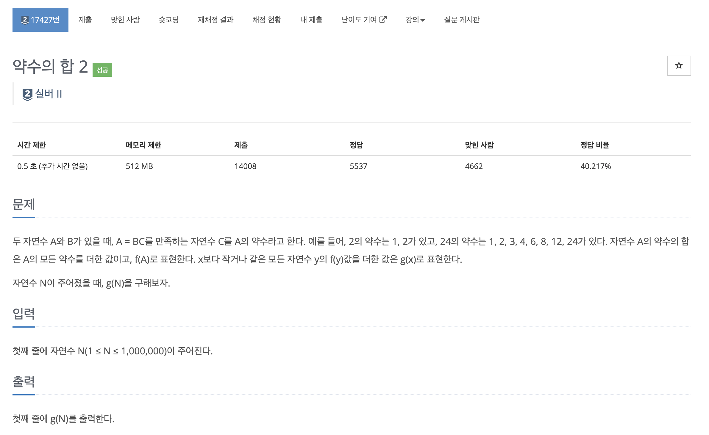
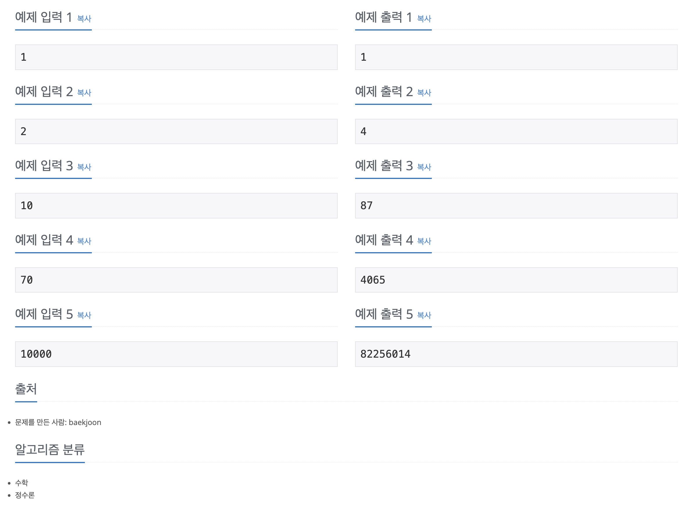

https://www.acmicpc.net/problem/17427

# 🔍 약수의 합 2

| 항목    | 내용                     |
|-------|------------------------|
| 설계 시간 | 60 min                 |
| 구현 시간 | 60 min                 |
| 난이도   | 실버 2                   |
| 알고리즘  | 수학                     |
| 코드 길이 | 379B                   |
| 실행 시간 | 84ms (시간 제한 0.5초)      |
| 메모리   | 11568KB (메모리 제한 512MB) |

---

# 💡 아이디어

문제의 설명대로 1부터 N까지 각 자연수의 약수의 합을 구하고 이를 다시 더하는 방식으로는 시간안에 해결할 수 없다. 반대로 1부터 N까지의 수가 g(N)에 몇 번 등장할지를 찾으면 간단하게 해결할 수 있는데 1은 1부터 N까지 1의 배수의 수만큼 등장하고 2는 2의 배수의 수만큼 등장하고 3은 3의 배수의 수만큼 등장한다. 이를 활용하면 간단하게 해결할 수 있다.

---

# ✔ 문제 풀이

배수는 나눗셈 연산으로 구할 수 있고 등장한 수의 합을 구하기 위해 해당 수를 곱하는 과정을 반복하면 간단하게 해결할 수 있다. g(N)을 구하는 과정에서 int형 오버플로우가 발생할 수 있음에 주의해야한다.

---

# 🧠 어려웠던 점

- 문제 설명대로 착실하게 푸는데 최적화로 해결할 수 있을줄 알았다. dp로 풀어도 안돼서 검색을 해봤다가 배수 어쩌고 보고 다시 해보니 됐다.

---

# 🧐 좋은 풀이
