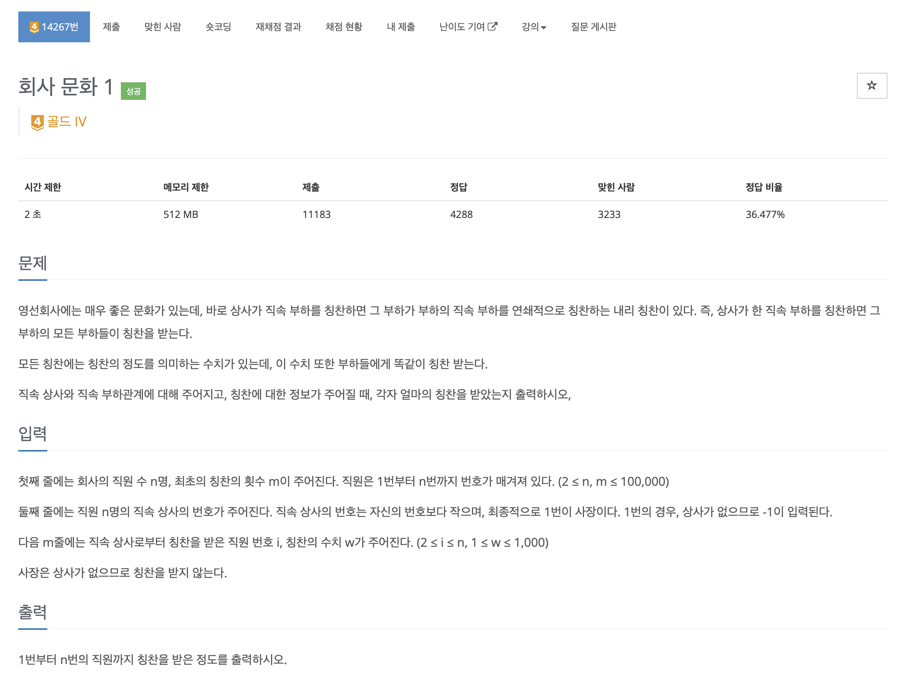
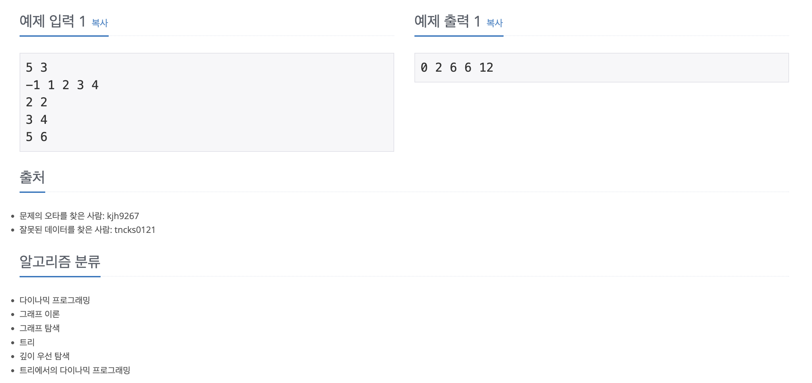

https://www.acmicpc.net/problem/14267

# 🔍 회사 문화 1

| 항목    | 내용                               |
|-------|----------------------------------|
| 설계 시간 | 30 min                           |
| 구현 시간 | 30 min                           |
| 난이도   | 골드 5                             |
| 알고리즘  | DFS, 다이나믹 프로그래밍, 트리              |
| 코드 길이 | 1262B / 1600B                    |
| 실행 시간 | 420ms / 468ms (시간 제한 2초)         |
| 메모리   | 52376KB / 88012KB (메모리 제한 512MB) |

---

# 💡 아이디어

각 칭찬마다 직원들의 칭찬 수치를 갱신하면 시간 초과가 발생한다. 각 직원마다 최초로 칭찬을 받은 경우 칭찬 수치를 더한 후 한번에 계산하는 방식으로 해결할 수 있다.

---

# ✔ 문제 풀이

- Bottom-Up 다이나믹 프로그래밍과 DFS 알고리즘으로 해결이 가능했는데 다이나믹 프로그래밍은 주어진 직속상사 정보를 바로 활용해서 현재 직원의 칭찬 수치는 현재 직원이 최초로 받은 칭찬 수치의 합과 현재 직원의 부모 직원이 받은 칭찬 수치이다. 상사의 번호가 직원의 번호보다 항상 작아서 해당 방식으로 해결할 수 있었다. DFS는 그냥 사장부터 탐색하며 파라미터로 칭찬 수치의 합을 들고 다니면 간단하게 해결할 수 있다.

---

# 🧠 어려웠던 점

---

# 🧐 좋은 풀이
