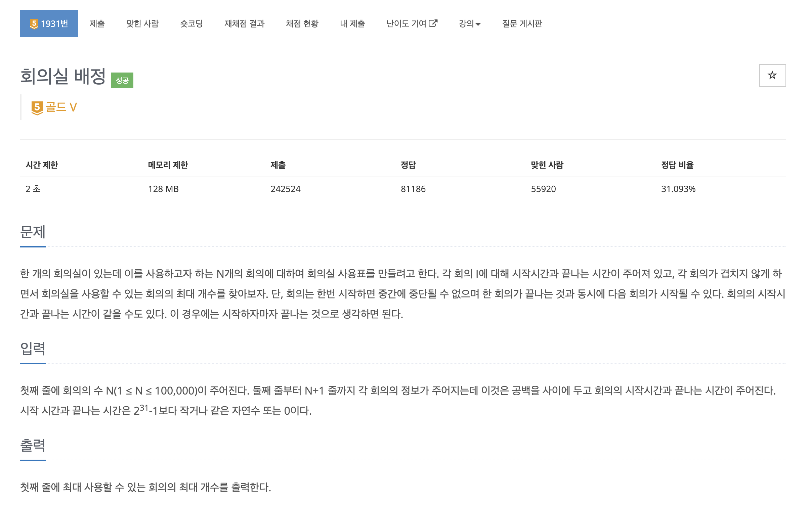

https://www.acmicpc.net/problem/1931

# 🔍 회의실 배정

| 항목    | 내용                     |
|-------|------------------------|
| 설계 시간 | 60 min                 |
| 구현 시간 | 30 min                 |
| 난이도   | 골드 5                   |
| 알고리즘  | 정렬, 그리디 알고리즘           |
| 코드 길이 | 1271B                  |
| 실행 시간 | 396ms (시간 제한 2초)       |
| 메모리   | 41740KB (메모리 제한 128MB) |

---

# 💡 아이디어

주어진 회의들을 끝나는 시간을 기준으로 정렬한 후 각 회의들이 겹치지 않게 선택하면 가장 많은 회의를 할 수 있다.

---

# ✔ 문제 풀이

- end 변수로 가장 최근에 회의가 종료된 시간을 기록했고 끝나는 시간을 기준으로 정렬된 회의들을 순회하며 해당 회의의 시작 시간이 end보다 늦거나 같으면 회의를 진행하는 방식으로 구현했다.
- 회의가 종료된 시간이 동일하면 일찍 시작하는 회의가 앞으로 오게 정렬해야 시작 시간과 종료 시간이 동일한 회의에 대해서도 최대 개수를 구할 수 있다.

---

# 🧠 어려웠던 점

백준의 퇴사 2 문제처럼 다이나믹 프로그래밍으로 접근했는데 얼핏보면 거의 비슷한 문제처럼 보이지만 전혀 달랐다. 다이나믹 프로그래밍으로도 해결이 가능했지만 그리디 알고리즘이 정석이었고 그리디 알고리즘의 대표 유형 문제였다.

---

# 🧐 좋은 풀이
