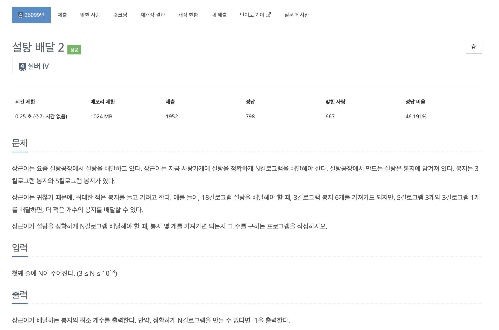
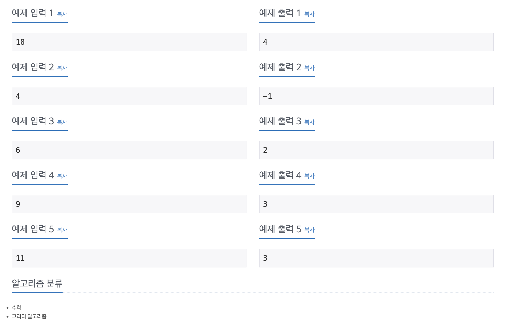

https://www.acmicpc.net/problem/26099

# 🔍 설탕 배달 2

| 항목    | 내용                      |
|-------|-------------------------|
| 설계 시간 | 15 min                  |
| 구현 시간 | 15 min                  |
| 난이도   | 실버 4                    |
| 알고리즘  | 수학, 그리디 알고리즘            |
| 코드 길이 | 672B                    |
| 실행 시간 | 64ms (시간 제한 0.25초)      |
| 메모리   | 11512KB (메모리 제한 1024MB) |

---

# 💡 아이디어

15키로는 3키로 봉지 5개 또는 5키로 봉지 3개처럼 한 가지 종류의 봉지만으로 만들 수 있다. 따라서 최소 개수의 봉지를 사용해서 정확히 N키로를 만들 때 3키로 봉지는 4개 이상 필요하지 않다.

---

# ✔ 문제 풀이

정답에서 필요한 3키로 봉지의 수는 0개 ~ 4개이다. 따라서 0개 ~ 4개의 3키로 봉지를 사용해서 정확히 N키로를 만들 수 있는지보면 되고 이는 몫과 나머지 연산으로 구현했다.

---

# 🧠 어려웠던 점

N이 최대 10^18인 문제라서 O(log N)의 거듭제곱 분할정복으로 접근했는데 이런 O(1)로 해결하는 스타일은 처음 봐서 유형 파악이 중요한 것 같다.

---

# 🧐 좋은 풀이
