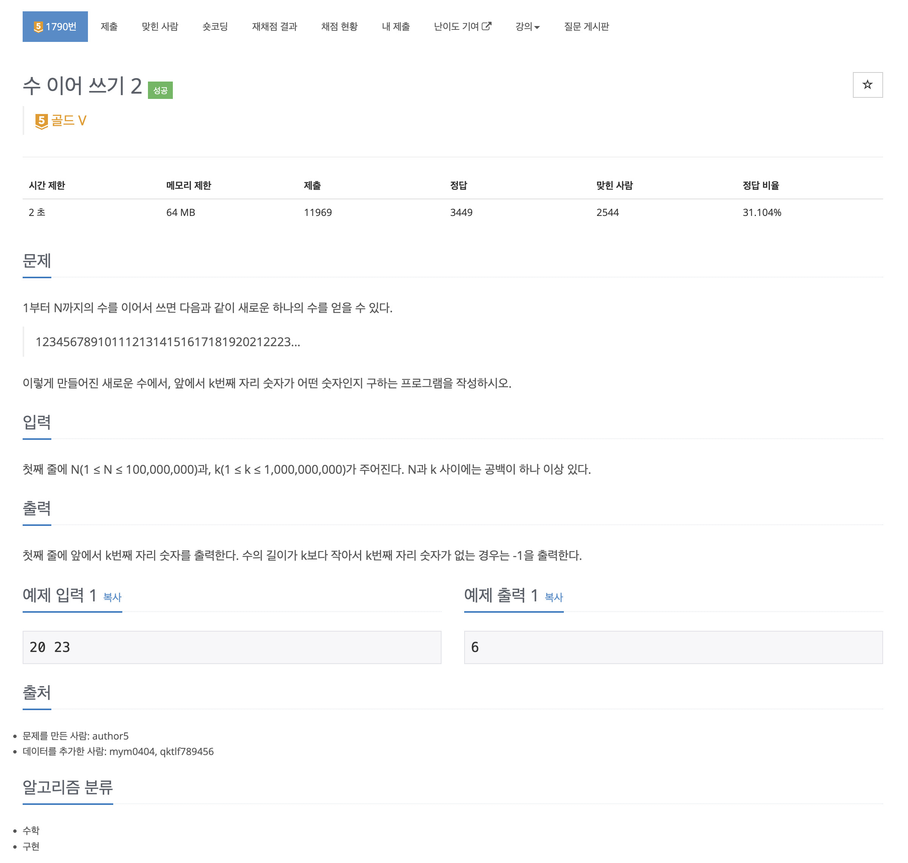

https://www.acmicpc.net/problem/1790

# 🔍 수 이어 쓰기 2

| 항목    | 내용                    |
|-------|-----------------------|
| 설계 시간 | 20 min                |
| 구현 시간 | 10 min                |
| 난이도   | 골드 5                  |
| 알고리즘  | 수학, 구현                |
| 코드 길이 | 735B                  |
| 실행 시간 | 136ms (시간 제한 2초)      |
| 메모리   | 12260KB (메모리 제한 64MB) |

---

# 💡 아이디어

N의 크기에 비하면 메모리 크기가 작아서 진짜 수를 문자열로 이어 쓰는 방식으로는 해결할 수 없다.(아마)
출력할 K번째 자리수가 실제로 어떤 수에 포함되어있는지를 구하는 방식으로 해결했다.

---

# ✔ 문제 풀이

1부터 9까지는 1자리, 10부터 99까지는 2자리 이렇게 수가 커지면 자리수도 점차 커지며 커지는 순간은 10의 거듭제곱이 되는 순간이다.
이를 활용해 현재 수와 현재 수의 자리수를 가지고 K에서 현재 수의 자리수를 빼는 과정을 반복해서 더 빼면 K가 음수가 되기 전까지 반복한다.
그러면 현재 수에서 K번째 위치의 수를 구해서 정답을 알아낼 수 있다.

---

# 🧠 어려웠던 점

K가 최대 10억인 문제로 처음엔 다이나믹 프로그래밍으로 접근했는데 도저히 규칙을 모르겠었다.
정답 방식처럼 1부터 찾아가는 방법은 갈수록 자리수가 커지기는 하지만 막 커지는건 아니라 이게 될까 싶었는데 됐다.

---

# 🧐 좋은 풀이
