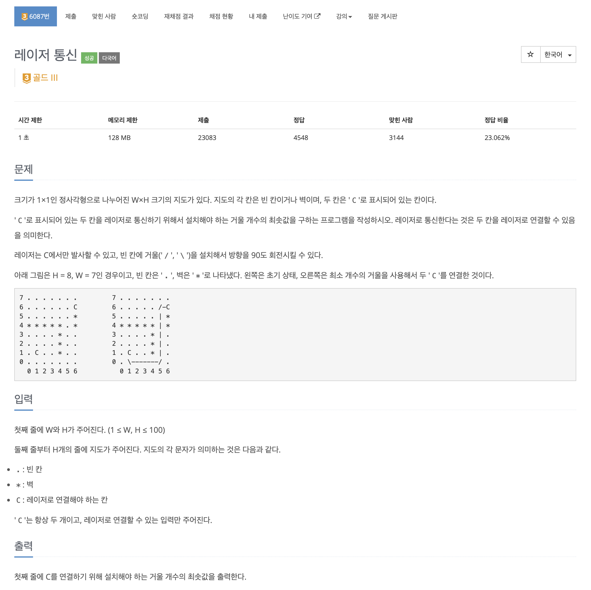
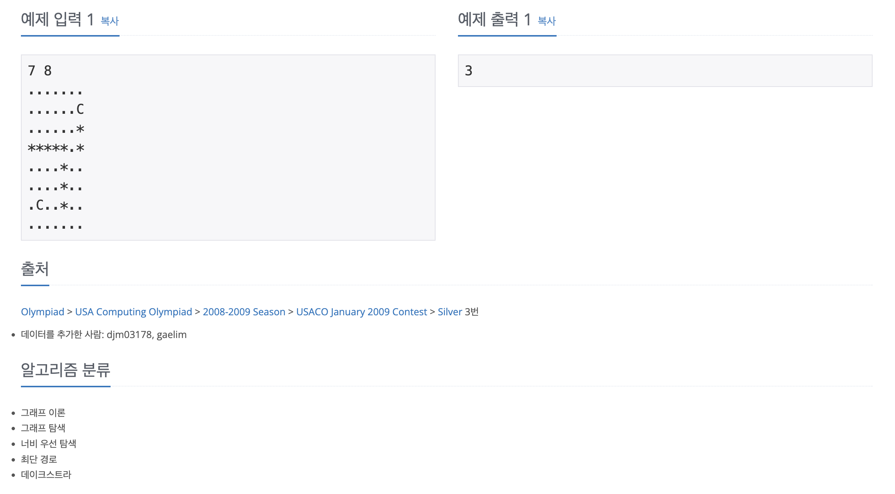

https://www.acmicpc.net/problem/6087

# 🔍 레이저 통신

| 항목    | 내용                     |
|-------|------------------------|
| 설계 시간 | 120 min                |
| 구현 시간 | 120 min                |
| 난이도   | 골드 3                   |
| 알고리즘  | BFS, 다익스트라 알고리즘        |
| 코드 길이 | 3533B                  |
| 실행 시간 | 144ms (시간 제한 1초)       |
| 메모리   | 15184KB (메모리 제한 128MB) |

---

# 💡 아이디어

각 위치에 대해 거울의 설치 횟수를 최소로 하며 도착할 수 있는지 판단하는 방식으로 다익스트라 알고리즘을 활용했다.

---

# ✔ 문제 풀이

다익스트라 알고리즘에 활용할 노드 클래스는 위치와 방향, 거울 설치 횟수를 필드로 갖고 거울 설치 횟수에 대한 정렬 기준을 설정했다.
방문 체크와 거리 배열의 경우 위치 뿐만 아니라 방향에 대한 체크도 해줘야 했는데 같은 거울 설치 횟수로 도착해도 레이저의 방향이 다르면 이후 결과가 달라질 수 있기 때문이다.
시작 위치에서 모든 방향으로 레이저를 쏜 후 사방탐색을 하며 사방탐색 방향과 현재 레이저 방향이 일치하는지 90도 차이가 나는지에 따라 구분해서 구현하면 됐다.
다익스트라 종료 후 도착점에 대해 모든 방향에서 최소 거울 설치 횟수를 구한 후 반환하도록 구현했다.

---

# 🧠 어려웠던 점

- 처음엔 레이저의 이동 방식이 DFS와 유사해서 DFS로 접근했는데 모든 경로 탐색을 위해 방문 체크 해제가 필요했고 이 경우 지도가 커서 시간초과가 발생했다.
- 이후 알고리즘 분류에서 다익스트라인 것을 보고 다익스트라로 접근했는데 방향에 대한 고려를 방문 체크에서만 하고 거리 배열에서 하지 않아서 디버깅이 오래 걸렸다.
- 거리에 대한 방향 고려는 사실 안하고 현재 노드의 거울 설치 횟수로 해도 되는데 이를 dp로만 해결하려고 해서 디버깅이 어려웠다.

---

# 🧐 좋은 풀이
