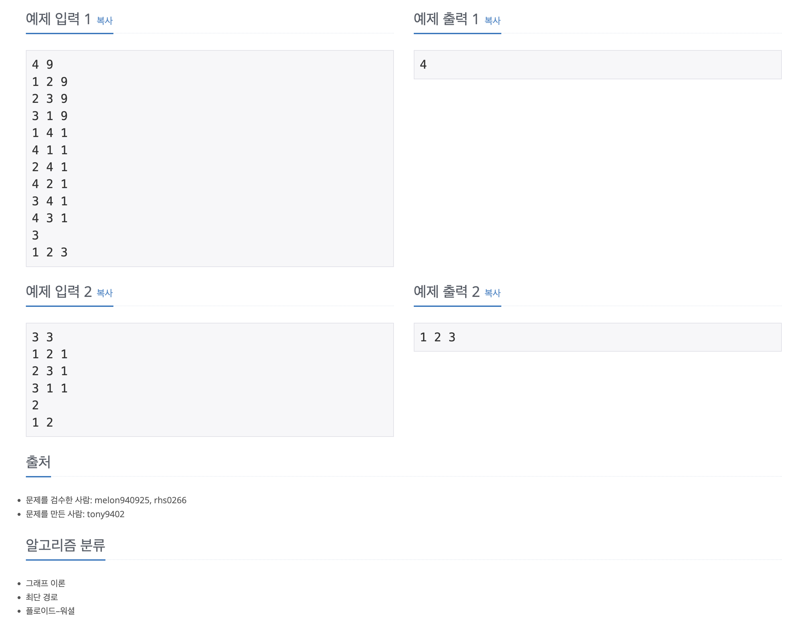

https://www.acmicpc.net/problem/21940

# 🔍 가운데에서 만나기

| 항목    | 내용                     |
|-------|------------------------|
| 설계 시간 | 30 min                 |
| 구현 시간 | 30 min                 |
| 난이도   | 골드 4                   |
| 알고리즘  | 플로이드 워셜 알고리즘           |
| 코드 길이 | 2042B                  |
| 실행 시간 | 312ms (시간 제한 1초)       |
| 메모리   | 26652KB (메모리 제한 512MB) |

---

# 💡 아이디어

1번 도시와 준형이와 친구들이 사는 K개의 도시들과 왕복 시간의 최댓값, 2번 도시와 준형이와 친구들이 사는 K개의 도시들과 왕복 시간의 최댓값, 이렇게 최댓값 중 최솟값을 구해야하는 문제로 N이 최대 200여서 플로이드 워셜 알고리즘으로 도시 간 최단거리를 미리 구한 후 이를 반복적으로 사용하면 간단하게 해결할 수 있다.

---

# ✔ 문제 풀이

플로이드 워셜 알고리즘으로 각 도시 간 최단 시간을 저장한 dp 테이블을 생성했다. 이후 행은 1번부터 N번 도시, 열은 준형이와 친구들이 사는 도시로 하는 거리 배열 dist를 만들어서 이 dist에 dp배열을 통해 왕복 시간을 저장했다.
이후 이를 정렬해서 최댓값들 중 최솟값을 찾고 이와 일치하는 도시들을 출력하는 방식으로 구현했다.

---

# 🧠 어려웠던 점

- 문제 설명을 이해하는게 좀 어려웠다.

---

# 🧐 좋은 풀이
