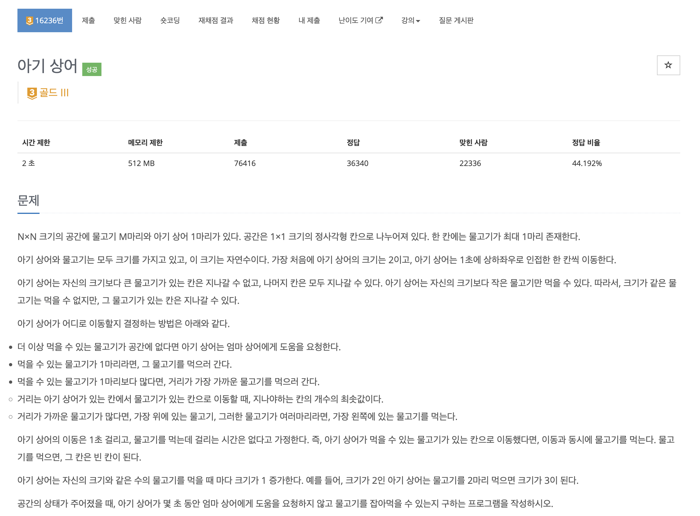
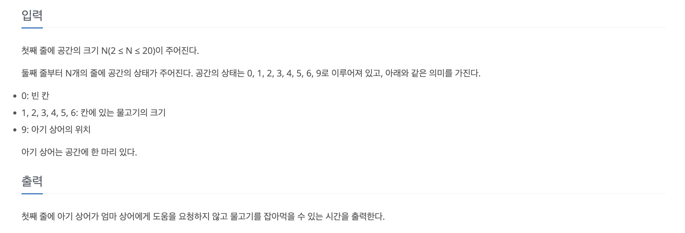
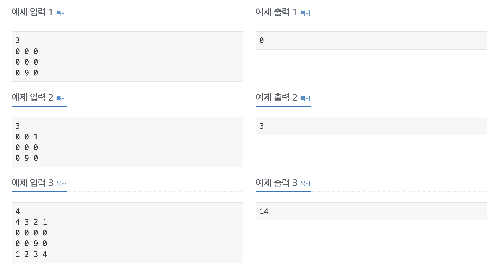
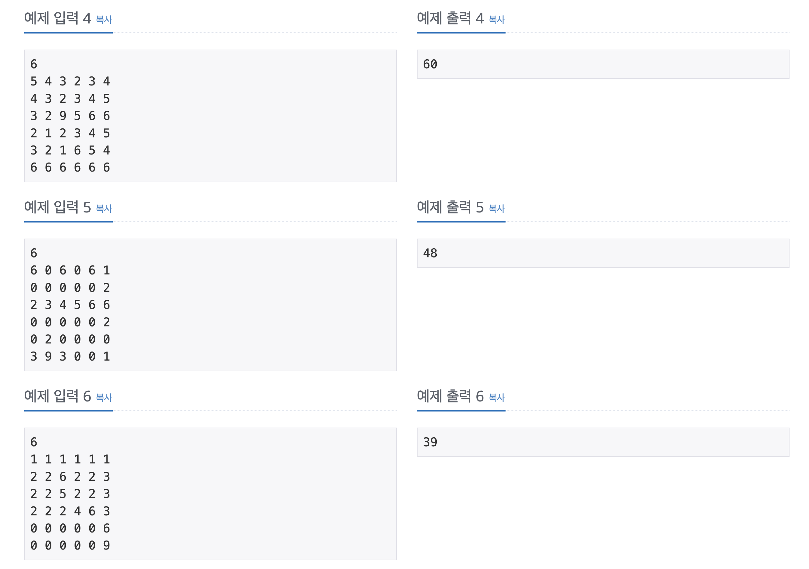
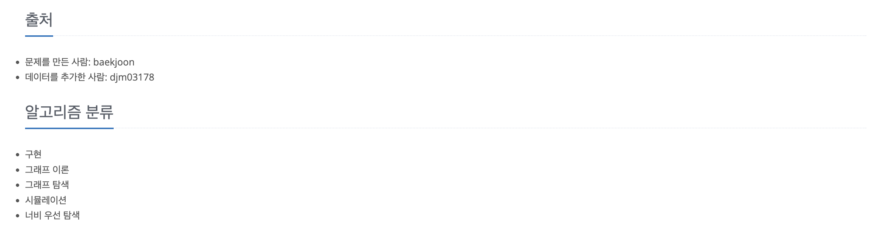

https://www.acmicpc.net/problem/16236

# 🔍 아기 상어

| 항목    | 내용                     |
|-------|------------------------|
| 설계 시간 | 5 min                  |
| 구현 시간 | 30 min                 |
| 난이도   | 골드 3                   |
| 알고리즘  | BFS, 시뮬레이션             |
| 코드 길이 | 2719B                  |
| 실행 시간 | 192ms (시간 제한 2초)       |
| 메모리   | 18588KB (메모리 제한 512MB) |

---

# 💡 아이디어

우선순위 큐와 BFS를 활용한 시뮬레이션으로 해결할 수 있다.

---

# ✔ 문제 풀이

아기 상어와 관련된 정보인 위치와 크기는 static 변수로 관리하며 BFS 알고리즘을 적용했다.
아기 상어의 위치를 입력 받으면 해당 정보로 초기화를 하고 공간에서 아기 상어의 표시인 9를 빈칸인 0으로 변경해서 이후 탐색이 용이하게 했다.
시뮬레이션은 무한 루프에서 BFS를 적용해서 엄마 상어에게 도움을 요청하는 표시인 -1을 반환하면 종료하고 아니면 누적 시간을 더하고 먹은 물고기를 세줬다. 먹은 물고기 수가 아기 상어의 크기와 같아지면 아기 상어의 크기를 키우고 먹은 물고기 수를 0으로 초기화했다.
BFS는 아기 상어가 물고기를 먹는 조건이 같은 거리면 위에 있는, 같은 거리면서 위로의 거리도 같으면 가장 왼쪽 물고기를 먹으므로 이 조건에 맞춰 우선순위 큐를 활용했다.
최단거리 BFS를 기본으로 구현하되 우선순위 큐에 바로 원소를 넣으면 우선순위 큐의 크기만큼 반복하더라도 새로 삽입한 원소가 기존 원소보다 앞에 삽입될 수 있어서 stored에 별도로 삽입 후 두 우선순위 큐의 참조값을 바꾸는 식으로 활용했다.
아기 상어는 크기가 같은 물고기가 있는 칸은 지나갈 수 있지만 먹을 수는 없는 점만 잘 고려해서 나머지 구현을 했다.

---

# 🧠 어려웠던 점

- 아기 상어가 가장 위 또는 가장 왼쪽 먹이를 우선으로 먹는 조건이 사방탐색을 반시계 방향으로 돌리는 것과 무관한 것을 찾는게 조금 헷갈렸다.

---

# 🧐 좋은 풀이
