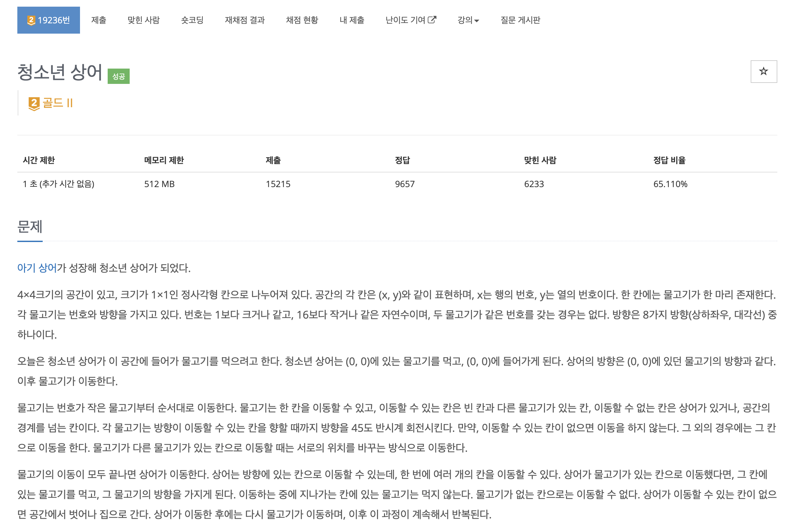
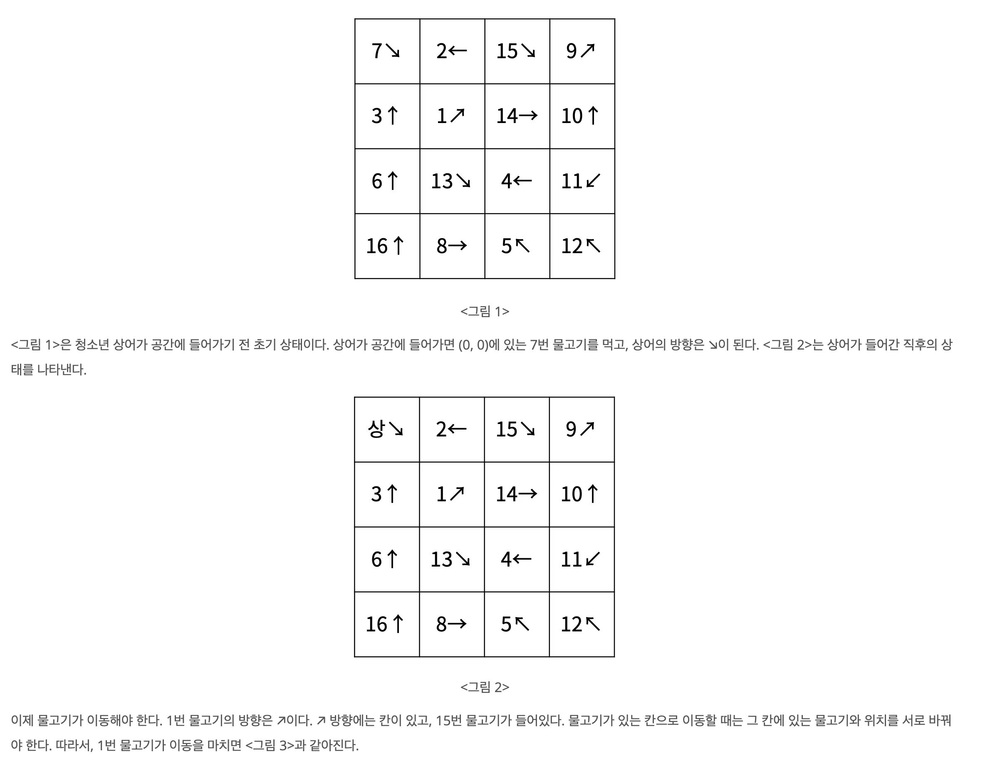
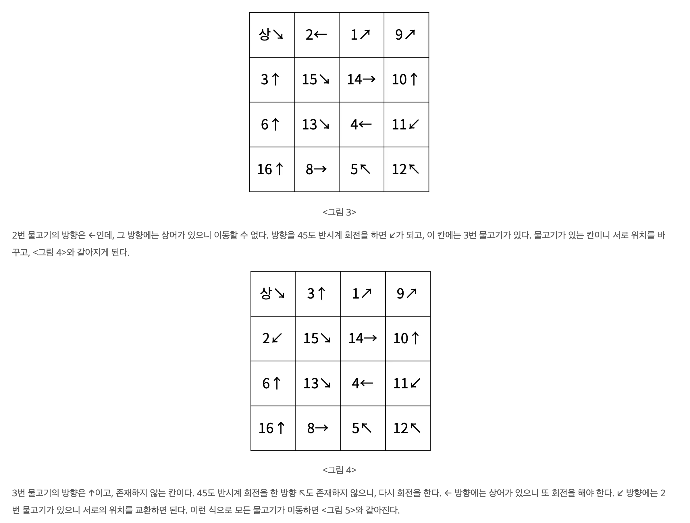
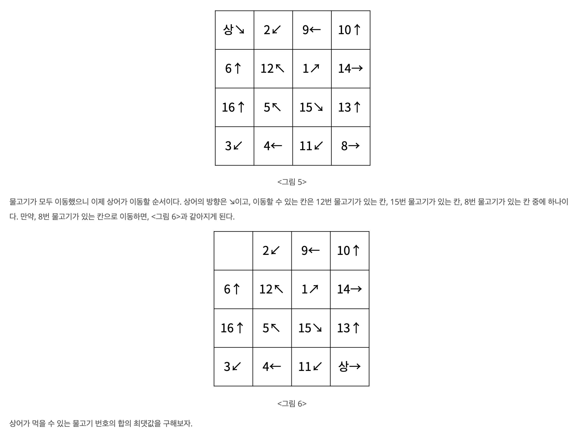
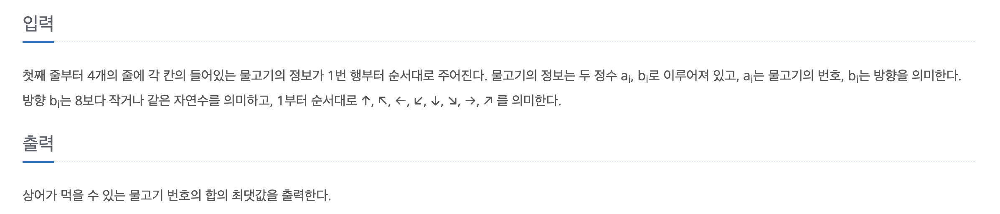
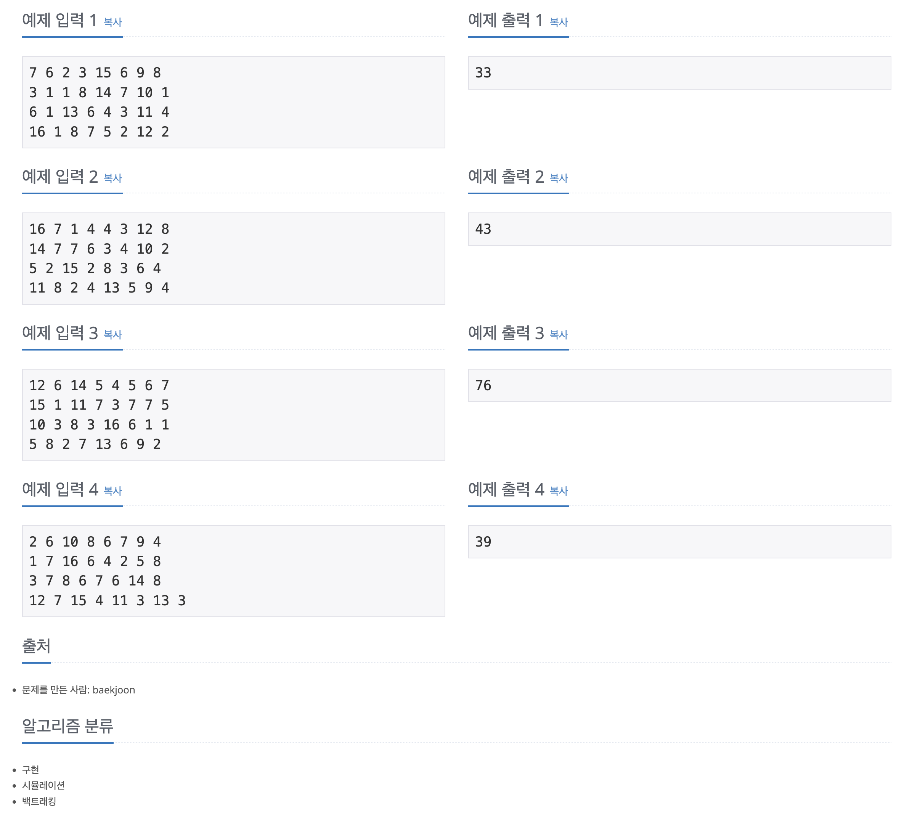

https://www.acmicpc.net/problem/19236

# 🔍 청소년 상어

| 항목    | 내용                     |
|-------|------------------------|
| 설계 시간 | 60 min                 |
| 구현 시간 | 180 min                |
| 난이도   | 골드 2                   |
| 알고리즘  | 구현, 시뮬레이션, 재귀          |
| 코드 길이 | 3710B                  |
| 실행 시간 | 11960ms (시간 제한 1초)     |
| 메모리   | 11960KB (메모리 제한 512MB) |

---

# 💡 아이디어

상어를 배치하고 물고기를 이동시킨 후 상어를 다시 배치하는 과정에서 최적값을 구하는 문제이다. 재귀 함수를 통해 현재 상태에서 다음 상태로 시뮬레이션을 돌려 최적값을 찾는 방식으로 해결할 수 있다.

---

# ✔ 문제 풀이

4 * 4 크기의 공간을 두 개 만들어서 하나에는 물고기의 번호, 다른 하나는 물고기의 방향을 저장했다.
물고기의 위치를 바로 알기 위해 Map 자료구조를 활용했고 잡아먹힌 물고기를 체크하기 위해 Set 자료구조도 사용했다.

시뮬레이션은 상어를 배치하고 상어가 배치된 칸의 물고기는 잡아먹힌 것으로 처리하고 번호와 방향을 -1로 변경해서 상어가 존재하는 공간임을 표시했다.
이후 1번부터 16번 물고기 중 잡아먹히지 않은 물고기는 8방 탐색으로 이동할 수 있는 칸을 찾아서 빈 칸이면 이동하고 물고기가 있는 칸이면 위치를 변경해줬다.
이후 상어가 이동할 차례이므로 원래 상어가 있던 칸을 빈 칸으로 만들고 다음 상어 위치 후보들마다 재귀로 시뮬레이션을 돌렸다. 이때 각 시뮬레이션이 독립적으로 실행되야하는데 참조 타입은 계속 원본값이 변경되므로 clone 메서드를 타입별로 오버로딩해서 작성한 후 복사한 상태를 전달하는 방식으로 구현했다.

---

# 🧠 어려웠던 점

- 71번째 줄 `dirMap[nr][nc] = nd;` 이거를 `dirMap[nr][nc] = d;` 이렇게 쓰고 있었던 걸 찾는데 시간이 많이 걸렸다.

---

# 🧐 좋은 풀이
