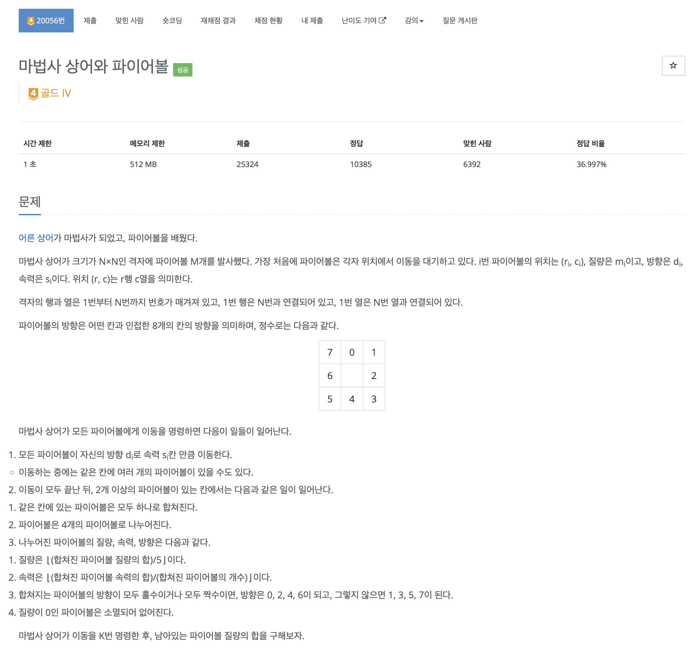
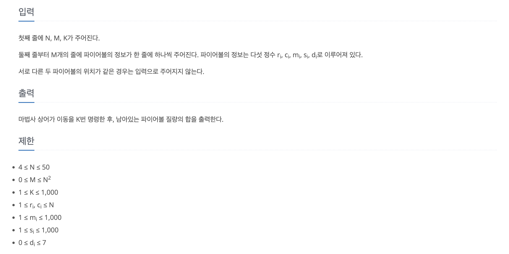
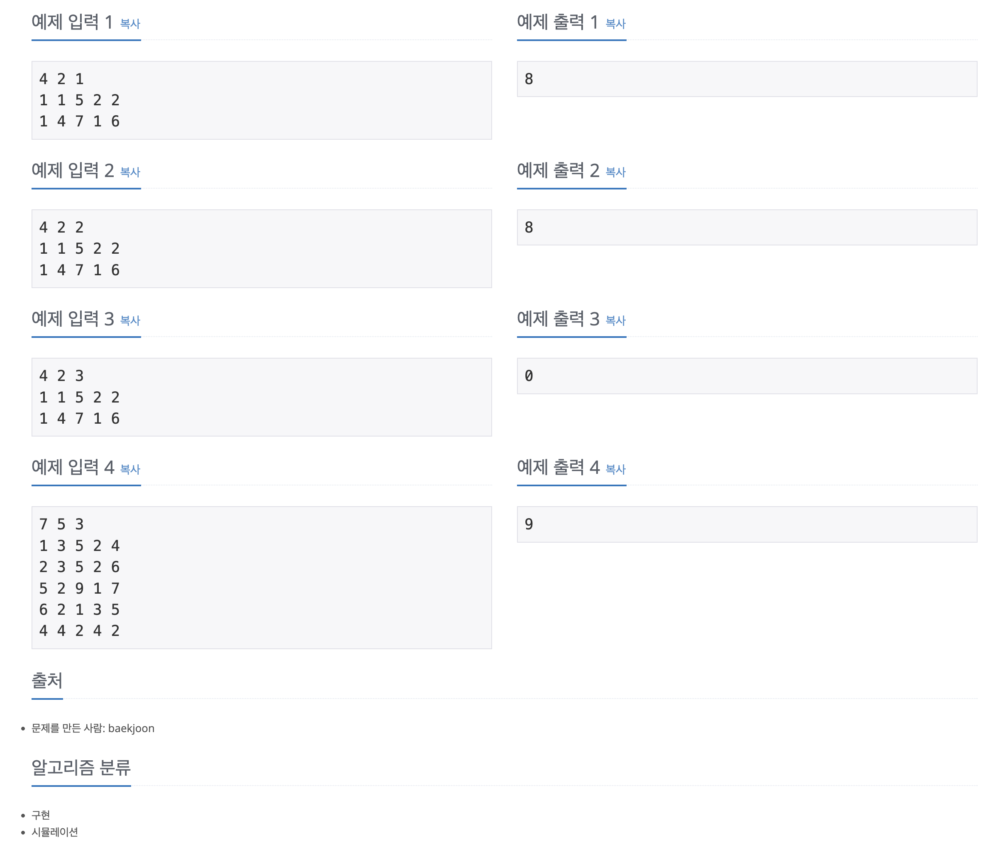

https://www.acmicpc.net/problem/20056

# 🔍 마법사 상어와 파이어볼

| 항목    | 내용                     |
|-------|------------------------|
| 설계 시간 | 10 min                 |
| 구현 시간 | 40 min                 |
| 난이도   | 골드 4                   |
| 알고리즘  | 구현, 시뮬레이션              |
| 코드 길이 | 3470B                  |
| 실행 시간 | 336ms (시간 제한 1초)       |
| 메모리   | 29348KB (메모리 제한 512MB) |

---

# 💡 아이디어

그냥 빡구현 문제로 이동시킬 예정인 파이어볼을 담은 Queue와 이동시킨 파이어볼을 담은 2차원 배열 두개를 활용해서 시뮬레이션을 돌렸다.

---

# ✔ 문제 풀이

- 파이어볼의 속성을 담는 클래스(FireBall)를 만들고 입력을 Queue<FireBall>에 넣었다. 이동시킨 파이어볼을 배치할 Queue<FireBall>[][] 2차원 배열도 초기화시켰다.
- k번 동안 move 메서드를 실행하며 move 메서드는 Queue의 파이어볼을 하나씩 이동시켜 2차원 배열에 담고 2차원 배열에서 파이어볼의 정보 갱신 후 다시 Queue에 담는 과정을 반복했다.
- 파이어볼은 격자를 벗어나면 연결된 행과 열로 오는데 이때 방향과 속도의 곱 때문에 위치가 격자에서 크게 벗어날 수 있어서 N * 1000을 더하고 N으로 나머지를 구하는 방식으로 항상 격자 내에 존재하게 했다.
- 파이어볼을 다시 Queue에 담는건 2차원 배열에서 각 칸에 파이어볼이 하나면 그냥 담고 여러개면 무게, 속도, 방향을 보정해서 넣으면 됐다.

---

# 🧠 어려웠던 점

- 행과 열이 연결되어 있다는 문장을 못봐서 시간이 좀 걸렸다.

---

# 🧐 좋은 풀이
