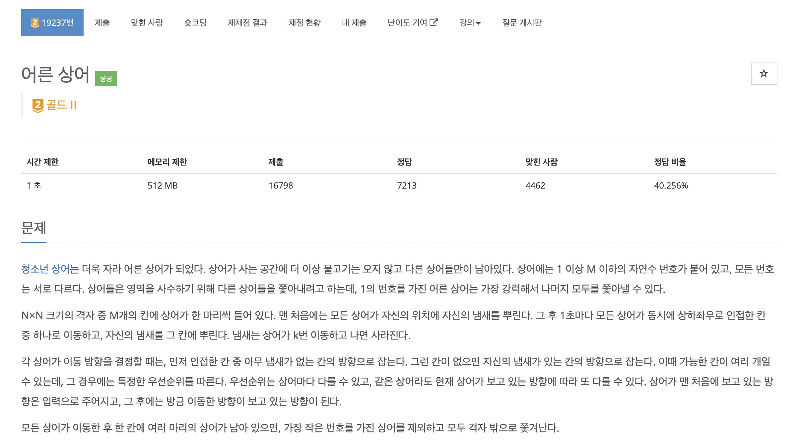
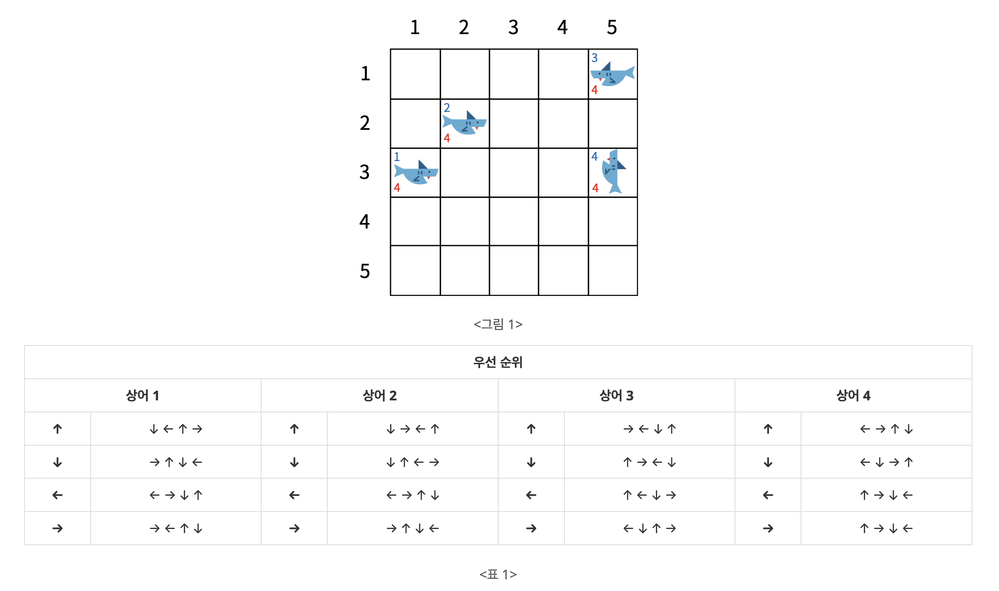
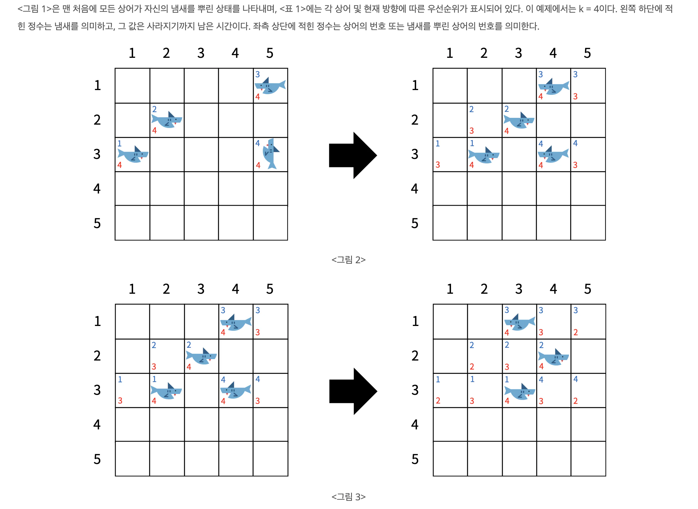
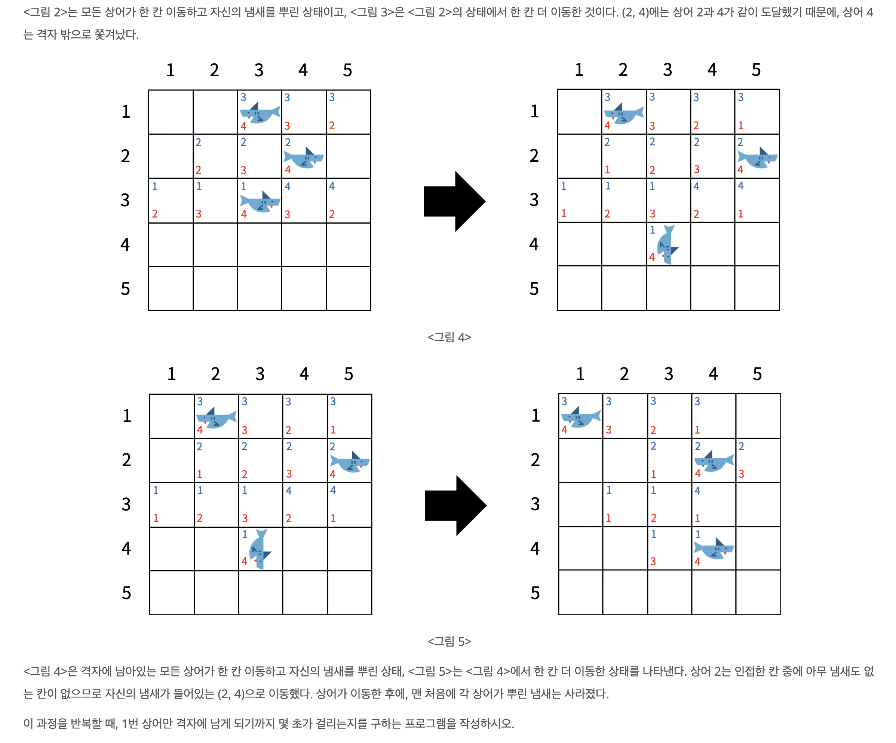
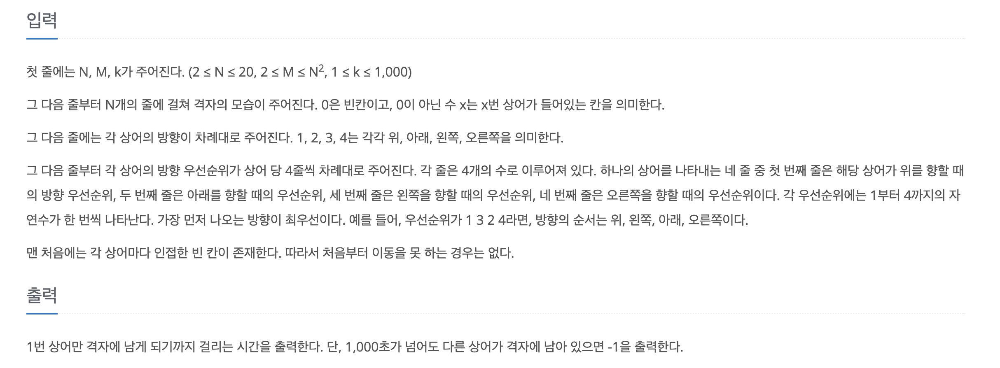
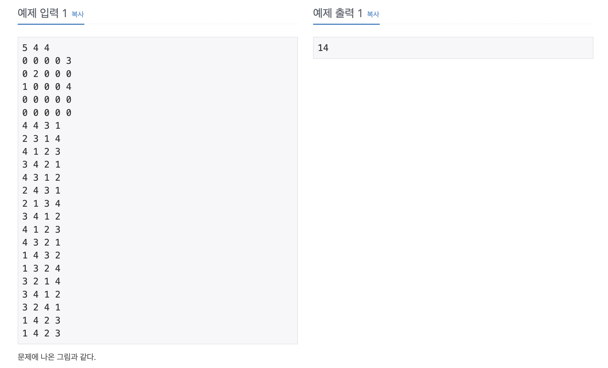
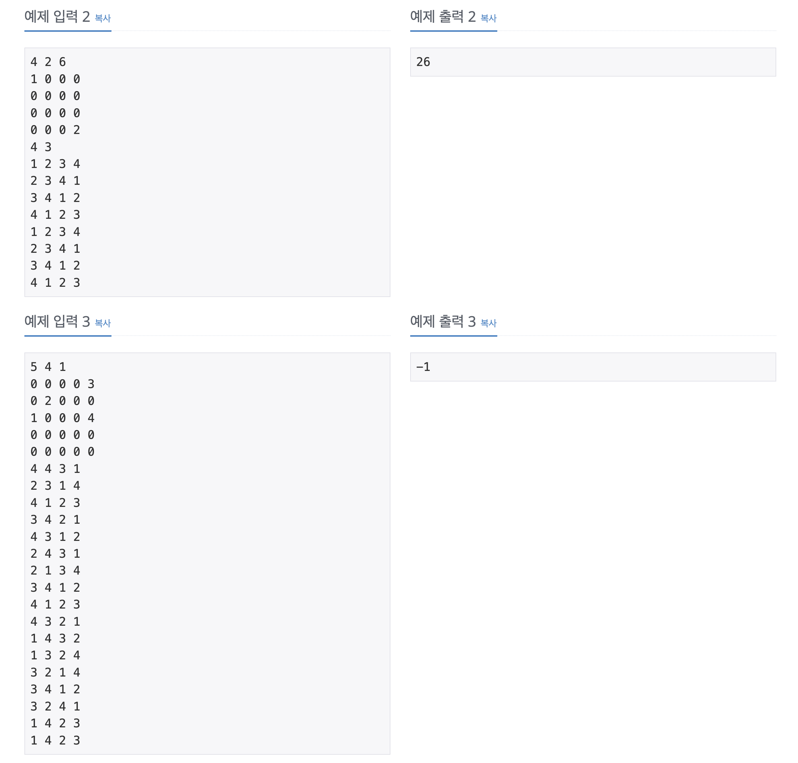
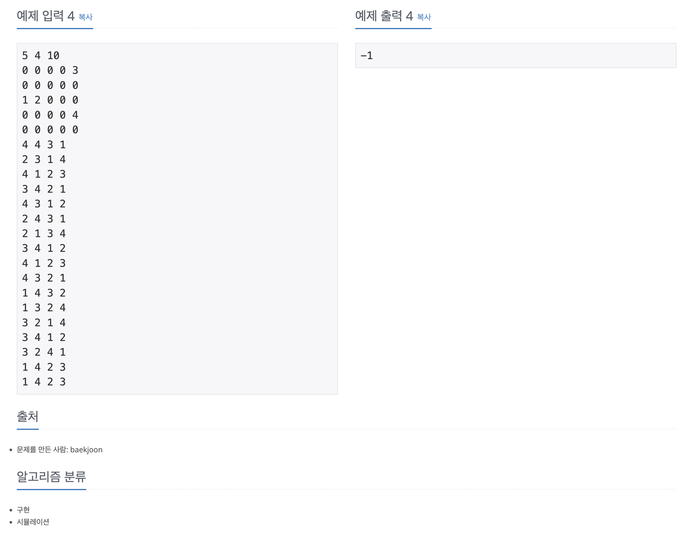

https://www.acmicpc.net/problem/19237

# 🔍 어른 상어

| 항목    | 내용                     |
|-------|------------------------|
| 설계 시간 | 10 min                 |
| 구현 시간 | 100 min                |
| 난이도   | 골드 2                   |
| 알고리즘  | 구현, 시뮬레이션              |
| 코드 길이 | 4949                   |
| 실행 시간 | 172ms (시간 제한 1초)       |
| 메모리   | 16752KB (메모리 제한 512MB) |

---

# 💡 아이디어

상어의 이동에서 다음 방향에 대한 우선순위가 현재 방향에 따라 달라진다. 이를 처리하기 위해 2차원 배열로 방향 관리를 했으며 우선순위 큐를 활용해 번호가 작은 상어가 우선권을 갖도록 구현했다.

---

# ✔ 문제 풀이

상어를 클래스로 만들어서 번호, 위치, 방향과 다음 방향에 대한 정보를 필드로 만들었다. 다음 방향은 현재 방향에 따라 우선순위가 달라져서 이를 2차원 배열로 나타내서 2차원 배열의 행 인덱스와 현재 방향을 맞춰서 현재 방향에 따른 다음 방향 우선순위를 처리했다.
상어 클래스는 번호에 대한 내림차순을 기본 정렬 기준으로 설정했는데 상어를 담을 우선순위 큐 2차원 배열에서 한 칸에 여러 마리의 상어가 있을 경우 한 마리만 남기고 우선순위 큐에서 지우는 방식으로 사용하기 위해서 였다. 대신 입력 단계에서는 번호에 대한 오름차순으로 데이터가 주어지므로 리스트에 임시로 담아 오름차순으로 정렬해서 데이터를 받은 후 이를 다시 우선순위 큐에 넣는 방식을 활용했다.

---

# 🧠 어려웠던 점

- 우선순위 큐에서 향상된 for문을 통한 조회가 정렬 기준대로 나오지 않는 것을 몰라서 디버깅이 조금 걸렸다.

---

# 🧐 좋은 풀이
